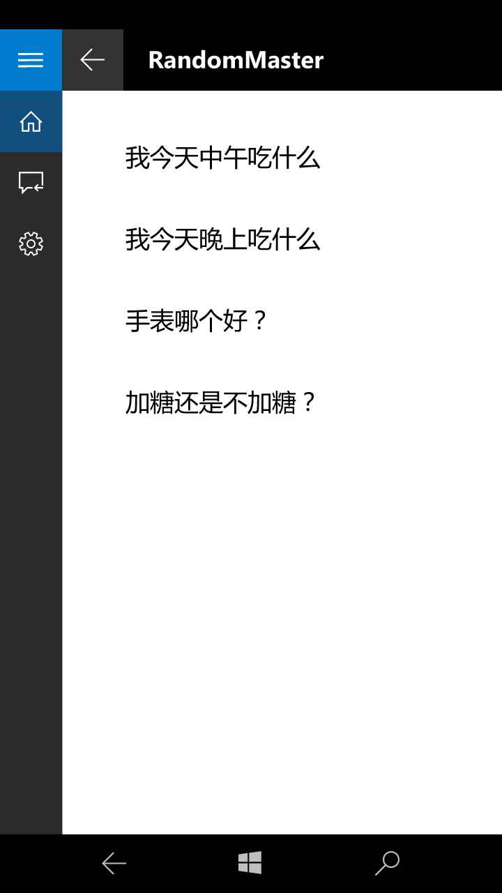
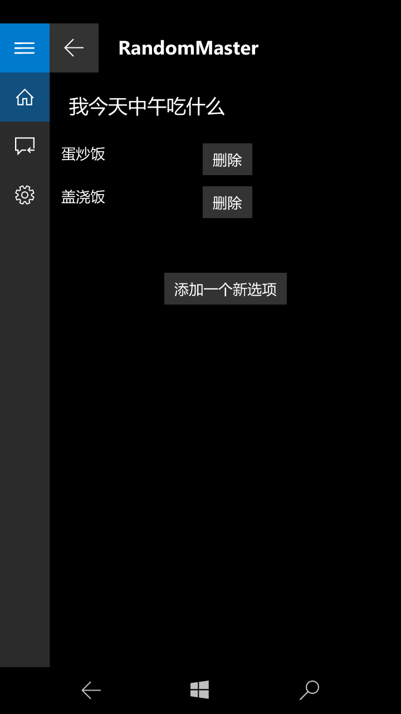
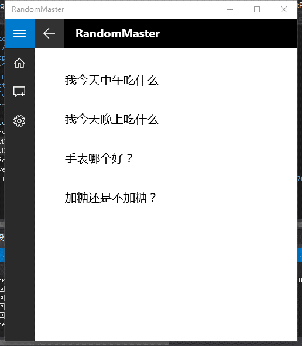
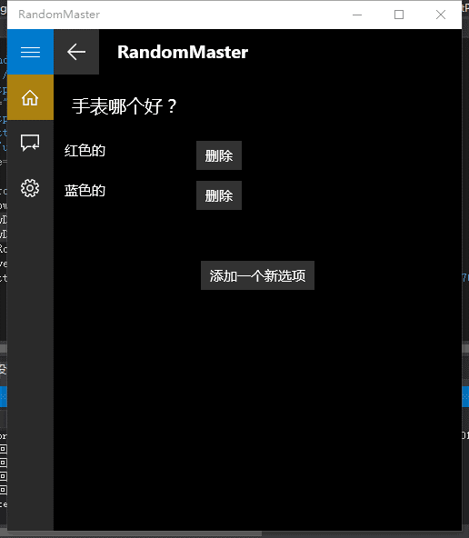
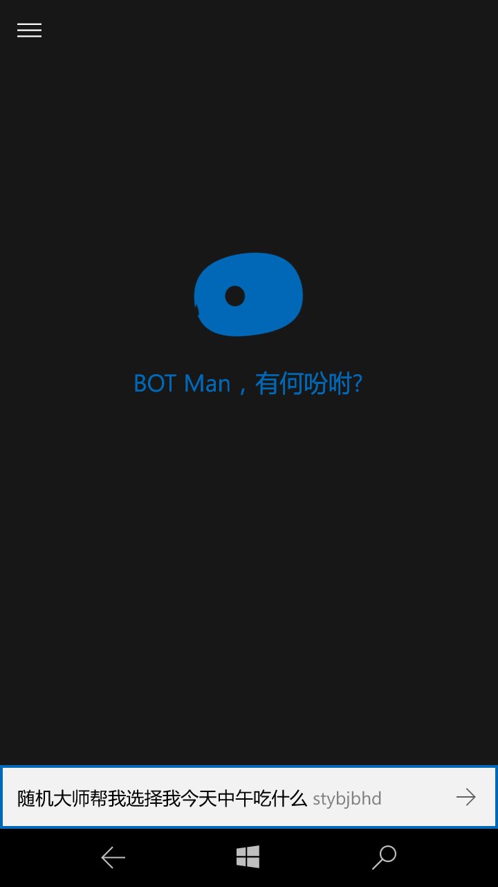
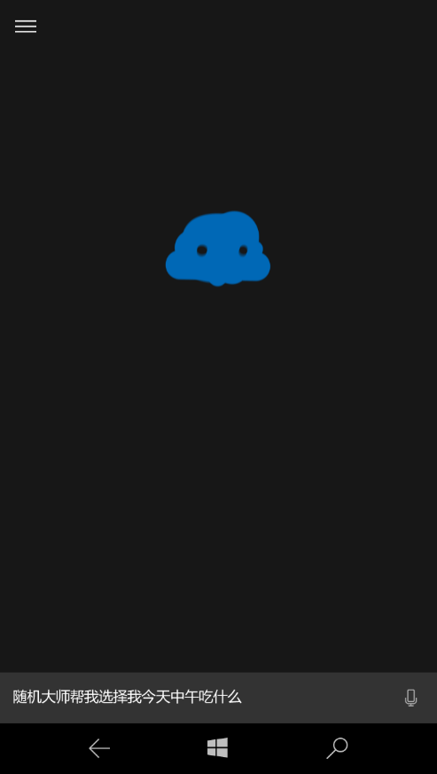
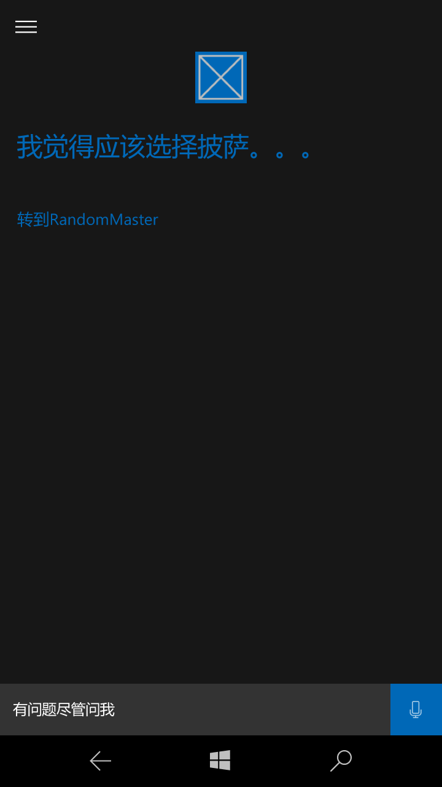
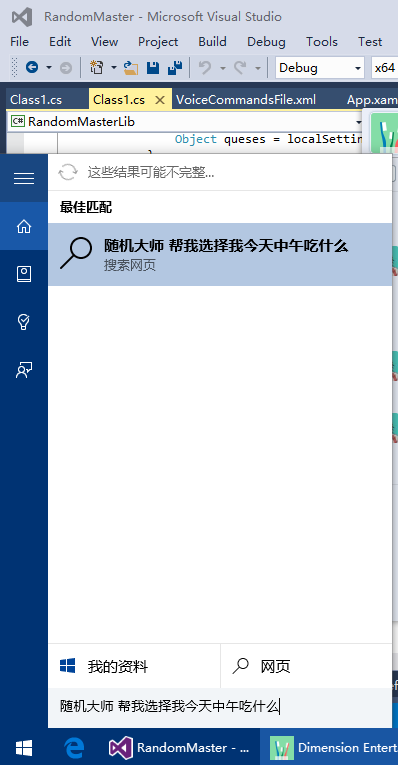
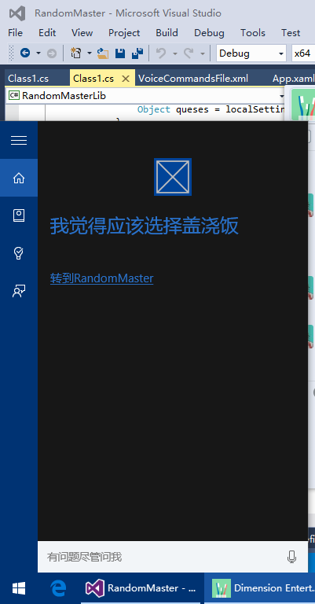

# Microsoft Campus Hackathon

> 2015/11/9
>
> Team Dimension: 李林旭/李俊宁/陈金柱

## Intro

希望写一篇日志来
纪念一下我参加的第一次黑客马拉松，
分享一下我学到的东西，
并希望能激励大家一起梦想而战~

> Our mission is to empower every person
> and every organization on the planet

## 日程

### 11月6日 晚上7:00 – 9:30

带着去膜拜各路大神，听听他们想法的心态，
我去参加了微软高校hackathon（黑客马拉松）的kick off仪式；

就在准备结束的时候看到上次那个安利surface3给我的研究生学长（星海信）
富有激情的到讲台上讲了几个有意思的想法，我决定还是报个名玩一玩，
于是顺便拉了一个想要一起去玩的台湾小伙伴（小小柱），一起组了一个队；

这个文艺的学长马上给我们队起了一个很拉风的队名——
Dimension Entertainment（维度娱乐）。。。；

之后我们随机确定了一个要做的项目——Random Master（随机大师），
然后机智的决定要开发Universal Windows Platform
（win10 下的通用应用平台）的app；
由于我们都没有学过C#，没有学过UWP开发，没有接触过Cortana接口。。。，

所以决定就在接下来两天挑战我们的极限——
开发一个UWP版本的集成入Cortana的帮助选择困难症“患者”选择的app——
Random Master for Cortana；

大概讨论了我们要干什么之后，大家就回去睡觉了，为了有充足的精力迎接下面的挑战；

### 11月7日 早上6:15 – 8:30

帝都还没天亮，然而想着要做一个很酷的东西的我已经起床了；
随后我们队伍跟着大家坐公交车来到了MSRA（微软亚洲研究院）进行Day1
（第一天的活动）；

### 11月7日 早上 9:00 – 10:00

在MSRA参加了开幕式；这次有北京的清华／北大／北航／北邮四所学校
和另外两个城市同时进行hackathon，然而北邮的同学占了一半以上的人数；

### 11月7日 早上 10:00 – 12:00

虽然我们team两个人都装了Visual Studio（微软的编程环境），
但是恍然间发现没有安装UWP SDK，于是开始进入了漫长的安装等待过程；
等待的同时，我们开始讨论我们的Random Master应该具体怎么实现
（这个时候发现两只电磁笔和一台surface是最好的草稿工具~）；

经过讨论，我们把自己的产品定位为一个集成于Cortana的小工具，
相比于市场上的随机选择器，优势在于我们可以将所有操作放入Cortana完成，
实现一种hands-off的体验~；

具体分工是我来实现和Cortana的交互部分（我猜比较简单，偷懒了）
，星海信实现用于管理用户问题和对应选项的界面，
小小柱帮忙制作PPT和找一些素材；

接下来进入了学习开发知识的阶段；（从0到0.1）

### 11月7日 中午 12:00 – 1:00

参加另一个活动（听歌接歌词），然后吃午餐
（虽然得到了学妹送的土豆泥，但是忘记吃了，放凉了:sob:）

### 11月7日 下午 1:00 – 7:00

进入了高速学习的阶段；我们主要从MSDN学习基本知识和一些开发规范，
从GitHub下载相应的sample（例子）参考；

这时候我们发现，对于没有接触过的知识，读文档效率低于看例子；
看例子虽然看懂了设计的原理步骤，但是实际操作的时候仍然出现很多的问题；
另外，星海之前没有使用过Visual Studio，很多使用技巧没有掌握，
而我虽然用这个东西一段时间了，
但是发现自己之前的很多技巧不适用于现在学到的内容；

虽然晚餐后有小游戏，但是已经没时间参加了。。。（从0到0.4）

### 11月7日 晚上 7:30 – 8:30

开始进入presentation阶段，然后我们team是第一组，
虽然我们team的小小柱制作了精美的PPT，虽然星海富有激情描绘了我们的idea，
但是由于大家没怎么接触过Cortana（不使用Windows Phone的后果。。。），
都对于我们的描述没什么感觉；

之后，我们听了别人的idea，感觉大家的想法真是丰富；

最后，我们北邮的两个team获得了最佳创意奖

### 11月8日 早上 8:30 – 1:30

我们来到北邮学十地下的创新大本营进行Day2；

然而对于我们team卡在了许多问题上（很多东西没有搞懂），我们继续高速学习； 

Day1中，我已经了解了和Cortana集成所需要的基本知识，
今天就把所有的具体细节和实现的教程列举出来
（推荐使用阅读列表，我就是添加了所有需要读的网页进去），然后逐一学习；
给我最大的感受是，如果要短时间内快速掌握没有涉足过的知识，就要看例子；
如果学着例子写了的东西仍然有bug，就要看运气；
很多东西看起来是这样，但是具体情况和你想的不一样；
很多东西在别人的机器上没问题，但是在你的机器上可能会出现怪怪的事情；

所以，相信大力出奇迹，用上自己的已有经验和直觉来克服所有困难；（从0到0.9）

### 11月8日 下午 1:30 – 5:00

逝者如斯，虽然开发时间结束，活动进入了展示和投票阶段，
但是我们的和Cortana交互部分出现了怪怪的bug，一直没有得出正确结果，
我们的UI也卡在了最后的navigation（导航页面）的怪怪的bug上面；

星海和小柱去做展示了，而我继续在旁边用各种方法定位出错位置
（因为调试C#和之前的C++有点不一样，或者我还没有发现其中奥秘），
解决我们的Cortana的问题；

最后，大力出奇迹，Cortana成功的回答了我的问题——

> “随机大师 帮我选择我今天中午吃什么——我选择盖浇饭”，

另一方面，我们的navigation终于成功了——可以让用户选择问题，
并编辑对应的选择选项了~~，当时真是感动；

最后经过进一步完善，我们用上了demo进行最后一次presentation，
并取得了很好的效果；最后我们的team拿到了最佳完成奖；
感觉idea和implementation都不错，可惜的是我们的；（从0到1）

虽然各位大神看我们team的产品十分的trivial，但是对于我们三个人来说，
这是一种从0到1的过程，
我们选择一个没有涉足的领域，
选择在小于24小时时间内完成，
选择突破极限，
选择keep calm and hack on；

用帅帅的话讲，我们好久没有那么爽过了；

## 分享

最后大概说一下我们的Cortana交互部分实现：
- 首先在app启动的时候注册语音文件，
  然后当你对Cortana说对应内容时就会接入你设置的入口中；
- 然后接入方式有两种，
  - 一种是打开app来接入的，
  - 另一种是通过注册一个运行时组件进而由组件将处理后的数据反馈给Cortana
    （看起来就是Cortana和你对话，感觉很自然）

附上参考链接（看完大概可以写了）

- https://docs.microsoft.com/en-us/windows/uwp/design/input/cortana-interactions
- https://docs.microsoft.com/en-us/previous-versions/windows/apps/hh779077(v=vs.140)

## 项目总结

### 简介

我们的team名字叫做Dimension Entertainment（维度娱乐），
我们的项目是制作一个集成于Cortana的帮助选择困难症“患者”的app——
随机大师（Random Master）；

### 创意来源

> 在生活中，我们往往会遇到很多选择，
> 而许多做选择的时候，选项都是让人感觉难以选择的；
> 
> 比如我今天中午/晚上吃什么，我今天中午/晚上去哪里吃；
> 对于这些问题，你的心中已经有了几个选项，
> 而选哪一个都无所谓，但是你必须选其中一个；

这时候我们可以拿出手机或者对着电脑的Cortana说：

> “随机大师 帮我选择我今天中午/晚上吃什么”
> 
> “随机大师 帮我选择我今天中午/晚上去哪里吃”

这时候如果Cortana会告诉你：

> “你可以选择披萨/我觉得应该选择汉堡”/“你可以选择去一食堂/二食堂”

这样我们就听她的吧
（因为哪一个被选中都没有利弊之分，但是又必须要有一个被选中）；

对比其他同类产品，我们的优势就在于我们可以借助Cortana实现一个沉浸式的体验
（所有操作在Cortana完成，询问问题/设置问题选项/删除问题等——
实现hands-off的natural操作）；

### 实现方式

我们采用C#/XAML进行编写UWP app；

其中使用了Cortana Interaction的相关API以及使用了微软最新的UWP-XAML相关技术；

### 目前进度

已经实现了基本界面和问Cortana的交互；并实现了手机和电脑上的部署

### 继续完善

1. 由于我们第一次接触相关的技术，所以将会继续学习技术并完善预期功能：
  例如修bug；
2. 另外，我们将会添加新的功能：
  - 例如使用Project Oxford识别自然语言关键词，活动更自然的体验；
  - 同步用户数据，从而使用户在所有Windows10设备上获得一致性体验；
3. 最后，我们会发挥Cortana的便捷的优势，
  将随机大师升级成为一个功能更加丰富的Cortana插件（不只是随机）：
  例如，做一些小游戏，我们可以让用户用语音和Cortana下井字棋
  （用户说出1-9表示用户的决策，通过返回图片的方式表示机器做出的决策）；
