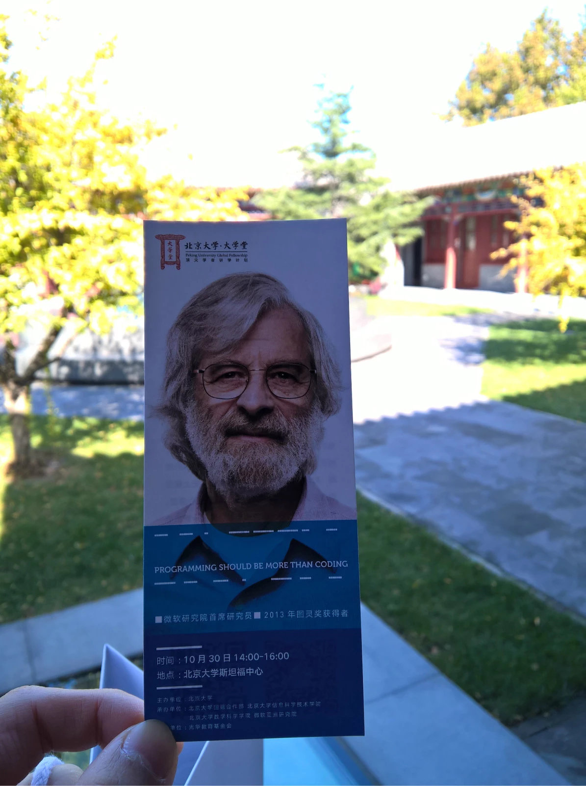
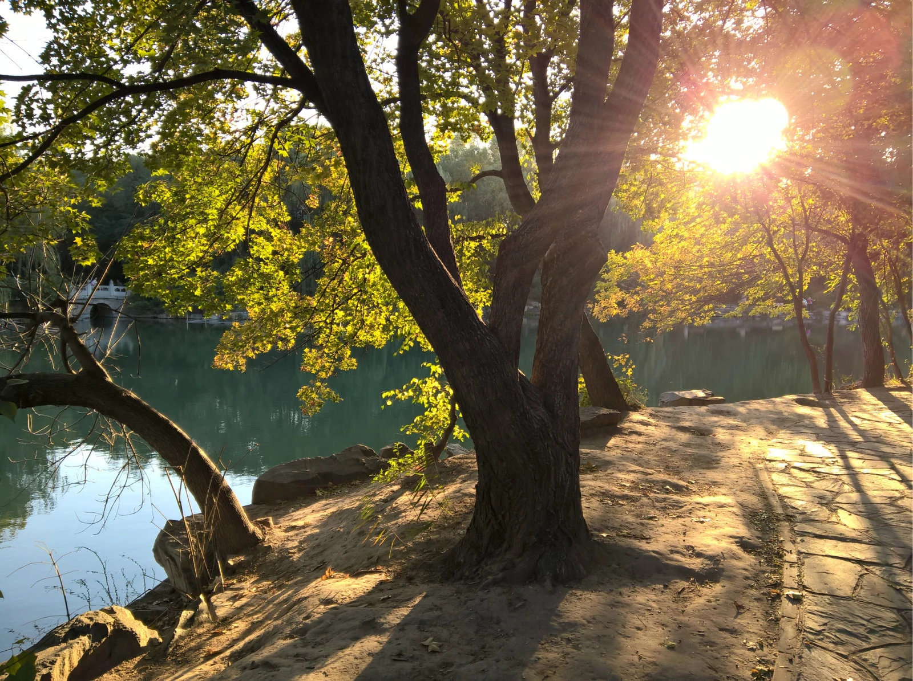

# Week 44 in Year 2015

> 2015/10/30
>
> 记录生活

## 时间线

- 第42周 周三 周四 微软俱乐部路演
- 第43周 周一 周二 周三 微软俱乐部招新帮忙 周六沙河招新帮忙
- 第44周
  - 周一 补做周五的实验 微软俱乐部见面会 win10 工程师
  - 周二 学习离散数学
  - 周三 Computing in the 21st Century
  - 周四 补做周三的实验 买surface 3
  - 周五 Leslie Lamport: Programming should be more than coding
  - 周六 武术社
  - 周日 MMA Learning

## 忙而充实的一周

这周虽然是大学以来最忙的，但也是最有收获的。
虽然没有了额外看其他书的时间，还要花时间补做实验，但收获了看书得不到的东西。
第一次写日志来记录下我的一些收获。

周一的收获主要是晚上和 Windows 团队的交流。
在微软提出 Windows10 之后，我开始喜欢上了 Windows （其实之前没什么感觉），
希望有一天能进入微软亲自开发这个每天都在用的系统。
我了解到 Windows team 有两个部分的人员，Redmond 和中国；
其中，中国的团队有好多北邮的校友。
Mobile 和 PC 的 Windows 使用的是同一个内核，共享了大部分的代码；
甚至现在的 Win10 Mobile 使用的也是 Dr. Watson。
通过交流，我还了解到了很多有趣的东西。

周三和周五的收获主要是去清华听 Computing in the 21st Century
和去北大听 Leslie Lamport 的讲座。
二十一世纪计算大会上，由于我对机器学习和大数据没什么概念，
几乎只是感受一下大师们的魅力，但是我非常喜欢（由于离散数学使用英文学习，
相对能听懂）其中的一位—— Leslie Lamport。

他在清华讲的是 A Mathematical View of Computer System，
在北大讲的是 Programming Should Be More Than Coding。
他是 2013 年图灵奖得主，微软研究院首席研究员，LaTeX发明者。
作为数学家，他追求 elegant，提倡使用 TLA+ 作为 programming 的
model checker 和 proof checker，告诉我们在大学要学好数学，
学会抽象的思考问题，而不是机械的写代码。
他认为 Coding should be trivial，甚至机器也能自己写代码，
但是机器和人的最大不同就在于 machine does trivial tasks。

一个 program 可以用 TLA+ 或者其他的数学方式优美的描述，
在设计的时候就不必考虑很多细节（比如 overflow），之后对 code 进行 patch 也很方便；
他还认为在一开始设计的时候不要用 IDE，因为那会影响你的 thinking。
另外，他还谈了一下大学的教育，
认为大学应该教学生 thinking abstractly 和 career，而不是 job。

最后，觉得北大校园好漂亮。

