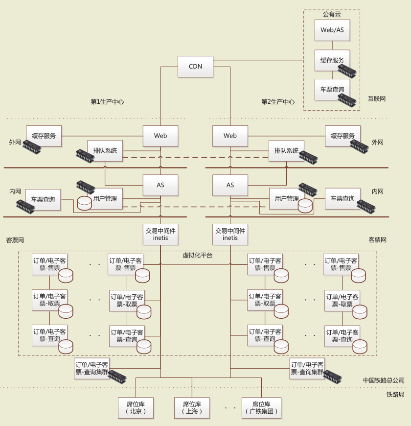

# 12306 技术分析

> 2016/12
>
> 本文及 [全国性在线考试系统设计](Exam-System-Design.md) 为 2016-2017 网络存储结课论文。

## [no-toc] TOC

[TOC]

## 摘要

> 本文参考了中国铁道科学研究院（铁科院）电子计算技术研究所近几年发表的论文及网上资料，从业务需求、技术架构、应用场景等方面，对 12306 互联网售票系统（12306）进行技术分析。

12306 是中国铁路客票、预订系统与传统互联网、移动互联网相结合的新型电子商务（电商）系统。作为中国铁路最重要的售票渠道，12306 在每年节假日前夕需要处理大量的访问。

12306 使用的**技术架构**、上线后遇到的**问题**及其**解决方案**、处理海量数据的**前沿技术**，都具有极大的参考价值。为此，本文以 2016 年 10 月铁科院公开的 12306 系统 [12306-testing] 为基础，进行技术分析。

## 1. 业务分析

### 1.1 需求分析

12306 结合了中国铁路客票、预订系统和传统互联网、移动互联网的特点；其业务大致可以划分为以下 3 种。[booking-system-design]

- 服务旅客需求
  - 在线售票服务需求，包括线上车票查询、预订、支付、退票、改签及订单查询等。
  - 线下配套服务需求，包括线下办理网购车票的退票、改签、换票、检票和验票。
- 业务管理需求，包括管理车票的票额、预售期、售票时间、席别、票种、车次、车站等数据。
- 系统监控需求，包括对资源利用、负载等运行状态的监控，以及对购票行为、订单状态等进行监控。

### 1.2 业务难点

在 2012 年春期间，12306 网站出现了页面打开缓慢、查询和下单报错、后台系统过载等问题。于是，网友们纷纷为 12306 的技术架构出谋划策，甚至有人提议为其写一个开源网站。[heavy-concurrency] 然而，相比于其他电商系统，12306 需要处理更加复杂的情况。[booking-system-request]

#### 1.2.1 业务规则复杂
与一般的电商销售商品不同，一般的商品库存为**静态库存**，而 12306 的商品库存为**动态库存**。例如，如果有一张 北京到南宁的 Z5 车票发售，那么这张车票可以拆分为一张 北京到武汉 和一张 武汉到南宁 的车票分别发售，或是拆分为一张 北京到郑州 和一张 郑州到南宁 的车票分别发售。

这种数据的复杂关联性使得**余票的计算**变得异常复杂。为了保证数据能被准确的修改，那么我们通常要把**并行**的操作转变为**串行**操作，这将使得计算效率大大下降。

#### 1.2.2 对事务要求强一致性
对于电商，如果商品销售小份额的超出库存，可以通过补充库存进行弥补，仅要求**弱一致性**。而 12306 属于实时的**交易型系统**，库存资源的数量固定，对**分布式事务**要求**强一致性**。

#### 1.2.3 多维业务访问需求
由于中国铁路客票、预订系统并不是单纯的线上系统，所以 12306 进行业务处理时，需要和线下的各个系统相结合。例如，在**多渠道售票**的情景下，车票可以在线上、线下各个渠道发售，而余票的数量计算也依赖于各个售票渠道。在这种情景下，数据一致性在高并发下是一个瓶颈。

#### 1.2.4 系统访问峰谷压力差异巨大
官方数据 [booking-system-request] 显示，截至 2015 年 7 月统计，互联网售票系统上线运营以来，高峰日售票量 636.8 万张，占客票系统交易总额的 68% 以上，累计销售客票约 18.1 亿张。日 PV 峰值 80 亿次、余票查询峰值请求 100 000 笔 /s、购票请求峰值 20 000 笔 /s。

每年的系统访问峰值，主要出现在各个节假日前夕的发售后的一个短时间内；而对于其他时段，访问量远小于峰值。所以这里需要 12306 系统拥有**弹性计算**能力。

## 2. 技术分析

### 2.1 架构设计

从铁科院的资料 [12306-architecture] 中，我们知道 12306 互联网售票系统整体上采用了双中心 + 公有云架构；网络上采用外网、内网和客票网的三级结构。

**12306 架构设计图** [12306-architecture]

（CDN = Content Delivery Network，Web = Web Server，AS = Application Server）

架构中应用的主要技术有：
- 双中心 构成**镜像**，每个中心可以独立进行完整的逻辑处理。
- 公有云 用于加速车票查询业务的处理，减轻双中心负载。
- 内容分发网络（CDN） 用于**流量分配**，加快请求的响应。
- 负载均衡 扩展服务器带宽，增加服务器吞吐量。
- 缓存服务 内存 NoSQL，用于缓存**余票**等计算结果，加速请求的响应。
- 排队系统 内存 NoSQL，用于缓存请求，保证数据库可用性。
- 客户管理 内存 NoSQL 用于**查询**，磁盘 SQL 用于**持久化**，加快用户登录、联系人信息查询速度。
- 车票查询 分布式内存 NoSQL 网格，**并行**处理，加快计算。
- 订单/电子客票-售/取/查票
  - **分库、分表** 加快读写速度，增强**水平可扩展性**。
  - **读、写分离** 查询放到 内存 NoSQL，加快响应速度。

### 2.2 关键技术

由于业务的特殊性，12306 有着独特的应对海量请求策略。[12306-architecture] [booking-system-request] 其使用的关键技术主要包括以下几个方面。

#### 2.2.1 虚拟化
2013 年，构建铁科院第 2 生产中心，采用 VMware 公司的 **vSphere 虚拟化**技术，实现了双中心的**双活架构**。[12306-virtualization]

这个架构的优点有：
- 双中心采取相同的部署，互为备份。
- 双中心同时在线提供服务，处理能力提升一倍。
- 当其中一个中心发生故障时，另一个中心可以承载全部的售票业务。

#### 2.2.2 公有云
目前，12306 在阿里云上部署了车票查询服务。2015 年春运期间，公有云最高分流了 75% 的查询请求，网站对外车票查询服务能力增加了 3 倍。[12306-architecture]

使用公有云的优点有：
- 实现了**弹性**的计算能力，能化解系统访问峰谷压力巨大差异。
- 用于加速用户的车票查询速度，减轻双中心负载。

#### 2.2.3 排队机制
在访问高峰期，系统先通过**队列接收**用户的下单请求，再根据后端处理能力**异步处理**队列中的下单请求。同时在业务上车票**整点发售**，避免集中的大量访问。

这个机制的优点有：
- 保证对核心**数据库**请求**压力**可控，更好的响应高并发的请求。
- 保证在供远小于求的业务情境下的**公平性**。

#### 2.2.4 分布式计算
**余票查询**业务的访问量远比其他业务要大，所以对其进行优化势在必行。2012 年，12306 改用了分布式内存网格，增强该业务的**并发处理**能力。[12306-architecture]

- 使用**高速的内存**，可以避免了低速的磁盘 I/O。
- 使用分布式系统，集群可以利用**搜索技术**，快速定位到相关数据内存单元，然后**并行调度**多个节点参与运算（map），最后**汇总**所有节点的运算结果（reduce）。
- 使用**缓存系统**，避免重复的计算，加快响应速度。
- 使用了 Pivotal 公司的 **GemFire** 解决方案 [pivotal-case-study]，并用低成本的 X86 平台替代了之前的 Unix 小型机。这样的架构具有很好的**水平可扩展性**，即 通过协同调度更多的廉价机器来达到和使用昂贵机器一样的效果。

#### 2.2.5 数据拆分/读写分离/售取分离
随着业务的不断扩展，数据不断增多，12306 单一数据库优化或 SQL 层面上的优化已经不能满足需求。

2012 - 2013 年，12306 对数据进行了如下拆分：
- 对订票、取票操作进行了业务分离；
- 对订单生成、查询进行了读写分离（**垂直拆分**）；
- 对订单/电子客票进行分节点、分库、分表改造，把数据通过 hash 分散到不同结点的库、表存储（**水平拆分**）。[12306-architecture]

这样的架构设计：
- 能大大提升**数据库**系统**可用性**，弥补了单机数据库系统的不足。
- 具有很好的**水平可扩充性**，即 不需要改动架构就可以很方便的增加存储。

## 3. 应用场景

12306 系统可以定位为**超大规模**的**高并发、高可用**的有**分布式事务要求强一致性**需求的**实时交易系统**，其应用场景并不常见。

- 一般的电商系统可能对**并发性、可用性**要求较高，但是由于使用“静态库存”且对**事务强一致性**要求不高，可以使用简单的分布式系统处理。
- 一般的交易系统对**可用性、实时性**要求较高，但是不需要处理**高并发**和特殊业务的问题。

但是 12306 对其他业务下的系统设计仍具有很大的参考价值。

## 4. 参考文献

[cite-sec]

- [12306-architecture]: 朱建生，王明哲，杨立鹏，阎志远，张志强. 12306 互联网售票系统的架构优化及演进. 铁路计算机应用，2015，24（11）：1-4.
- [booking-system-request]: 杨立鹏，王富章，梅巧玲，朱建军. 互联网售票中的海量请求处理技术研究. 铁路计算机应用，2015，24（7）：25-27.
- [booking-system-design]: 王明哲，张振利，徐彦，王富章，朱建生. 铁路互联网售票系统的研究与实现. 铁路计算机应用，2012，21（4）：23-25.
- [12306-virtualization]: 刘相坤，李 琪，徐东平，李聚宝. 虚拟化技术在12306双活数据中心中的应用. 铁路计算机应用，2016，25（10）：27-30.
- [12306-testing]: 李天翼. 12306互联网售票系统测试的实现. 铁路计算机应用，2016，25（10）：27-30.
- [pivotal-case-study]: Pivotal. Case Study: China Railway Corporation, Scaling Online Sales for the Largest Railway in the World. https://pivotal.io/big-data/case-study/scaling-online-sales-for-the-largest-railway-in-the-world-china-railway-corporation
- [heavy-concurrency]: 幽云十八. 透过 12306 五大焦点看高性能高并发系统. http://storage.it168.com/a2012/0217/1313/000001313424_all.shtml
