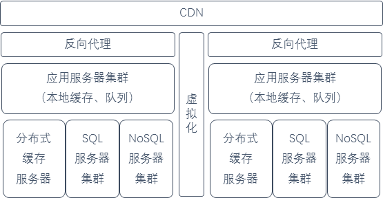

# 全国性在线考试系统设计

> 2016/12
>
> 本文及 [12306 技术分析](12306-Architecture.md) 为 2016-2017 网络存储结课论文。

## [no-toc] TOC

[TOC]

## 摘要

> 本文将从业务分析、架构设计、关键技术等方面，设计一个服务于大型全国性在线考试的系统（考试系统），并重点设计了针对海量数据的存储策略。

随着互联网的高速发展，在线无纸化考试有着易部署、低成本、安全可靠等优势，正逐渐取代传统的考试方式。

本文参考了国内外大型网站架构，设计一个全国性在线考试系统，服务于大型的全国性在线考试（例如，英语 4 / 6 级考试、计算机等级考试等各类考试）。

## 1. 业务分析

### 1.1 情境假设

考试系统服务的全国性考试如下描述：
- 考生需要到附近的指定考场，使用考场内的计算机进行考试（由监考人员监考，防止作弊）。
- 考生需要使用统一的客户端，防止考生在本地作弊（通过监控输入设备等方式）。
- 考试题目分为三类：客观题、主观题和扩展性试题。
  - 客观题：分为选择题和判断题，考生须在规定的答案中选择一个结果。
  - 主观题：分为填空题和简答题，考生可以在字数限制内填写字符串答案。
  - 扩展性试题：格式根据具体的考试类型确定。
- 考试过程中，客户端可以根据需求在线获取试题（例如，英语 6 级考试需要提交听力、作文后才能获取阅读、翻译试题），或离线获取试题（例如，一般的考试在开考时立即获取试卷）。
- 考试过程中客户端定时向服务器提交**答案快照**，以减少因本地故障而临时丢失答案的损失，即 当考生机器发生故障时，可以向监控人员申请更换机器继续进行考试。
- 考试时间固定，允许提前交卷；考试结束时，客户端自动交卷。

### 1.2 需求分析

考试系统需要满足以下几个基本需求：
- 服务考生需求
  - 考试前，考生可以在网页端**报名**考试，**查询**考试科目、时间、地点等信息。
  - 考试后，考生可以在网页端**查询**考试结果。
  - 考试过程中，考生使用客户端**登录**、**答题**。
  - 考试过程中，系统准时**发布**试题，定时**收回**答案。
- 服务考试主办方需求
  - 考试前，考试主办方可以**录入**考试信息、试题信息等。
  - 考试后，考试主办方可以**导出**试卷、**批改**试卷、获取结果报表。
- 业务管理需求，包括考生、考试主办方等信息**配置、管理**。
- 系统监控需求，包括对资源利用、负载等**运行状态**的监控，以及对考试、查询等**用户操作**进行监控。
- 系统需要有良好的可用性，保证能根据具体需求同时服务多地、多场、多门考试，保证所有用户数据能完好的存储。
- 系统需要有良好的可扩展性，在业务需求增加时，能平滑升级系统。
- 系统需要有良好的安全性，保证传输过程安全可靠，数据不被非法窃取。

### 1.3 业务特点

#### 考试过程中的高并发请求
由于同一场全国性考试往往是在同一时间、多个地点进行（例如，全国大学生英语考试），所以在考试的过程中，会出现大量的 **获取试题、提交答案（包括快照）** 的请求。而在考试过程中，对**试题**数据主要是进行**读**操作；对**答案**数据主要是进行**写**操作。

#### 海量数据可靠存储
每一场全国性考试都会产生大量的数据，包括试题、答案、日志、监控信息等，需要优化针对**海量数据**的存储策略。

## 2. 架构设计

考试系统针对业务需求分为三层：
- 应用层，包括 Web 页面相关部分和客户端部分。
- 服务层，提供对业务服务的支持，响应应用层的请求。
- 数据层，提供海量数据存储的支持。

### 2.1 应用层设计

- 服务考生功能
  - 设计一个网页端，用于考生在非考试时间进行**报名、查询**等操作。
  - 设计一个客户端，**提前部署**在考场机器上，用于考生考试时**查看试题、提交答案**等。
- 服务考试主办方功能
  - 设计一个网页端，用于考试主办方**录入**信息、**导出、批改**试卷、**导出**结果等。
- 业务管理/系统监控功能
  - 设计一个网页端，用于运维人员进行**业务管理/系统监控**等操作。

### 2.2 服务层、数据层 设计

- 使用两个**镜像部署**的数据中心提供支持，使用产品为 `VMware vSphere`。
  - 两个数据中心通过**虚拟化**技术，实现**双活**架构。
  - 正常情况下，两个数据中心同时对外提供服务，实现双倍处理性能。
  - 当一个数据中心不可用时，平滑切换，由另一个数据中心承担所有业务。
- 在 ISP 处部署 **CDN** 服务器，在数据中心部署**反向代理**服务器，使用产品为 `Nginx`。
  - 用于缓存网页端 *静态资源* 及可以放到公网上的 *考试信息、结果* 等数据。
- 在数据中心部署**应用服务器**集群，使用产品为 `Linux Virtual Server`。
  - **Web 服务器**部署在应用服务器集群中间，提供网页浏览服务。
  - 对于每个请求，通过**负载均衡**技术，分发到应用服务器上。
  - 应用服务器上使用**本地缓存**。
  - 使用**队列**，用于缓存每次考生提交的 *答案快照*。
- 在数据中心部署**分布式缓存**服务器集群，使用产品为 `Memcached`。
  - 用于存放考试过程中考生的 *答案快照* 等数据。
- 在数据中心部署分布式 **SQL 数据库**集群，使用产品为 `MySQL`。
  - 用于存放考试 *主办方、考试、考生、配置、日志* 等信息。
- 在数据中心部署分布式 **NoSQL 数据库**集群，使用产品为 `Apache HBase`。
  - 用于存放考生 *答案* 等信息。

### 2.3 处理流程

#### 2.3.1 Web 请求

- Web 静态资源请求 -> CDN 返回静态资源
- Web 动态数据请求 -> CDN / 反向代理 检查缓存
- 未命中缓存的请求 -> 应用服务器计算 -> 响应

#### 2.3.2 考试过程

- 考生登录系统 -> 应用服务器认证
- 客户端请求试题 -> 反向代理 返回缓存结果
- 客户端提交答案 -> 压入 队列 -> 应用服务器 处理（校验答案合法性），写入 分布式缓存，响应 
- 考试结束时 -> 应用服务器 读取 分布式缓存 -> 写入 NoSQL 数据库（持久化考生答案）
- 考试结束后 -> 应用服务器 读取 NoSQL 数据库 -> 处理数据 -> 写入 SQL 数据库（生成考试结果）

## 3. 关键技术

这里主要分析考试系统的**服务层、数据层**设计上的关键技术。

### 3.1 业务分割

将不同业务**分割**为各个模块，并部署在不同**应用服务器**上。这样的设计：
- 有利于业务的扩展、系统的升级，即 通过增加新的服务器处理新业务，实现平滑升级；
- 保证关键业务的稳定性，即 将实时性较强的考试模块（高并发、要求高可靠性）和查询、管理模块分开部署，保证前者能在高负载时更稳定的运行。

### 3.2 双中心

双中心使用相同的部署，通过**虚拟化**技术协同调度，并使用两套独立的能源系统。这样的设计：
- 相比于一个数据中心、一个灾备中心的模式，双中心同时在线提供服务，实现**双活**架构，更合理利用资源。
- 当其中一个中心发生故障时，另一个中心可以承载全部的考试业务，实现平滑的**服务灾备**启动，即 不会出现考试过程中突然中断的情况。

#### > 虚拟化 使用 VMware 的 `vSphere` 解决方案 [vmware-vsphere]
- 成熟的解决方案：简化大数据基础架构管理，节省运维成本。
- 智能运维管理和自动化：在利用与环境相适应的自学算法和预测性分析的同时，监控和管理运行状况，发现性能瓶颈和容量短缺，在需求高峰到来之前重新均衡工作负载，从而提高应用性能。
- 使用虚拟化 Linux：实现高性能，更高的可用性，更强的虚拟机功能和灾难恢复能力。
- 增强应用性能和可用性：均衡工作负载并确定资源使用优先次序，从而确保为最重要的应用提供最佳性能。在虚拟环境中快速调配和部署工作负载。
- 支持容器：可以在同一基础架构中并行运行传统应用和容器化应用。

### 3.3 集群化

使用更多的计算机构成集群，完成相同的工作，使在线考试等对实时性要求更高的业务能并行处理。

- 使用**负载均衡**技术：
  - 将负载合理**分发**给集群内各个服务器，避免单一服务器由于过载而响应缓慢。
  - 实现**失效转移和恢复**功能，即 对于在集群中出现问题的服务器，考试系统能自动检测到，并将失效服务器临时性移除；等到问题解决后，原失效的服务器能重新进行服务。
- 使用集群可以提高系统的**水平可扩展性**：
  - 当需要服务更多、更大规模的考试时，只需要增加应用服务器、缓存服务器结点数量，就可以提高系统的吞吐量了。
  - 当需要存储更大规模的考试数据时，只需要增加数据库结点数量，就可以存储这些海量数据了。

#### > 应用服务器集群 使用 `Linux Virtual Server` 解决方案 [linux-server]
- 经过长时间的生产环境考验，具有很好的可用性。
- 使用集群化技术，具有很好的可扩展性，即 可以透明的增减集群内服务器结点。
- 实现完全对上层用户透明，即 上层用户操作集群系统，就像是使用一个高性能的虚拟服务器一样。
- 通过负载均衡，将服务分发到各个服务器并行处理。
- 使用守护模块，实现失效转移和失效恢复，保证高可用性。

### 3.4 数据缓存

> 网站性能优化第一定律：优先考虑使用缓存优化性能。[website-architecture]

#### 3.4.1 设计依据
将短期内经常访问的、不经常变化的数据（静态资源等不变数据、考试题目等热门数据），可以缓存在 **CDN**、**反向代理**服务器、应用服务器本地、分布式缓存集群中，以避免数据库读取而进行大量的磁盘 I/O，从而增加系统吞吐量。

#### 3.4.2 存储策略
- 考试系统将**非关键性**的数据缓存在 **CDN** 上，例如：
  - 近期很多人访问的某一个站点的相同静态资源（如 js、css 等）；
  - 经常被查询的某一门考试的时间、地点等公开信息。
- 对于某些**关键性**的数据，需要缓存在**反向代理**服务器上，以防止数据泄露，例如：
  - 正在进行的考试试题数据（仅考生客户端可见）；
  - 经常被查询的考试结果等信息（指定特定用户组访问）。
- 考试过程中，考生客户端自动提交的**答案快照**缓存到**分布式缓存集群**上。
  - 缓存集群使用 hash 计算数据特征值，将数据分散在集群内不同的机器上。
  - 当缓存占满时，使用 LRU 算法替换缓存内容，将答案数据写入 NoSQL 数据库。

#### > 反向代理 使用 `Nigix` 服务器 [nigix]
- 经过长时间的生产环境考验，具有很好的稳定性。
- 具有丰富的功能集，可以方便的扩展需要的功能。
- 作为轻量级的解决方案，具有较低系统资源的消耗和高性能。

#### > 远程分布式缓存集群 使用 `Memcached` 分布式内存对象缓存系统 [memcached]
- 内部使用内存作为存储介质，速度更快；并使用高效的内存管理机制，减少内存碎片。
- 通信协议简单，有丰富的客户端程序支持。
- 使用 Libevent 作为通信模块，有稳定的长连接，实现高性能通信。
- 集群内部服务器互不通信，使得集群具有很好的水平可扩展性。

### 3.5 SQL 设计

考试系统使用关系型数据库存储的数据有：
- 考试主办方信息，包括主办方单位、管理员配置等信息。
- 考试信息，包括考试题目、报名信息、考试时间、地点等，每一个考试数据对象**关联**到考试的主办方。
- 考生信息，包括个人信息、考试结果等，每一个考生数据对象**关联**到对应的每场考试。
- 日志信息，包括资源利用、服务器负载等监控信息及用户考试、查询相关操作的记录信息。

存储的数据对象关系大致为：
- 主办方（SQL） <- 考试（SQL） <- 考生（SQL） <- 答案（NoSQL）
- 运行日志（SQL)

#### 3.5.1 设计依据
- 因为主办方信息、考试信息、考生信息、日志信息等数据格式一般比较固定，为了存储方便，考试系统使用关系型数据库进行存储。
- 对于上述数据经常需要进行查询、统计（聚合计算），使用关系型数据库就有了较大的优势。

#### 3.5.2 存储策略
- 对于上述的每一个数据对象的不同业务内容，拆分为**细粒度更小**的数据实体（例如，考生对象中的个人信息和考试结果可以进行拆分），在 SQL 集群中使用不同的**表**进行存储，并通过**外键**进行关联到同一数据对象。
- 对于具体的每一个数据实体，在 SQL 集群中使用**分库分表**策略进行存储，即 对数据实体的列定义加入库位置、表位置加以标识。
- 定期对数据库进行**索引**，以加快数据查询速度。

#### > SQL 数据库集群 使用 `MySQL` 集群 [mysql]
- 具有优化的 SQL 查询算法，有效地提高查询速度。
- 支持大型的数据库。可以处理拥有上千万条记录的大型数据库。
- 复制全局事务标识，可支持自我修复式集群。

### 3.6 NoSQL 设计

考试系统使用关系型数据库存储的数据为：考生的答案信息。

#### 3.6.1 设计依据
因为假定 *考试题目分为三类：客观题、主观题和扩展性试题*，为了保证试题答案存储的可扩展性，考试系统将答案全部存放到非关系型数据库。因为非关系型数据库可以存储**半结构化**的数据，内容形式更为灵活。

例如，如果加入了新的考试形式，需要考生提交不同答案的数据格式：
- 如果之前系统存储答案使用的是 SQL 数据库，可能就需要对原有的系统进行大面积的改动、升级（例如，加入新的**列**、建立新的**表**）。
- 如果使用 NoSQL 数据库，就可以直接存入新的考试答案内容，不需要修改之前的答案存储相关的架构。

#### 3.6.2 存储策略
- 每一个考生对应于一场考试有一个 ID，考试试卷上的题目也有一个 ID，可以通过 `考生 ID × 题目 ID`（key），**映射**到该考生对应的题目答案（value）上。
- 通过算法优化，例如**定位算法**，对数据库进行**索引**，加快查找速度。

#### > NoSQL 数据库集群 使用 `HBase` 集群 [hbase]
- 适合大规模海量数据，PB 级数据。
- 分布式、并发数据处理，效率极高。
- 易于扩展，支持动态伸缩。
- 适用于廉价设备。
- 适合于读操作，不适合写操作。

### 3.7 系统冗余

为了给全国性大型在线考试提高**可靠**的服务，考试系统需要通过加入**服务冗余、数据冗余**提高可用性。

- 使用双中心虚拟化架构，保证一个中心能在另一个中心故障时，平滑的继续对外**服务**。
- 考试系统的数据层通过 SQL 数据库主从分离和 NoSQL 数据库冗余的实时同步，实现数据的**热备份**。
- 考试系统通过定期存档、备份，实现数据的**冷备份**。
- 考试系统定期把备份数据到国家考试灾备中心（考虑为异地，减少不可抗力带来损失），进行**灾备**。

### 3.8 自动化

考试系统引入自动化机制，以缩短开发周期、节省运维成本。其中使用的自动化技术包括：

- 自动化测试，对每次**持续集成**的代码提交进行自动化测试，保证其代码质量。
- 自动化部署，当加入新的业务时，实现自动化的部署；并通过集群技术，实现**平滑升级**，即 不影响正在进行的考试，每次升级部分系统。
- 自动化监控，实时监控服务器**健康状况**，记录负载信息、日志信息等。
- 自动化报警，当发生特殊状况或**负载**达到**阈值**时，自动向运维人员报告。
- 自动化失效转移和恢复，对于在集群中出现问题的服务器，考试系统能自动检测到，并将失效服务器**临时移除**；等到问题解决后，系统能**重新启动**服务。

### 3.9 其他策略

#### 3.9.1 处理提交答案的高并发
在考试结束、客户端提交答案快照时，考试系统可能会遇到**高并发提交答案**的情况。这时考试系统采用以下方案应对：

- 通过**负载均衡**机制，平衡应用服务器的负载，保证系统可用性。
- 通过**队列**机制，先将考生的**答案**和提交**时间戳**压入队列，然后应用服务器**异步**取出数据进行处理，保证对**数据库**请求**压力**可控。
- 当访问量超出系统可以处理的范围时，系统采用**服务降级**机制，临时性的关闭查询等非关键性业务，或对此类业务进行随机拒绝，以保证核心业务——考试答案提交的可用性。

#### 3.9.2 判断考生是否在指定的时间内提交答案
- 应用服务器通过检查**提交队列**中考生提交数据的**时间戳**，判断当前提交是否合法。
- 考试结束时，对于超时提交的答案，系统不接受该答案；而是将最近一次该考生自动提交的**答案快照**，作为考生本场考试的最后答案。

#### 3.9.3 保证答案数据传输安全性
考试的试题、答案采用**加密**方式进行**传输**，可以更好的保证数据的安全性。

#### 3.9.4 前端优化
在网页端、客户端设计时，通过编写程序，减少 Web 请求、压缩传输数据等减轻服务器负载。

## 4. 总结

考试系统的设计基于对情境的假设，结合了本人的开发、设计**经验（经验有限，设计上有所不足）**，参考了国内外大型网站架构 [website-architecture] 和 12306 售票系统架构 [12306-architecture] 的设计，针对海量数据存储进行了相关优化，具有良好的可用性、可扩展性、安全性。

对于考试系统的实际运行状况，有待实际的投入使用、测试。

## 5. 参考文献

[cite-sec]

- [website-architecture]: 李智慧. 大型网站技术架构 核心原理与案例分析. 电子工业出版社，2013，ISBN 9787121212000.
- [12306-architecture]: 朱建生，王明哲，杨立鹏，阎志远，张志强. 12306 互联网售票系统的架构优化及演进. 铁路计算机应用，2015，24（11）：1-4.
- [vmware-vsphere]: VMware. vSphere and vSphere with Operations Management. https://www.vmware.com/products/vsphere.html
- [linux-server]: Linux. The Linux Virtual Server Project. http://www.linuxvirtualserver.org/
- [nigix]: Nigix. Nigix. http://nginx.org/en/
- [memcached]: Memcached. Memcached - a distributed memory object caching system. http://memcached.org/
- [mysql]: Oracle. MySQL. http://www.mysql.com/
- [hbase]: Apache. Apache HBase. http://hbase.apache.org/