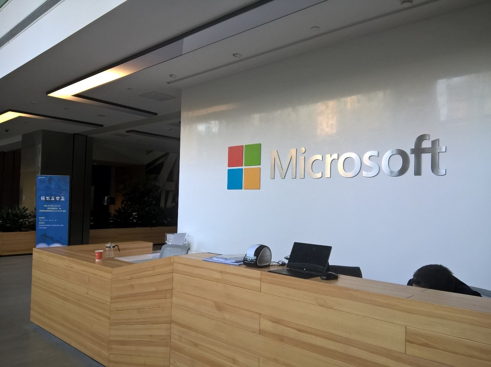

# Microsoft MPC Hackathon

> 2016/5/28 – 29
>
> Team Hack Tour: 李俊宁/王明哲/张悦枫/朱其泰/边红

## 写在前面

这是我人生中参加的
- 第一次正式的Hackathon，
- 第一次晚上只睡一小时的经历，
- 第一次和至少强于我五倍的人合作。

## 赛前

非常巧，在大创展的时候接到一个电话——
邀请我们的随机大师团队去参加一个微软的hackathon；
由于李林旭比较忙，所以我打算自己组一个团队去。

第一次收到别人的hackathon邀请，好开心~
事实上，事后发现这次被邀请的hackathon
是[Azure的云中黑客松](http://hacking.kaiyuanshe.cn/site/azure-open-hackathon)，
而不是[MPC Hackathon](http://www.k4w.cn/Hackathon.html)。

不过都是机缘巧合啦，开心就好。

起初，我希望找几个美(mei)工(zi)去加快我们的开发速度，
我问了好几个，不过她们都没时间或者觉得两天时间太长。

之后，我又找了袁哲，他也没时间。
最后我找了志龙学长和明哲大大，这两个人愉快的答应了。
我想了想，还是要体验一下有女生的团队合作，于是找了一个找我一起做大创的张悦枫。
不过几天后，志龙因为大作业要赶工就不去了。最后定下我们三个人。

就在周四(5/26)的下午，我突然发了高烧。
之后经过了一个晚上的休息和周五(5/27)一天的休息，高烧终于退了，
身体没之前那么软了，不过喉咙还是很痛。
不能放弃，我预感这次比赛会很精彩。

## Day 1

### 8点50分

和明哲碰面后，我们就去简单的签到了，进去坐了下来。
张悦枫由于要考数字电路，只能11点到。

### 9点30分

API宣讲开始了，首先是一个外国人
(Yannis Paniaras，前Nokia Staff，现Design Team)，
他讲的是Design相关的东西。

最后我问了个问题：“如果要实现responsive UI，是在C#还是Xaml上的实现”。
之后吃了点心，又轮到了微软中国开发顾问的关于
Hello/Cognitive/Kinect Face/Cortana/Ink的演讲。

 
### 13点15分

漫长的宣讲终于结束了（明哲已经困了），
我们三个人就一起去吃饭和想idea了。
感觉伙食好好，各种水果/果汁/肉食/巧克力… 都好好吃，而且可以免费添加。
期间，明哲大大想了两个不错的idea：
- 基于Cortana的快速截屏-搜索-反馈
- 关怀自闭症儿童的情绪培养app。

### 13点30分

吃完饭了，开始进行组队。
由于强制5人一个团队，我们三人就组了两个外来的朋友——
朱其泰(一个晋级选手，也是两个工作人员的同学)，
和边红(一个微软中国开发顾问的朋友，一个刚刚成为妈妈的姐姐)。

于是，五个人就组成了一个团队；队名还是用之前随便起的Hack Tour。
之后大家就开始讨论idea了。

### 15点

由于我要反馈Cortana的bug，我找到了开发顾问的人聊。
等我回去之后，大家大致定下了project的方向和功能——
一个基于Project Oxford的幼教的app，
大概有四个方面的功能：
- 看脸选情绪
- 模仿情绪的表情
- 拍照识物
- 学习写字。

我大概看了看，感觉还是不错的，就答应了。
边红姐姐由于有事，就先撤了。接下来就是我们的开发了。
我大致分了一下工作，明哲负责写Project Oxford相关内容，
其泰负责UI的Xaml设计，悦枫负责和其泰一起做UI，
我负责将后端和UI连接以及交互逻辑。

我们按照四大功能的顺序进行开发。

### 15点30分

我们开始写啦~

其中最坑爹的是一开始的如何将“看脸选情绪”的
将明哲从Bing Image弄回来的图片装入Image控件，
于是各种神奇的stream和bitmap就出现了。

这个地方卡了一个小时，最后用直接让明哲返回URL，
我重新加载source的URI来walk around。
还好明哲的速度很快，前两个需求的后端逻辑都已经敲完了。

### 16点30分

之后就比较顺利了，不久就完成了第一个功能（两行代码）的接入和测试。
UI那边还在学Xaml。由于明哲写完了负责的部分就很闲了，我就让他到UI那边帮帮忙；
最后UI完成了功能选择界面。

于是，我开始研究怎么用Camera，打算弹出窗口来拍照；
不过神坑，一直到了弹窗就停了，debug了好久
（最后知道是没在manifest申请webcam权限）。

### 19点

开饭喽。

晚餐一样的丰盛，最后还有很多吃剩的东西，感觉和没吃过一样
（或许是某些团队太拼了没吃的结果）。

### 19点30分

继续开发。

### 20点

开始看Sample的Camera，自己折腾了好久，才发现是manifest没申请webcam权限。
然后就顺利了。

### 23点30分

Camera弄好了，第二个功能的内部逻辑已经完成，
不过Camera还是有点问题（占用后不能Dispose），不过算了，能用。
到了晚上效率开始下降。

明哲已经写完了前三个部分了（膜），第四个部分不需要他做；
UI那边大概完成了功能内部框架的设计，不过没有做出功能的具体界面。

### 24点

明哲不放心明天，就让我们app先合一次代码。
我大概折腾了一下，发现只能合一点点，因为功能页面还没写；算了先睡觉吧。

### 24点30分

顶不住了，去刷了牙，和大家一起去旁边一个会议室打地铺了。

## Day 2

### 0点30分

或许真的不用乱说话，本来说好第一个睡着的，结果变成了凌晨四点睡着，
五点钟被太阳亮醒。或许是因为有点冷加上身体不适和过度兴奋，睡不着。

半夜里大概想了一个不错的idea，
让我们的app支持hands-off操作——全程聆听语音命令+Cortana接入；
然后让明哲写个Oxford的voice + LUIS。

### 5点

刷刷手机，又躺了躺，毕竟还是要保存体力。
之前一直纠结要不要Surface作死升级Red Stone 1来做Ink，
之后看到blog上有关于旧版的InkCanvas的API，心里放宽了。

### 6点

起床了，刷个牙，喝杯热水，喝杯咖啡，HACK ON！

### 6点30分

大家陆续起床了，开始工作。

我随即作出了一个重大决定——明哲大大转向UI工作。
虽然他不大愿意，但是为了我们的效率~
之后我把之前的工作移到了一个单独的page，并将功能框架合并到了master里。

### 7点30分

吃早餐啦。

不过早餐是真功夫的，只有两个面包和一碗粥，差评。

### 9点

我这边完成了第三个功能的内部逻辑和语音识别的逻辑；
在明哲的带领下，UI方面完成了第一个功能的界面，
于是界面和界面逻辑合并的工作终于可以开始了（心累）。
然后姐姐也来了，她负责最后的presentation的设计。

之后，我决定将第三第四个功能的界面合并——
用户小朋友拍照后显示拍照主体的中文+英文，
单击发出读音并让用户跟读，
双击进入临摹界面进行手写学习，优化一致性体验。

### 10点30分

第一个功能正式完成，第二个的界面也出来了，继续合并。
一开始我打算用background task来实现自动拍照识别，
结果和以前一样，C#的Task的毒性太强最后放弃了。
改用双击屏幕来实现拍照。

### 12点

UI在明哲的带领下果然速度加快了好多，第三个功能的界面完成了；
另外，他们在功能框架上加入了成就功能——用一颗小树的成长来提现成就。

我这边，除第三个功能外所有部分的合并完成。

### 12点30分

午餐变成了一个汉堡，一包薯条，一杯可乐。
我大概为了保住喉咙，只吃了汉堡和可乐。

完成了第三个功能的显示中英文及发音+跟读（之后发现跟读毒性太强，删掉了）。
由于我这边比较忙，就让明哲来写小树成长了。

### 13点30分

完成了第三个功能的所有的部分。

最坑的还是各种控件对点击事件的支持，
最后实现的是点击中文/英文先发音，再进入临摹界面。

然后各个评委老师来了，其中有之前来过北邮的梁健和杨滔老师。
一个用户体验的老师认为我们的作品内容过多，广而不深；
另一方面，如果是面向自闭症患儿童，缺少严肃性。

### 14点

比赛结束了。

我们组运气还不错，抽到了第8个演示的签（总共11个队）。然后我就继续写手写功能了。

由于InkCanvas丢到Grid里面之后就不能用了，于是我们就让那个page直接独立开，
全屏手写。最后由于控件重叠的原因，我们没有实现临摹功能，最后直接在空白处写了。

姐姐决定最后的三分钟presentation用表演来进行，于是和明哲去排练了。

### 14点30分

所有功能完成，然后继续修细节。
由于做demo的需要，我们将原来写的代码进行了一些细节的修改——
减少可能的要模仿的表情的种类来提高正确率，反馈是否正确后伴随语音读出，
点击英文不进入临摹界面（因为临摹界面没做返回）。

明哲和姐姐继续排练。

### 16点30分

我们的presentation效果不错。

姐姐因为有事，先走了。

### 17点

所有的demo演示结束，来了一个赞助商讲解他们的新型USB3.0 有源混合光纤数据线。
之后的抽奖中，我获抽到了一条，据说1000多。第一次抽奖被抽到，好开心。

### 17点30分

评奖结束了，我们拿了三等奖（第5名）。

每个人得了一个2011年生产的Arc Touch鼠标，我们组得了一条光纤USB。
然后他们给了我，于是我就有了两条线（真心不知道拿来干什么）。

之后所有人拍了个大合照，我们剩下的四个人拍了一堆照片。

## 写在最后——写给十年后的自己

> Be the best you. You can always be whatever you are.
