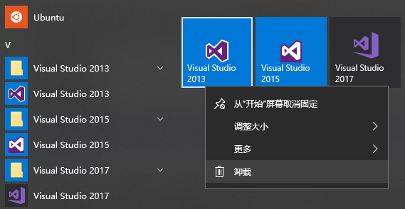

# 回调 vs 接口

> 2017/12/13
>
> There are just two kinds of languages: the ones everybody complains about and the ones nobody uses. —— Bjarne Stroustrup

[heading-numbering]

如果还不知道什么回调函数，可以阅读 [如何浅显的解释回调函数](Callback-Explained.md)。

## [no-toc] [no-number] TOC

[TOC]

## 一个故事

### 背景

前一段时间有一个类似的需求：

- 在 Windows 10 的开始菜单上新增右边的 **磁贴条目**（原来只有左边的 **列表条目**）
- 如果左边（或右边）的某个快捷方式被删除，右边（左边）展示的项目会对应消失
- 也就是，**同一套数据模型** 在 **多处展示**，某一处对数据模型的修改，需要 **同步** 到其他各处



为了实现这个功能，我们重构了相关的代码：

- 把原来的 **自治 view 模式** 转换成了 **MVC 模式**
  - 原来是 view 直接修改 model，并修改展示的内容
  - 现在是 view 通过 controller 修改 model，model 的更新通知 view 修改展示的内容
- 使用了 [观察者模式](Design-Patterns-Notes-3.md#Observer)
  - 避免了 model 对 view 的直接依赖
  - model 只有一个，而未来可能有更多的 view 加入，不能耦合

而在这次观察者模式的实践中，我遇到了一个问题：通过继承 **`IObserver` 接口**，还是直接使用 **回调函数对象**，来执行 model 对 view 的通知呢？

### 方案 1：接口

首先，定义 `IObserver` 和 `IObservable` 接口：

``` cpp
class IObserver {
public:
    virtual void OnNotified () = 0;
};

class IObservable {
public:
    virtual void Register (IObserver *observer) = 0;
    virtual void Unregister (IObserver *observer) = 0;
    virtual void NofityAll () = 0;
};
```

然后，改造 model，继承 `IObservable`，并实现注册、通知相关函数：

``` cpp
class Model : public IObservable {
public:
    void Register (IObserver *observer) override;
    void Unregister (IObserver *observer) override;
    void NofityAll () override;
};
```

对于 view 有两种实现方法：

**a) 继承 `IObserver`**

- 改造原有的 view，继承 `IObserver`，并实现接收到 model 通知的处理逻辑
- 注册到 model (`IObservable`) 上，然后 model 回调 `OnNotified`

``` cpp
class View : public IObserver {
    Model *_model;
public:
    View (Model *model) : _model (model) {
        _model->Register (this);
    }
    ~View () {
        _model->Unregister (this);
    }
    void OnNotified () override {
        // handle model update
    }
};
```

**b) 组合 `IObserver`**

- 针对每个 view 定义独立的继承 `IObserver` 的类
- 把这个类的对象，作为成员变量，组合到 view 中
- 从而避免把 `IObserver` 耦合到已有的 view 类上

``` cpp
class ObserverForView : public IObserver {
    View *_view;
public:
    ObserverForView (View *view)
        : _view (view) {}
    void OnNotified () override {
        // handle model update using _view
    }
};

class View {
    std::unique_ptr<ObserverForView> _observer;
public:
    View () : _observer (new ObserverForView { this }) {}

    // register/unregister _observer at ctor/dtor
};
```

### 方案 2：回调

- 首先，定义 `ModelObserver` 为 `std::function`
- 并为 model 加入 `IObservable` 相关的操作

``` cpp
using ModelObserver = std::function<void ()>;

class Model {
public:
    void Register (ModelObserver *observer);
    void Unregister (ModelObserver *observer);
    void NofityAll ();
};
```

而 view 需要给 model 注册一个 `std::function` 对象，在对象内处理 model 的通知。

这里也有两种轻量的实现方法（这里还有更多的方法）：

**a) 绑定成员函数**

- 利用 `std::bind` 绑定成员函数得到 `std::function` 对象
- 将具体的处理逻辑委托到成员函数 `OnNotified` 内实现

``` cpp
class View {
    std::unique_ptr<ModelObserver> _observer;
public:
    View () : _observer (new ModelObserver {
        std::bind (&View::OnNotified, this) }) {}

    // register/unregister _observer at ctor/dtor

    void OnNotified () {
        // handle model update using _view
    }
};
```

**b) 构造闭包**

- 如果不希望引入新的成员函数，可以使用 lambda 表达式构造[闭包 _(closure)_](https://en.wikipedia.org/wiki/Closure_%28computer_programming%29)
- 闭包内捕获 view 的本身，并在回调过程中使用 view 相关的数据

``` cpp
void View::SetObserver() {
    auto onNotified = [this] {
        // handle model update using _view
    };
    _observer.reset (new ModelObserver { onNotified });
}
```

## 回调 vs 接口

我们讨论的这个问题很早以前就有人提出了：两种方式各有什么优缺点呢？

- 使用回调（`std::function` / `std::bind`）
- 使用接口（抽象类），传递派生类对象，调用这个对象的函数

[这个回答](https://stackoverflow.com/questions/22362691/pros-cons-of-a-callback-stdfunction-stdbind-vs-an-interface-abstract-cl/22366369#22366369) 讲的很好：

- 答主支持使用 **回调** 的方式
- 使用 **接口** 的最大问题在于：需要定义 `IObservable` / `IObserver` 接口，并把原有的 类层次结构 _(class hierarchy)_ 耦合到新增的接口里 _(your type must be coupled to this hierarchy)_
- 而使用 **回调** 借助 `std::function`，可以装载 全局函数 _(global function)_、成员函数 _(member function)_、函数对象 _(function object, functor)_、匿名函数 _(anonymous function, lambda)_ 等，避免了各种破坏原有结构的接口
- C++ 标准库中：几乎所有的算法都是基于迭代器的，但没有统一的 `Iterator` 接口；比较两个对象也不需要标准的 `Comparable` 接口

> 2018/12/29 补充：[简单的 C++ 结构体字段反射](../2018/Cpp-Struct-Field-Reflection.md)
> 
> 讨论了 C++ 标准库如何利用 **泛型** _(generic)_ 可调用对象，实现 **编译时多态** _(compile-time polymorphism)_ 机制，从而避免引入 `Iterator`/`Comparable` 接口。

对于回调者，它关心的往往是一个 **可调用** _(callable)_ 的东西，只关注它的 **参数、返回值**，而不关心调用的东西具体是什么。所以：

❗❗❗ 回调是 **面向语义接口** 的回调，而不是 **面向语言接口** 的回调！

> Favor object composition over class inheritance.（组合优于继承）—— GOF
>
> “继承就像一条贼船，上去就下不来了” —— [《以 `boost::function` 和 `boost::bind` 取代虚函数》陈硕](https://github.com/downloads/chenshuo/documents/CppPractice.pdf)

另外，使用接口的方式还有一个问题：**实现了不同接口的可调用实体之间不能相互转换**。例如，我们定义了一个接受鼠标点击事件的接口 `IMouseClickHandler`。

``` cpp
class IMouseClickHandler {
public:
    virtual void OnClicked () = 0;
};
```

尽管这个 `IObserver` 和 `IMouseClickHandler` 里的函数签名一致，但是他们的子类对象不能相互转换。如果我们想用一个函数，同时处理 `IObserver::OnNotified` 和 `IMouseClickHandler::OnClicked`，就不能直接把对象绑定到两个的事件发送者上了。

而对于使用回调的方法，`using MouseClickHandler = std::function<void ()>;` 和 `ModelObserver` 却是相同类型的，可以相互转换。

> 2019/1/16 补充：[对编程范式的简单思考](../2019/Thinking-Programming-Paradigms.md)
> 
> 从语言层面上看，接口属于 [**面向对象** _(object-oriented)_](https://en.wikipedia.org/wiki/Object-oriented_programming) 的概念，而回调属于 [**函数式** _(functional)_](https://en.wikipedia.org/wiki/Functional_programming) 的概念：
> 
> - 函数式中，函数是 [**一等公民** _(first-class function)_](https://en.wikipedia.org/wiki/First-class_function)；面向对象中，对象是一等公民（一等公民指，和基础类型 `int`/`double` 有同等地位）
> - 函数式中，函数可以 作为参数传递/通过返回值返回，即 [**高阶函数** _(higher-order function)_](https://en.wikipedia.org/wiki/Higher-order_function)；面向对象中，只能 传入/返回 实现接口的具体对象
> - 函数式中，**可调用实体** 可以直接调用，并执行对应函数；面向对象中，**实现接口的对象** 只能通过指定接口调用，并执行对应的实现函数

## 回调的实践

可调用的概念早在很多语言里都有实现。

### C 语言中的回调（面向过程语言）

对于 C 风格的回调函数没有闭包的概念，不能方便的实现可调用对象，只能定义回调接口，然后定义业务逻辑处理函数实现接口，并通过回调函数的参数传递上下文变量。

例如，使用 libevent 监听 socket 可写事件，实现异步/非阻塞发送数据：

``` c
// callback interface
typedef void (*event_callback_fn)(evutil_socket_t, short, void *);

// callback code
void do_send(evutil_socket_t fd, short events, void* context) {
  char* buffer = (char*)context;
  // ... send |buffer| via |fd|
  free(buffer);
}

// client code
char* buffer = malloc(buffer_size);
// ... fill |buffer|
event_new(event_base, fd, EV_WRITE, do_send, buffer);
```

- 由于 C 语言没有对象的概念，不支持可调用对象，必须通过 **定义回调格式接口** 实现
  - 定义回调接口 `event_callback_fn`
  - 实现回调接口 `do_send`，在该函数中处理业务逻辑
- 由于 C 语言没有对象的概念，不支持闭包捕获上下文，必须通过 **回调接口的 `context` 参数** 传递上下文数据
  - client 代码申请发送缓冲区 `buffer` 资源，并作为 `context` 传入注册函数
  - callback 代码从 `context` 中取出 `buffer`，发送数据后释放 `buffer` 资源

### Javascript 语言中的回调（面向对象脚本语言）

在 JavaScript 里，**回调**、[**闭包** _(closure)_](https://developer.mozilla.org/en-US/docs/Web/JavaScript/Closures) 是一个最基本的概念。

在网页里，我们常常使用回调来处理用户的输入：

``` html
<button onclick="alert('haha 😁 ~')">Click Me</button>
```

[align-center]

<p>
<button onclick="alert('haha 😁 ~')">Click Me</button>
</p>

代码里的 `alert('haha 😁 ~')` 就是一个回调对象，注册到按钮的点击事件上。对于 JavaScript 的回调，并 **不需要定义接口**，只需要给回调对象传入参数，然后调用就行。

### C++ 语言中的回调（面向对象编译语言）

对于 **不做类型检查、原生支持内存回收** 的脚本语言来说，回调就是一个巨大的福利。而对于 **强类型、强检查** 的 C++ 语言而言，回调最大的问题在于如何 **构造和存储可调用实体**。主要有两个难点：

- 构造可调用实体时，需要捕获并存储一些上下文变量（构成 **闭包**），要求满足其中一点：
  - **拥有** 这些变量的 **所有权**；确保他们的 **生命周期** 持续到 **回调时刻**
  - **没有** 这些变量的 **所有权**；如果在 **回调时刻** 已经 **失效**，能被 **检查** 出来
- **不同的可调用实体** 往往有 **不同的类型**，而且 **不能相互转换**，难以使用一个特定类型的变量存储

第一个问题可以通过下面 4 种方法解决：

- 使用同步回调（在可调用对象生命周期结束前完成回调），从而保证捕获变量的声明周期能超过回调时刻（raw-ref 语义）
- 将上下文变量通过 拷贝或移动 传入闭包，在闭包内一般以只读的方式使用传入的变量（copy/move 语义）
- 捕获变量的强引用，确保能在回调时或回调后释放（shared-ref 语义）
- 将变量的弱引用传入闭包，在回调时检查变量的有效性（weak-ref 语义）

而第二个问题就非常棘手了：C++ 是一个 **强类型、强检查** 的语言，所有 **函数的调用都必须基于明确的接口**，而这个接口需要在编译时明确指定。为了解决这个问题，C++ 约定使用 `operator ()` 作为 [**可调用** _(callable)_](https://en.cppreference.com/w/cpp/concept/Callable) 的接口 —— 凡是可以通过 `xxx (...)` 调用的东西，就是可调用的。拿到一个可调用对象 `obj`，只需要通过 `obj (...)` 就可以对这个对象进行调用 —— 调用者只关心给 `obj` 传入的参数和它的返回值。

而为了让各种类型的可调用实体能 **转换到这个接口** 上，标准库利用模板的奇技淫巧设计出了 **函数适配器** _(function adaptor)_。最核心的有三个：

- `std::function`
  - 装载不同类型的 **可调用实体** 全局函数 _(global function)_、成员函数 _(member function)_、函数对象 _(function object, functor)_、匿名函数 _(anonymous function, lambda)_ 等，把它们 **适配到统一的接口上**
  - 对装载的实体 **类型擦除** _(type erasure)_，抹去实体原本的实际类型，仅 **保留** **函数签名** _(function signature)_
- `std::bind` 通过绑定参数，实现函数参数的 **[部分应用](https://en.wikipedia.org/wiki/Partial_application)**，从而 **修改** 函数签名
- `std::mem_fn` 将 **类成员函数** 转换为以类对象为第一个参数的 **普通函数**，也 **修改了** 函数签名

很多人会好奇：`std::function` 是怎么实现的？这里有一个 [简单的实现原理](https://shaharmike.com/cpp/naive-std-function/)。（测试代码：[`std_function.cpp`](Callback-vs-Interface/std_function.cpp)）

> 2019/1/12 补充：[深入 C++ 回调](../2019/Inside-Cpp-Callback.md)
> 
> 更系统的讨论了 C++ 回调的设计问题，并分析了 [Chromium 的 Bind/Callback 机制](https://github.com/chromium/chromium/blob/master/docs/callback.md)。
> 
> 2019/10/16 补充：[设计 `std::function` 时需要考虑哪些问题](https://quuxplusone.github.io/blog/2019/03/27/design-space-for-std-function/) (by Arthur O’Dwyer)？
> 
> - 核心语义层面
>   - 是否接管 Callable 的所有权
>   - 如果接管了所有权，是否可拷贝（以及如何处理不可拷贝的 Callable）
>   - 如果可拷贝，是否共享底层的 Callable 对象（针对有状态闭包）
>   - 是否支持不可移动的 Callable
> - 是否支持小 buffer 优化
> - 是否支持空状态
>   - 是否支持默认构造
>   - 被移动后，是否进入空状态
> - 类型擦除问题
>   - 是否支持类型还原
>   - 是否支持类型转换（签名兼容时可以转换）
> - Callable 签名问题
>   - 如何支持变长参数
>   - 如何支持 `const`
>   - 如何支持引用限定符
>   - 如何支持 `noexcept`
>   - 是否支持函数签名重载

## 写在最后 [no-number]

~~由于最近太忙了，这篇文章准备了大半个月。~~

感谢 [@WalkerJG](https://github.com/WalkerJG) 和 [@htfy96](https://github.com/htfy96) 提出的修改意见。

如果有什么问题，**欢迎交流**。😄

Delivered under MIT License &copy; 2017, BOT Man
