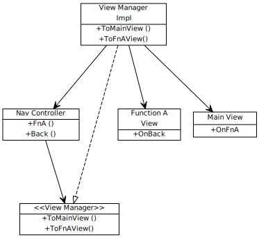

# 如何优雅的把命令行界面 Hack 到 Qt 界面

> 2017/6/17
>
> We are all apprentices in a craft where no one ever becomes a master.
 —— Ernest Hemingway

[heading-numbering]

## [no-toc] [no-number] TOC

[TOC]

## 为什么

前一段时间，为了完成软件工程的大作业，我们设计了一个 [分布式温控系统](https://github.com/BOT-Man-JL/BUPT-Projects/blob/master/3-2-Software-Engineering)。而这个系统最原始的版本是 **命令行界面** _(CLI)_ 的，根据需求，我们需要为它设计并交付一个 **图形化界面** _(GUI)_ 的版本。

当然，不管是命令行还是图形化，系统的 **业务逻辑** _(business logic)_ 是相同的 —— 两个版本可以共享这部分代码。

## 设计

在设计图形界面之前，需要设计一个能 **同时** 服务于命令行和图形化界面的可扩展性架构。

### 耦合的设计

首先，假设我们有一个需求如下图。程序有两个界面：主界面和功能 A 界面；在主界面上选择 _功能 A_，就跳转到功能 A 界面；在功能 A 界面上选择 _返回_，就回到主界面。

[align-center]


[align-center]

（矢量图，可放大）

接下来，我们增加了新的需求：在进入功能 A 界面前，需要对用户进行身份认证。也就是增加一个新界面（认证界面）：

- 在主界面上选择 _功能 A_
  - 如果已经登录，就跳转到功能 A 界面
  - 如果没有登录，就跳转到认证界面
- 在认证界面 _登录_ 后，就跳转到功能 A 界面
- 在功能 A 界面 _注销_ 后，就回到认证界面
- 另外，认证和功能 A 界面都可以直接返回主界面。

（具体导航关系如下图）

[align-center]


[align-center]

（矢量图，可放大）

对于没有使用 MVC 的程序，所有的 **业务逻辑**、**导航逻辑**、**交互逻辑** 都写在 **视图内部**。这样设计破坏了 [开闭原则](https://en.wikipedia.org/wiki/Open/closed_principle)：

- 在业务更新中，需要大动干戈的修改已有代码
- 如果从命令行版本升级到图形化版本，需要几乎重写所有代码

### 更好的设计

为了实现可扩展性，一开始，我们就采用了 [MVC](https://en.wikipedia.org/wiki/Model-view-controller) 架构进行设计。

[align-center]



[align-center]

（矢量图，可放大）

整个架构在界面的部分主要有：

- **视图** _(View)_ 处理 **交互逻辑**
- **视图管理器** _(View Manager)_ 处理 **导航逻辑**
- **控制器** _(Controller)_ 处理 **业务逻辑**

在这个设计中，三者的关系为：

- **控制器** 根据对业务逻辑的处理，调用 **视图管理器** 进行界面导航
- **视图管理器** 在界面导航时，将控制器的 **操作** _(action)_ **绑定** _(bind)_ 到视图的 **系统事件** _(event)_ 上。
- **视图** 在接收到用户输入时，根据交互逻辑转为 **系统事件**，调用被绑定的 **回调函数** _(callback)_ 进行处理 —— 也就是控制器的 **操作**。

#### 应对新需求的可扩展性

当新需求到来时，我们只需要增加新的模块，然后重新绑定响应的操作就可以。

[align-center]


[align-center]

（矢量图，可放大）

例如上图：

- 视图：添加了认证界面和功能 A 界面的注销逻辑
- 视图管理器：添加了到认证界面的导航逻辑
- 控制器：增加了处理和认证相关业务的控制器

#### 针对不同视图的可扩展性

基于 MVC 的设计可以很好的解除视图对控制器的耦合。

对于上述设计，只需要 **重新设计** 基于 **图形化** 界面的 **视图**，并在 **视图管理器** 的实现中 **绑定** 到图形化视图，就可以实现了 **命令行到图形界面** 的迁移。

除了一般的命令行到图形化的迁移，再假设这样一个场景：

- 原始的需求中，要求一个功能 B 界面：在界面上输入一个用户名，界面上显示该用户最近一次登录时间
- 新的需求中，要求功能 B 通过 **HTTP** 请求输入用户名，并返回最近一次登录时间

对于上述设计，只需要把基于图形化或命令行界面的 **视图**，**重新设计** 为基于 **HTTP** 的视图（请求相当于界面输入，响应相当于界面输出），并在视图管理器中 **绑定** 这个视图（启动 HTTP 服务器），就可以实现 **用户界面到网络界面** 的迁移了。

## 实现

尽管我个人不喜欢 Qt 的设计风格（例如引入的关键字 `signals` `slots` 完全可以用 C++ 的方式实现，**欢迎指正**），但是 Qt 仍是一个非常流行的 C++ 图形库。所以，我们这次打算使用 Qt 作为图形界面的解决方案。

### 命令行版本架构的实现

**视图** 有一个统一的接口 `Show` 函数，即所有视图继承抽象基类 `ViewBase`。视图的 `Show` 函数显示界面，处理 **交互逻辑**，并在界面退出后返回。

``` cpp
class ViewBase
{
public:
    virtual void Show () = 0;
    virtual ~ViewBase () {}
};
```

**视图管理器** 利用一个 `Start` 函数进行启动，其原理是：将当前界面替换为下一个待显示的界面，显示新的界面，循环这个过程直到没有新界面需要显示。对于每个页面，调用接口定义的 `Show` 函数，并阻塞到界面退出。

``` cpp
class ViewManager                // CLI Version
{
    std::unique_ptr<ViewBase> _viewNxt;
    std::unique_ptr<ViewBase> _viewCur;

public:
    void Start () {
        while (_viewNxt) {
            _viewCur = std::move (_viewNxt);
            _viewCur->Show ();   // Block Here
        }
    }

    void ToMainView (...);       // Set _viewNxt
    void ToAuthView (...);       // Set _viewNxt
    void ToFunctionAView (...);  // Set _viewNxt
};
```

> 之所以导航时没有直接替换 `_viewCur`，而 **缓冲** _(buffer)_ 到 `_viewNxt`，是因为页面导航发生在 `_viewCur` 的 `Show` 函数结束前，这时不能在成员函数内部析构 `_viewCur` 对象。
>
> 这里使用 `unique_ptr` 进行垃圾回收（View 切换时，ViewManager 析构时）。

**主模块** 首先导航到起始界面（主界面），然后调用 `Start` 函数启动视图管理器。

``` cpp
int main (int argc, char **argv)
{
    ...
    ViewManager manager;
    manager.ToMainView ();
    manager.Start ();
    ...
}
```

### Qt 和命令行交互的不同

图形界面和命令行在交互逻辑上，有着本质的不同：

- 命令行的输入是基于终端的，图形界面的输入是基于窗口的
- 终端一个时刻仅有一个输入，窗口在一个时刻可以产生很多的输入
- 为此，操作系统给窗口提供了 **消息队列** 的机制，将并行的输入转化为串行。

例如，最简单的 Qt 项目：在程序启动时，构造一个 `QApplication`，然后构造并显示需要的窗口，最后调用 `exec` 处理 **消息队列** 并等待所有窗口关闭。

``` cpp
int main (int argc, char **argv)
{
    ...
    QApplication app (argc, argv);
    MainWindow wnd;
    wnd.show ();
    app.exec ();
    ...
}
```

`QApplication` 和我们在主模块中启动的 `ViewManager` 很相似，相当于是整个 GUI 的核心控制部分（管理导航逻辑）。所以两者在主模块中的操作具有相似之处：

- 构造一个 **视图管理对象** 用于视图管理
- 在视图管理器内部，构造并显示 **视图**
- 通过运行视图管理器，处理视图的 **交互逻辑**

但是，两者的处理流程在根本上有着不同之处：

- `Window` 的 `show` 是一个非阻塞函数（和 `ViewBase` 的 `Show` 语义不同），调用后立即返回
- `QApplication` 的 `exec` 是一个阻塞的函数（和 `ViewBase` 的 `Show` 语义相同），会阻塞到所有界面的退出 —— 也就是在所有的界面退出前，`exec` 函数不会返回（一直监听界面输入消息队列）

相反，命令行界面基于标准输入输出流，不需要额外的启动辅助代码，也不需要监听任何用户消息。为了实现命令行界面的 **导航逻辑**，我们不得不保留 `ViewManager`。

### Let's Hack Qt

为此，我们需要为 Qt 做一个专门的 `ViewManager` 实现。这里仅需要改造已有的 `Start` 函数：

- 在 `Start` 开始时，构造一个 `QApplication` 对象
- 在 View 的 `Show` 调用后，调用 `QApplication` 的 `exec` 进行消息处理
- 原本 View 的 `Show` 函数不阻塞，而将阻塞延迟到结束之后

``` cpp
class ViewManager                // GUI Version
{
    std::unique_ptr<ViewBase> _viewNxt;
    std::unique_ptr<ViewBase> _viewCur;

    int _argc;                   // *
    char **_argv;                // *

public:
    void Start () {
        QApplication app (_argc, _argv);  //   *
        while (_viewNxt) {
            _viewCur = std::move (_viewNxt);
            _viewCur->Show ();
            app.exec ();         // Block Here *
        }
    }

    void ToMainView (...);       // Set _viewNxt
    void ToAuthView (...);       // Set _viewNxt
    void ToFunctionAView (...);  // Set _viewNxt
};
```

#### 关于 View 的 `Show` 函数实现

对于 **命令行版本** 的 `Show` 函数，我们需要 **主动获取用户输入** _(active input)_。例如，提示用户输入命令后，UI 线程监听标准输入流（等待系统事件），获取用户输入的命令。

``` cpp
virtual void Show () override  // CLI Version
{
    std::cout << "Welcome, type what you wanna do :-)\n"
        " - 'fnA': Go to function A\n"
        " - 'fnB': Go to function B\n"
        " - 'quit': Quit this app\n";
        
    std::string cmd;
    while (true)
    {
        std::cin >> cmd;  // wait for event (cli input)
        if (cmd == "fnA") if (_onFnA) _onFnA ();       // event
        else if (cmd == "fnB") if (_onFnB) _onFnB ();  // event
        else if (cmd == "quit") return;
        else std::cout << "Invalid Command\n";
    }
}
```

对于 **图形化版本** 的 `Show` 函数，我们仅需要设置回调函数（也就是槽函数），图形界面系统（如 Qt）就把用户的输入（系统事件）串到消息队列上，并调用不同输入的回调函数（槽函数），从而实现了**被动获取用户输入** _(passive input)_。

和主动处理的方式不同，`Show` 函数仅需要将控制权下放到 `Window` 内部，通过回调的方式处理逻辑。例如，首先定义一个 `MainWindow` 类，然后在 `Show` 函数中构造并显示，最后在交互逻辑中关闭窗口。当用户点击 FnA 按钮，图形界面系统就会调用 `on_FnABtn_clicked` 函数（槽函数），从而调用了 `_onFnA`（控制器的操作）。

``` cpp
class MainWindow : public QWidget
{
    Q_OBJECT

    OnFnA _onFnA;
    OnFnB _onFnB;
    Ui::MainWindow *ui;

public:
    explicit MainWindow (QWidget *parent = 0);
    ~MainWindow ();
    
    void SetOnFnA (OnFnA &&fn) {
        _onFnA = fn;
    }
    void SetOnFnB (OnFnB &&onFnB);

private slots:
    void on_FnABtn_clicked () {
        if (_onFnA) _onFnA ();
        this->close();  // cause `exec` return
    }
    void on_FnBBtn_clicked ();
};

...

virtual void Show () override  // GUI Version
{
    MainWindow wnd;
    wnd.SetOnFnA (std::move (_onFnA));
    wnd.SetOnFnB (std::move (_onFnB));
    wnd.show ();  // NOT Block Here
}
```

> 实现上，可以在 `MainView` 的构造函数里提前构造 `MainWindow` 对象，在 `Show` 函数直接显示该对象。（坏处是：需要一个数据成员 `_wnd` 存储对象，会在 `MainView` 的定义中暴露出 _图形界面基于 Qt_ 的实现细节；放到 `Show` 内部就可以将这个细节隐藏在具体实现上）
>
> 为什么要设置 `SetOnFnA` `SetOnFnB` 函数接受系统事件响应逻辑函数（控制器的操作），而不在 `MainWindow` 构造函数之间传入？ 因为 Qt 的实现内部会多次构造 `MainWindow` 对象，所以要求 `MainWindow` 有默认构造函数（这里有点迷，**欢迎指正**）。

#### 关于退出界面

由于交互方式的不同，命令行界面只能主动退出界面（例如敲入 `quit`），而图形化界面可以被动的退出界面（例如点击右上角 `X` 关闭窗口）。

所以 Qt 要提供了重载 `closeEvent` 函数的方式，实现控制界面退出。当然，我们也可以通过传入相关的回调函数（可以是控制器的操作），处理这部分交互逻辑。

## [no-number] 写在最后

设计并无对错之分，只有优劣之别。

以上仅是我对界面架构设计的浅显认识。如果有什么问题，望**不吝赐教**。😄

Delivered under MIT License &copy; 2017, BOT Man