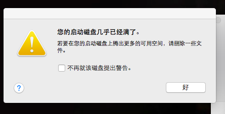
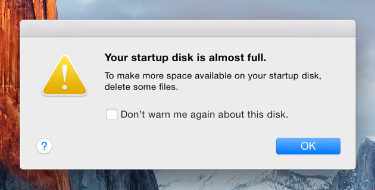
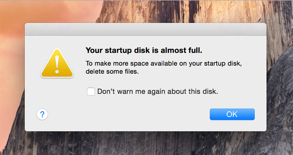
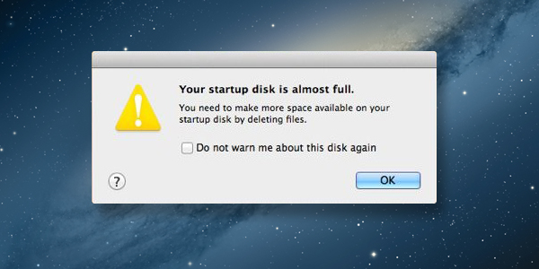

# 如何使用英文搜索

> 2017/2/20
>
> 分享一直以来积累的一点搜索引擎使用经验。Warning: TL;DR 😅

## 为什么

作为中国人，我们在日常生活中，离不开 **中文**；所以遇到不知道的问题时，往往会在 [百度](https://baidu.com) 上搜索。但是，对于很多问题（尤其是技术相关的），我们能找到的 **中文结果** 不尽人意（不管是 [谷歌](https://www.google.com.hk) 还是 [必应](https://cn.bing.com/) 或者 百度）：

- 在国内很多网站上，许多问题的回答都 **不够全面、专业、认真**，而且充斥着 **哗众取宠** 的回答；（对比一下 [Stack Exchange](https://stackexchange.com/) / [Segment Fault](https://segmentfault.com/)、[Quora](https://www.quora.com/) / [知乎](https://www.zhihu.com/)；当年，那个一直都在用 [百度知道](https://zhidao.baidu.com/) 的我，第一次上 [Stack Overflow](https://stackoverflow.com/) 的时候就被那些人的 **认真** 震惊了😂）
- 许多小网站喜欢 **抄袭** 其他网站的内容，删减了原文的样式，新增了许多广告；（例如，[博客园](https://www.cnblogs.com/) 上很多优秀的原创文章会第一时间被乱七八糟的网站 *据为己有*）
- 很多优秀的中文内容都是从 **英文翻译** 过来的；（比如，我看到微信公众号上有写的很好的文章时，第一反应就是找 **英文原文** 的链接）
- 国内很多资源站点喜欢以 **注册、积分** 的方式来留住用户，而国外多数人喜欢 **分享**；
- 多数的中文网页上有很多的 **庸俗的广告**；（不管是 **运营商植入**，还是 **站点本身**）

所以，我们不得不将自己的问题用 **英文** 描述，再去找更好的 **英文结果**。（另外，谷歌和必应会过滤 **不符合法律法规的内容**，而百度不会 🙄）

## 怎么做

就以前几天有人问我的 *Mac 笔记本磁盘空间不足* 为例。

> 注：作为一个没钱买奢侈品的人，我没有用过 *Mac*，不能直接给出解决方案。😅

### 中文搜索结果

通过输入 `Mac 启动硬盘 满` 进行搜索 **中文搜索**，得到的结果并不够好。

**以 百度 为例**

| 第一页结果来源 | 说明 |
|---|---|
| 百度经验 | 无 有效的解决方案 |
| pc6苹果网MAC资讯 | 有 解决方案，但不全面 |
| 威锋网 > 威锋论坛 > Mac综合讨论区 | 与 2 雷同 |
| 威锋网 > 威锋论坛 > Mac综合讨论区 | 无 完整的解决方案 |
| 百度知道 | 无 完整的解决方案 |
| 三联 > 电脑常识 | 与 2 雷同 |
| MacX.cn > Mac OS X 讨论区 | 无 完整的解决方案 |
| 百度经验 | 无 完整的解决方案 |
| 百度知道 | 无 有效的解决方案 |
| 知乎 | 无 解决方案 |
| 百度知道 | 无 有效的解决方案 |

又尝试了 谷歌 和 必应，得到的结果与 百度 的结果 **类似或相同**，多数与 百度 的结果 2 相同。

### 第一次 英文搜索

由于不知道 `Mac 启动硬盘 满` 的英文表述，所以简单的翻译为 `mac boot disk full`，进行 必应 搜索。

看到了很多相关的结果描述为 `Your Mac's Startup Disk Is Almost Full`，而且内容的截图和中文的很相似。

### 第二次 英文搜索

将原来的关键词修正为 `mac startup disk full`，再进行 必应 搜索。

这样就得到了 **英文关键词**，想要的答案也就在那里了。

## 总结

对于很多自己不是很清楚的问题，我们可以通过逐步尝试的方法获得 **英文关键词**，从而搜索答案。

例如，可以通过搜索引擎的提示，一步一步的摸索 **抓谱** 的 **关键词翻译**：

- Convert music to notes
- Convert music to **music notation/sheet music**
- Convert **audio** to music notation/sheet music
- **Transcribe** audio
- Transcribe **music** / **music** transcription

尽管意思相近的关键词也可以找到很好的结果，但是一步一步修正可以获得 *抓谱* 的翻译。

> 如果对文章有什么问题，欢迎指教。😉
>
> https://github.com/BOT-Man-JL/BOT-Man-JL.github.io/issues