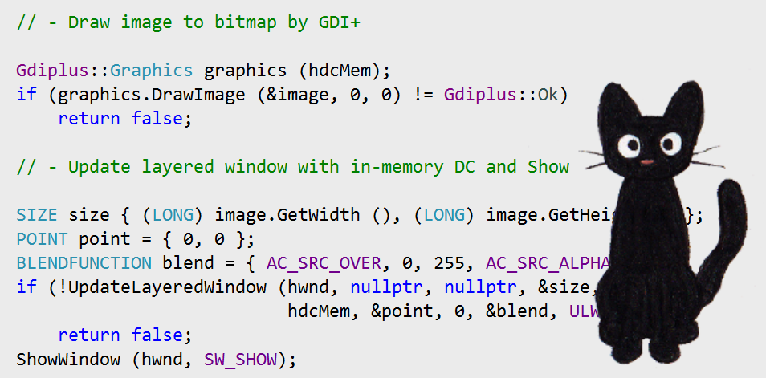

# 最简单的分层窗口样例

> 2017/10/6
>
> New York is 3 hours ahead of California,
> but it does not mean that California is slow,
> or that New York is fast.

[heading-numbering]

## [no-toc] [no-number] TOC

[TOC]

## 需求

根据 [MSDN](https://docs.microsoft.com/en-us/previous-versions/ms997507%28v=msdn.10%29) 描述，为了提升 Windows 应用程序视觉效果，Windows 2000 引入了 **分层窗口** _(Layered Window)_ 的概念。

什么是 **分层窗口**？我们一般看到的 Windows 应用程序窗口都是 **矩形窗口** _(rectangle)_ —— 上边是标题栏，下边是窗口内容区域。使用这样的窗口，我们不需要太多额外的学习成本。

但是，有时候我们为了让程序更加美观，需要做一些 **非矩形窗口** _(non-rectangle)_。例如，鼠标就不是矩形的；另外，它可以显示在屏幕的最上层，并且不会出现在任务栏上。

一个比较常见的应用就是，很多年前流行的 **桌面虚拟宠物** _(desktop virtual pet)_。



> _jiji_ by &copy; _Kirei-Kaze (Breeze Kruse)_

## 实现

和普通的应用程序一样，桌面宠物也 “生活” 在一个窗口里，不过这个窗口有点特别：

- “宠物” 之外的部分完全透明，而且鼠标可以穿透透明区域
- 总是显示在屏幕最上层，不出现在任务栏，而且没有边框

Window 2000 之后，系统为我们提供的接口可以用很少的代码实现这个需求。

下面的代码用最简单的方式实现了上述需求。

- [完整代码](Minimal-Layered-Window-Example/minimal-layered-window-example.cpp) 加了注释只有 100 行
- 使用的 GDI 和 GDI+ 基础，MSDN 有 [入门教程](https://docs.microsoft.com/en-us/windows/win32/learnwin32/your-first-windows-program)
- [可执行文件下载](Minimal-Layered-Window-Example/virtual-pet.zip)

### 创建窗口

首先，我们使用 `CreateWindowEx` 创建一个窗口，放在屏幕 (100, 100) 的位置上。

- `CLASSNAME` 是已经使用 `RegisterClass` 注册的一个窗口类
- `WS_EX_LAYERED` => 分层窗口，内容可以透明
- `WS_EX_TOPMOST` => 置顶窗口，总是显示在屏幕最上层
- `WS_EX_TOOLWINDOW` => 工具窗口，不出现在任务栏
- `WS_POPUP` => 弹出窗口，没有边框（在这里不需要指定）

``` cpp
HWND hwnd = CreateWindowExW (
    WS_EX_LAYERED | WS_EX_TOPMOST | WS_EX_TOOLWINDOW,
    CLASSNAME, CLASSNAME, WS_POPUP, 100, 100, 0, 0,
    nullptr, nullptr, (HINSTANCE) GetCurrentProcess (), nullptr);
if (!hwnd) return false;
```

### 加载图片

由于系统提供的接口不能加载 png 文件（带透明度），所以这里使用了 _GDI+_ 加载图片。

``` cpp
Gdiplus::Image image (imageName);
if (GetLastError () != ERROR_SUCCESS) return false;
```

### 创建画布

- 创建一个和窗口兼容的 **设备上下文** _(device context, DC)_（类似于画布）
- 为这个 DC 创建一个和图片大小相同的 **位图** _(bitmap)_（类似于画布的实际内容）
- 检查刚刚位图的 **像素位数** _(pixel bits)_ 是否至少 32 位
  - 位图的像素位数有 1, 4, 8, 16, 24, 32 位等
  - 而只有 32 位的像素模型带有 **透明度** _(alpha)_ （ARGB 模型）
  - 1, 4, 8 位模型一般是 **颜色表索引模型**
  - 16, 24, 32 位模型一般是 **颜色分量值模型**

``` cpp
HDC hdcWnd = GetDC (hwnd);
HDC hdcMem = CreateCompatibleDC (hdcWnd);
HBITMAP hBitmap = CreateCompatibleBitmap (
    hdcWnd, image.GetWidth (), image.GetHeight ());
SelectObject (hdcMem, hBitmap);

BITMAP bitmap = { 0 };
GetObject (hBitmap, sizeof BITMAP, (void *) &bitmap);

if (!hdcWnd || !hdcMem || !hBitmap ||
    bitmap.bmBitsPixel < 32)  // PixelFormat32bppARGB
    return false;
```

### 绘制图片

使用 GDI+ 提供的接口，把图片带透明的，绘在画布上。

``` cpp
Gdiplus::Graphics graphics (hdcMem);
if (graphics.DrawImage (&image, 0, 0) != Gdiplus::Ok)
    return false;
```

### 更新窗口

最后一布就是 使用刚刚绘好的画布，更新一开始创建的窗口，并显示窗口。

- 不改变窗口的 **调色板** _(palette)_、位置（保持原来的 (100, 100)）
- 修改 窗口尺寸 为 图片尺寸
- 使用 整张画布 作为 窗口内容
- `ULW_ALPHA` => 使用 **混合函数** _(blend function)_ 方式更新窗口
  - 目前系统只支持 `AC_SRC_OVER` 和 `AC_SRC_ALPHA` 的组合，进行透明混合
  - 另外，`ULW_COLORKEY` 和 `ULW_OPAQUE` 分别支持 颜色混合、不透明混合

``` cpp
SIZE size { (LONG) image.GetWidth (), (LONG) image.GetHeight () };
POINT point = { 0, 0 };
BLENDFUNCTION blend = { AC_SRC_OVER, 0, 255, AC_SRC_ALPHA };
if (!UpdateLayeredWindow (hwnd, nullptr, nullptr, &size,
                          hdcMem, &point, 0, &blend, ULW_ALPHA))
    return false;
ShowWindow (hwnd, SW_SHOW);
```

最后，就展示出了我们的 **桌面宠物**。


## [no-number] 写在最后

本文仅是我对 Windows 编程的一些理解。如果有什么问题，望**不吝赐教**。😄

Delivered under MIT License &copy; 2017, BOT Man
