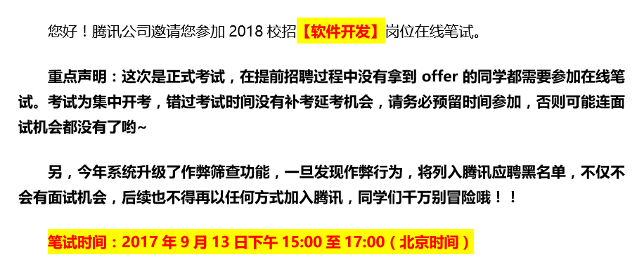
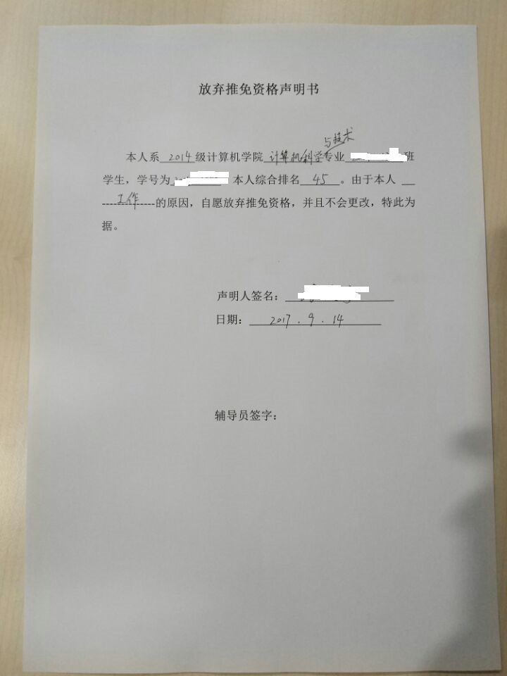

# 2017 最后的简短感叹

> 2017/12/31
>
> 累吗？累就对了，舒服是留给死人的。

<audio controls="controls" loop="loop" preload="auto">
  <source src="Thinking-Life-2/Nokia-Silver.mp3" type="audio/mp3" />
</audio>

## 前途

> 2017/9/17

时间过得很快，暑假已经结束。就在开学后短短的两周里，发生了很多的事情。

月初突然得到 **今年组里没有名额** 的消息，而之前又放弃了很多公司的机会，突然感觉前途有些不明朗，也有些后悔当时 **没有给自己留后路** 的错误决定。

[align-center]

（提醒没有拿到 offer 的同学参加秋招笔试）

就在同一周，又得到了 **获得保研推免资格** 的消息。有些欣喜，但也在情理之中。这让目前一个 offer 都没拿到的我，内心又燃起了一丝希望。

抱着拿着推免保底的心态，煎熬了差不多一周后，**Tom 哥决定收留我**，我于是放弃了保研的机会。

Tom 哥和我说的第一句话是：

> 先想想：你是想做客户端开发？还是只为了留在这里？

也许这句话就是所谓的 **初心** 吧。尽管接下来的生活节奏可能会比原来更快，我仍然很感激 —— 感激帮助我的人，感觉对我好的人。

## 工作

> 2017/10/12

可能因为我工作比较认真，或者因为其他人真的认为我的水平很高，组里先是给我批准了 **更高的权限**，再是分派 **更复杂的任务** —— “拿着实习生的工资，干正式员工的活”。也许是因为他们比较缺人，也许他们希望给我更多的机会锻炼和提升。

不过，听到最扎心的一句话：“这个是冲今年 KPI 的，加油今天做完 ... 刚入职就让你加班真是辛苦了。” 我：“没事，我明年入职。” 😂😂😂

## 红颜

> 2017/9/17

~~或许是因为物以类聚 🙄，~~ 和我比较熟的女生大都很漂亮，也很优秀：

- 双修 北大经济
- 保研 北大计算机
- 申到 学校的出国交换
- 拿到 腾讯产培 offer

当然，他们的 [男朋友](https://github.com/wyq730) [们](https://github.com/HelloSangShen) 也很优秀。。。🙃

有时候总感觉自己错过了很多机会，尽管不能稳赢。

但每次鼓起勇气的时候，总想着给自己 **找理由逃避** —— 不想认识更多的人，也不想主动和认识过的人说话 —— 因为还有很多更重要的事情等着我去做。

另外，总觉得未来 **还有更好的机会**，没必要为眼前的花费太多的时间。

也许最根本的原因还是：对于一个结果未知的赌局，我不愿意压下太大的筹码，因为 **我输不起** —— 输不起费了很大劲才攒起来的赌注，更输不起用来积攒更多赌注的时间。

## 生活

> 2017/12/31

很多时候，活得很累 —— 每天都戴着 **微笑面具**，只能在没人的时候摘下面具做做自己，因为 _no one wants the tears of a clown_。

不管怎么样，日子总要过。而很多时候，却不知道脚下的路通往何方，不知道它能不能把自己带到理想的目的地。于是，开始 **说服自己**，劝自己要 **把握当下** —— 因为走过的岔路口回不去了，现在能选的也只是下一个路口了。

虽然我总觉得自己的决定不是最好的 —— 还可以选择 “瘦死的骆驼” 微软，或者到清华读个研究生，或者出国深造 —— 不过一位朋友 [放弃了其他人眼里的 “大好前程”，而选择快手](https://mp.weixin.qq.com/s?__biz=MzU3NDE1NDQ4NA==&mid=2247483660&idx=1&sn=6ed8d4d30d0209135eae114c3f69ce6d)，让我有点吃惊。 

## 未来

> 2017/9/17

看到一条网上流传的段子：

> 大街上，有个小男孩吵着要买棉花糖。妈妈指着他手里的小糖人，说：“刚买的孙悟空还没吃呢，怎么还要？”小男孩不听，赖在原地，非要买棉花糖不可。妈妈没办法，只好同意了。小男孩终于拿到了棉花糖，开心地对小糖人说：“大圣你看，你的筋斗云来了！”

脑海里突然闪过那段已经逝去了的童年时光 —— 简单、美好、无忧无虑。

也许这就是 [孩子](http://m.jiemian.com/article/1793101.html) ——

> 他们没经历过爱情
>
> 但似乎总比我们懂爱情
>
> 他们没经历过太多生活
>
> 但好像比我们更懂生活
>
> 他们什么都不知道
>
> 却好像又什么都知道
>
> 一旦被贴上“大人”这个标签
>
> 不得不承认
>
> 有些话就再也说不出来了

转眼间，现在面对的却是 **不明朗** 的未来。

也许，这就是所谓的 **彷徨**。也许，只是因为自己 **太浮躁**。也许，还是因为需要学习的知识太多，而自己掌握的太少。

最后摘取一篇小诗：

> New York is 3 hours ahead of California,
> but it does not mean that California is slow,
> or that New York is fast.
> Both are working based on their own "Time Zone."
>
> Some one is still single.
> Someone got married and 'waited' 10 years before having a child.
> There is another who had a baby within a year of marriage.
>
> Someone graduated at the age of 22,
> yet waited 5 years before securing a good job;
> and there is another who graduated at 27 and secured employment immediately!
>
> Someone became CEO at 25 and died at 50
> while another became a CEO at 50 and lived to 90 years.
>
> Everyone works based on their 'Time Zone',
> People can have things worked out only according to their pace.
>
> Work in your time zone.
> Your Colleagues, friends, younger ones might "seem" to go ahead of you.
> May be some might "seem" behind you.
> Don't envy them or mock them, it's their 'Time Zone.'
> You are in yours!
>
> Hold on, be strong, and stay true to yourself.
> All things shall work together for your good.
> You're not late. You are not early ...
> You're very much on time... In Your Time Zone....
