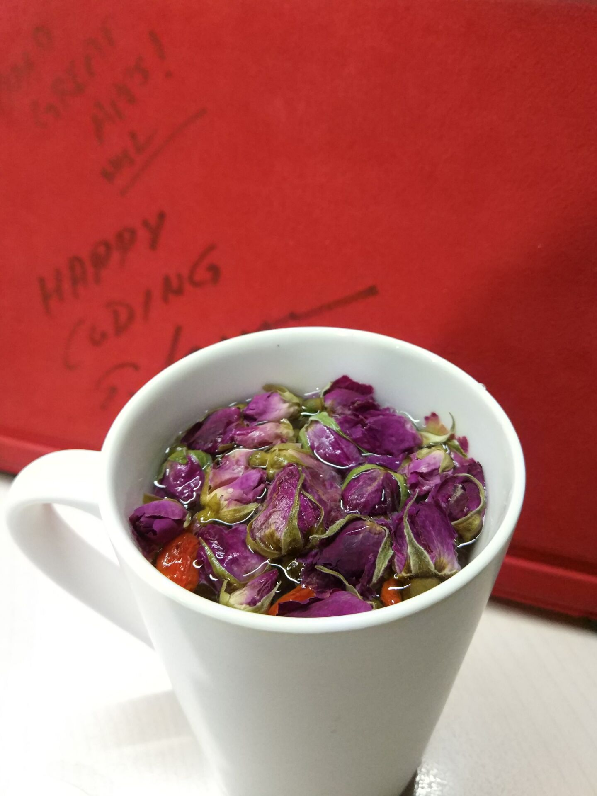
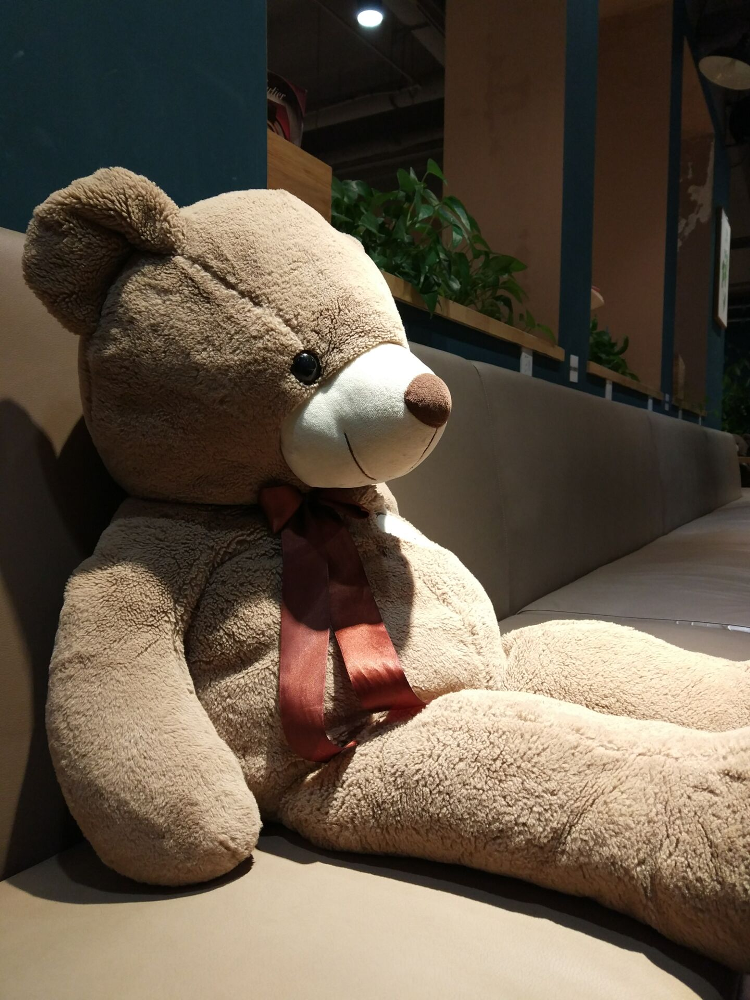

# 简单的思考生活

> 2017/8/26
>
> 人总会寂寞，寂寞的时候会思考，而我会把它记下来。

虽然生活节奏很快，但是有时候需要慢下来，比如读这篇文章的时候。

## 为什么要写这篇文章

长时间做相同工作的人，除了身体会感到累，心里也会寂寞。有的人寂寞的时候会和喜欢的人一起去玩，有的人寂寞的时候会找人开黑打游戏，而我寂寞的时候会写点东西。

除了写东西，我看你还会继续学习。就像 [这位博主](http://www.fluentcpp.com/2017/06/23/7-ways-better-cpp-summer/) 说的：

> 夏天来了。
>
> 人们往往会想到 大海、阳光、沙滩、高山或者房子，而夏天给你带来的最大的好处还是：充足的时间。可能你在休假，也可能因为这段时间工作没那么忙了。
>
> 你有两个选择：1) 出去放松放松，享受这段时光 2) 利用一部分时间提升你的技能。

~~所以，这个夏天我开始了 Node 和 设计模式 的学习。学累了，乱写一些东西。~~ 🙄

很多人已经写过了类似的东西，为什么我还要写？因为那是他们的想法，而这是我的。😝

> _You chase that pussy, I hunt for money._ **That's me, whatever I am.**

## Life is a Struggle

很多人的人生，大致分为两种：一种是 **按部就班**，做自己能预想到的事情，享受生活的美好；另一种是 **大胆尝试**，做自己完全不能想象的事情，在这个过程中磨砺自己。

### 1

如果你的生活属于前者，那么你很幸福：如果不出现什么意外或者惊喜，闭上眼睛都可以想到第二天的生活会是怎么样的场景。

如果生活很稳定，每天可以很闲适的想着吃什么、穿什么、玩什么，没有太多的顾虑。即使生活没那么稳定，每天也可以想到明天会发生什么。

就像一个拿了腾讯 offer 的学姐曾经纠结的：

> 回天津当个公务员多好啊。每天 4 点半下班，然后可以去看看电影、逛逛街；周末还有时间去旅游。公务员有户口，而且天津房子也不贵 ...
>
> 你说这里的弹性工作制，每天早早的就来了，一干就干到晚上；周末哪有时间去玩啊。而且又没有户口，也买不起房 ...

如果我是个女生，我应该也会向往着一个安定、舒服的生活。可惜，我是男的。

### 2

如果你的生活属于后者，那么你很痛苦：每天很难想到第二天会发生什么，可能是意外或者惊喜，而意外往往占 80%，惊喜也只剩下 20%。

这个时候你会迷茫，因为你在走一条 **没人愿意走的路**，所以一路上没有几个能给你 **指路的人**。

而最大的问题不在于此，而在于连你自己都不知道这条路 **通向何方** —— 也没人知道前面是地狱，还是天堂。

于是你会安慰自己：_Don't give it a F. That's the life I chose._ 但是安慰只是安慰，痛苦依然痛苦。

选择这样生活的人，往往有两种结局：多数人 **败者为寇**，永远的被这个世界忘记 —— 一部分人回归了按部就班的生活，一部分人选择了堕入地狱；少数人 **成者为王**，永远的被这个时间记住 —— 把名字列入名人堂里，把照片贴在一个个杂志的封面，把说过的话整理成一本本畅销书。

## Life is an Uncertainty

世界上有很多人，你也会遇到很多人，然后会认识很多人。

但是了解你的人并不多，欣赏你的人更少，他/她欣赏你、而你也欣赏他/她的人 更是微乎其微。

所以如果你遇到了他/她欣赏你、而你也欣赏他/她的人，你很 **幸运**，好好 **珍惜**。

就像我曾说过的：面试最主要还是看缘分 —— 一个人不可能精通所有的知识（编程语言、算法、设计模式、计算机科学基础 ...），但是

- 如果你足够幸运，面试官会考察 要求 和 你的知识 的 **交集部分**
- 如果没那么幸运，面试官会考察 要求 和 你的知识 的 **差集部分**
- 如果你足够倒霉，面试官会考察 你的知识 的 **补集部分**

然而，每个在麦田里行走的人，都会一路寻找最大的麦穗。然而麦田那么大，并不是所有人都会碰到自己那颗最大的麦穗。所以，有的人 **止步于** 一颗普通的麦穗，也有的人永远的 **错过了** 命运中最大的那颗。

对于麦穗的问题，没有人知道答案。而这却是人活下去的动力 —— 如果你已经直到了接下来人生里会发生的所有的事情（假设不能改变），那么就和被剧透了一样，活着还有什么意义。就像《阿甘正传》里说的：

> 生活就像一盒巧克力，你永远不知道下一颗是什么味道。

## Life is not What you see

先引用八命先生（baguniang2015）的 [_那女孩抽烟，肯定很好睡_](http://mp.weixin.qq.com/s?__biz=MzIzODA0MjQ4Mw==&mid=2660506886&idx=1&sn=ee6a9db277fa2a9bc57a4e54ef68a9bc) 的一段话（我觉得她的东西写的都很好）：

> 就像朋友圈里流行的那段话一样：
>
> “我见过斯斯文文的女生在外偷人的，也见过大大咧咧抽烟喝酒纹身的姑娘坚守爱情的；见过穿着西装打领带对着爸妈破口大骂的，也见过一身刺青伺候家里住院长辈无微不至的；温柔都是装的，没有一个人不会没有脾气和性子，但人品和骨子里的那份善良却是伪装不了的。”
>
> 真正的以貌取人，取的内在涵养所衬托出的外在气质，是岁月沉淀下精致的生活态度。而不是简简单单的标签，更不是带有强烈情感色彩的批判。

这个世界很复杂，没有人能看清所有表象背后的东西。包括我，第一眼，看脸。🙈 _I'm a human after all._ 看完脸，通过交流和行为，不断地了解一个人的内心世界。

但是你能看到的一个人的内心世界仅仅是你看到那个部分。我曾见过，和我谈笑风生的人，转脸就对着家人大吼大叫；也见过，和我有说有笑的人，当面对着服务员指手画脚。

有时候，当你一直从内心世界去了解一个人，你往往会发现他/她的形象 **逐渐崩塌**，甚至最后荡然无存。_We are human after all._

甚至，我觉得，我并没有真正的认识 **自己**。因为有时候，我发现我开始做出和他们一样的事情，逐渐的变成 **我不想变成的样子**。于是逐渐理解尼采的那两句话：

> 和怪兽战斗的人，要小心自己不要变成怪兽。
>
> 如果你长时间盯着深渊，深渊也会看着你。

人最害怕的不是伸手不见五指的黑夜，而是恍惚看见而又看不清的昏暗。于是，我也开始 **害怕自己**，甚至 **安慰自己**：变成那样也没什么不好的。

最后慢慢 **习惯了新的自己**。有人把它叫做 **成长**。

如果看到这里，你的眼眶也湿了，那么你和我一样，心里还住着一个 **小王子**。👦

## 写在最后

写到这里，我写不下去了。

我无法想象，像我这样理性的人，也有那么感性的时候。_I'm a BOT, but a Man._

尽管 _life sucks_，但是你还没死。那是因为：生活有着自己的 **魅力**，让你在关键的时候不会放弃，痛苦的时候支撑着你活下去。

感谢你读到了最后。有什么问题欢迎交流。😘

Delivered under MIT License &copy; 2017, BOT Man