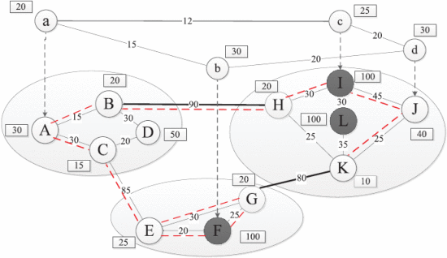
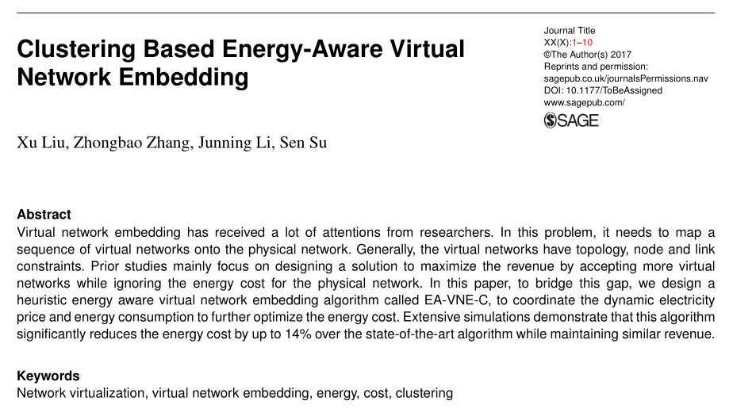

# Virtual Network Embedding Algorithm Study

> John Lee, 2017/4/13
>
> A breif introduction to my study on Virtual Network Embedding Algorithm

[slide-mode]

---

## Intro

- Dr. Zhongbao Zhang
- State Key Laboratory of Networking and Switching Technology
- March, 2016 - Now
- **Virtual Network Embedding Algorithm**（虚拟网络映射算法） Study
- Publishing a research paper

---

## Real-world Problem

- **Network Virtualization**（网络虚拟化）
- **Infrastructure as a Service**（基础设施即服务）

[float-right]

> Zhang Z, Su S, Niu X et al. Minimizing electricity cost in geographical virtual network embedding. In IEEE GLOBECOM. pp. 2609–2614.

- Sharing computing capacity and bandwidth
- Mapping **multiple** virtual networks to **one** large physical network

---

## Problem

- VN Constraints
  - Topology Constraints（拓扑结构）
  - Capacity Constraints（计算能力）
  - Location Constraints（地理位置）
- PN Properties
  - Capacity Property（计算能力）
  - Domain Electricity Price Property（区域电价）
- Goals
  - Maximize revenue（收入）
  - **Minimize (energy) cost**（成本) 👈

---

## Previous Works

- Path splitting and migration（路径分割与合并）
- **Topology-Aware** Node Ranking（拓扑感知）
- **Energy-Aware** Virtual Network Embedding（能量感知） 👈

>  Yu M, Yi Y, Rexford J et al. Rethinking virtual network embedding: substrate support for path splitting and migration. ACM SIGCOMM Computer Communication Review 2008; 38(2): 17–29.
>
> Cheng X, Su S, Zhang Z et al. Virtual Network Embedding Through Topology-Aware Node Ranking. ACM SIGCOMM Computer Communication Review 2011; 41(2): 39–47.
>
>  Su S, Zhang Z, Liu AX et al. Energy-aware virtual network embedding. IEEE Transactions on Networking 2014; 22(5): 1607–1620.

 

## Two Drawbacks

- Consider **Power Consumption Only**（能耗）
  - High Electricity Price
- Consider **Electricity Price Only**（电价）
  - Large Power Consumption

---

## Our Works - Coordination

[**Clustering Based**（基于聚类的） Energy-Aware Virtual Network Embedding](http://journals.sagepub.com/doi/full/10.1177/1550147717726714), _Xu Liu, Zhongbao Zhang, **Junning Li**, Sen Su_

[align-center]

[img=max-height:170mm]

---

## Mapping Scheme

- **Region Mapping**（域映射） 👈
- Node Mapping（节点映射）
- Intra-domain Link Mapping（域内链路映射）
- Inter-domain Link Mapping（域间链路映射）

## Region Mapping Should ...

- Consolidate node mapping
  - Mapping to less **active nodes**（开启节点）
  - Shorten **inter-domain links**（跨域链路）
- Prefer lower **electricity price**（电价）

---

## Region Mapping

### Clustering Similarity（相似度计算）

$$
\overline {Price_{ab}} = \sum_{i \in D_a \cap D_b} (\frac {Price_{max} - Price_{i}}{Price_{max} - Price_{min}})^{1/r}, r \in \mathbb{Z^{+}}
$$

$$
w^{*}_{ab} = \alpha \cdot \frac {Price_{max} - \overline {Price_{ab}}}{Price_{max} - Price_{min}} + (1 - \alpha) \cdot \frac {bw_{ab}}{bw_{max}}, \alpha \in (0, 1)
$$

$$
w_{ab} =
\begin{cases} 
w^{*}_{ab} & D_{a} \bigcap D_{b} \ne \emptyset \\ 
0 & D_{a} \bigcap D_{b} = \emptyset
\end{cases}
$$

---

## Region Mapping

### Clustering Method（聚类方法）

- *init* $cluster = \{ \{ u \} | u \in VitualNodes \}$
- calc $w_{ab}$ matrix
- $if$ $max \{ w_{ab} \} != 0$
  - group $a$ and $b$ into one cluster
  - $goto$ $step 2$
- $else$
  - $break$

---

## Special Thanks

- Ye Peida Academy
- State Key Laboratory of Networking and Switching Technology
- Dr. Zhongbao Zhang

---

    

# Thank you for listening 🙂

---
