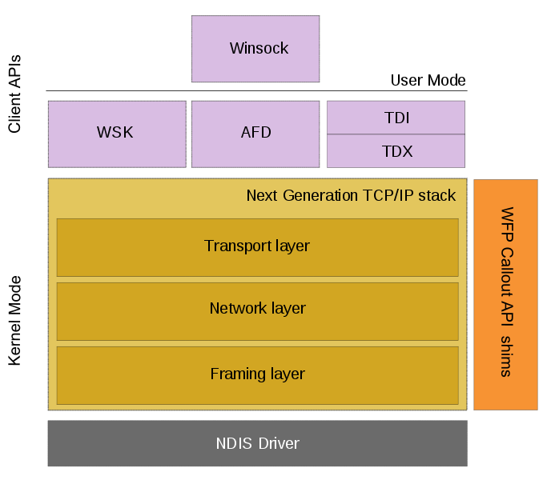
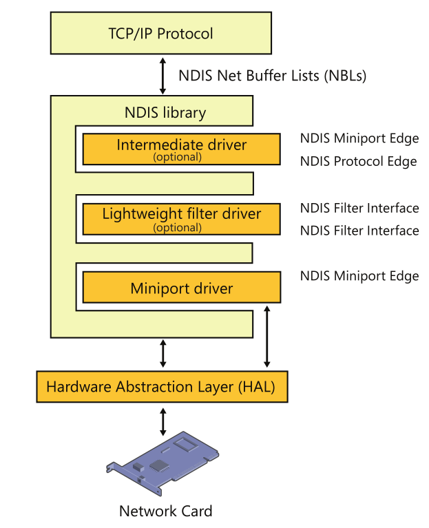
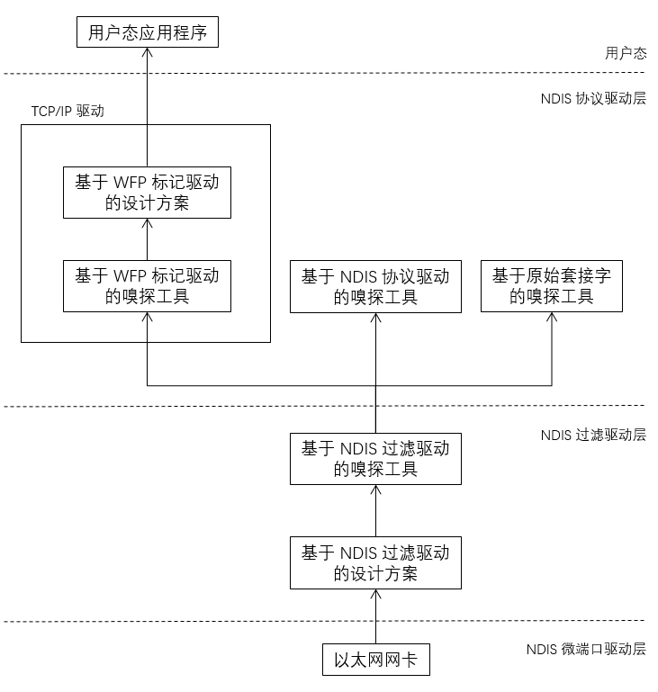
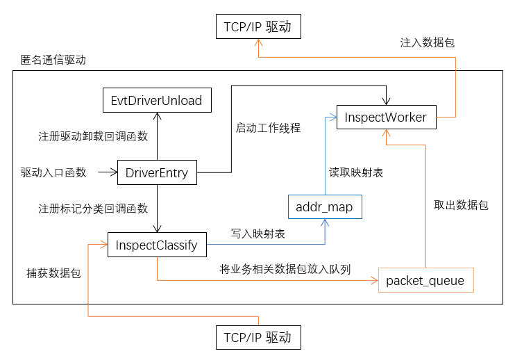
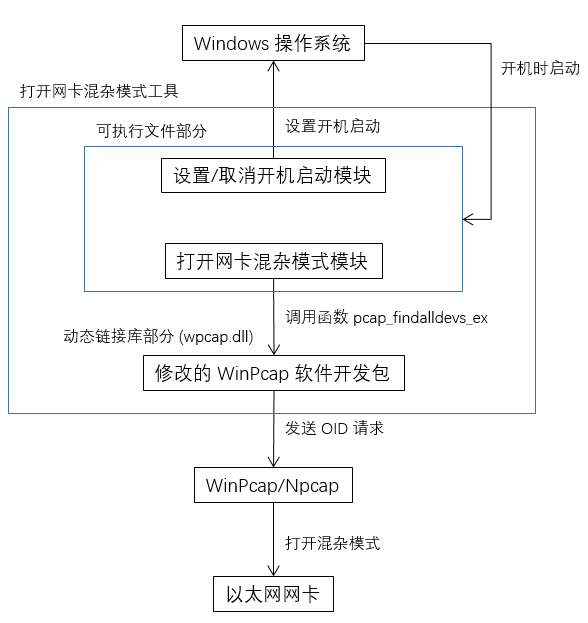
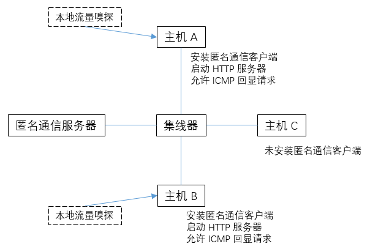

# 匿名通信 Windows 客户端的设计与实现

> Speaker: BOT Man
>
> Date: 2018/6/11

[slide-mode]

---

## 目录

- [sec|选题背景和意义]
- [sec|相关技术介绍]
- [sec|系统需求分析]
- [sec|系统设计与实现]
- [sec|系统测试]
- [sec|问题与展望]

---

## 选题背景和意义

- 流量嗅探 -> 窃取敏感数据
  - 在网络设备上
  - 在主机本地上
- 基于 -> U-TRI 匿名通信系统
  - 伪造 MAC 地址、IP 地址、TCP/UDP 端口号
  - 网络设备 程序 + **主机 客户端**
- 本课题 -> Windows 匿名通信客户端
  - 拦截/修改主机流量，实现匿名通信协议
  - 防止主机本地流量嗅探工具监听原始流量

---

## 相关技术介绍

- Windows 网络架构
  - 下一代 TCP/IP 协议栈架构
  - Windows 过滤平台（WFP）
  - 网络驱动接口规范（NDIS）
- 流量嗅探工具
  - 基于 NDIS 协议驱动：WinPcap、Win10Pcap
  - 基于 NDIS 过滤驱动：Npcap、Network Monitor
  - 基于 WFP 标记驱动：无实际产品
  - 基于原始套接字：Winsock Sniffer

---

## 相关技术介绍 - Windows 网络架构

<table>

<tr style="background-color:#FFFFFF">
<td align="center" valign="center">

</td>
<td align="center" valign="center">

</td>
</tr>

<tr style="background-color:#FFFFFF">
<td align="center" valign="center">
<small style="font-size:12pt">下一代 TCP/IP 协议栈架构 & Windows 过滤平台（WFP）</small>
</td>
<td align="center" valign="center">
<small style="font-size:12pt">网络驱动接口规范（NDIS）</small>
</td>
</tr>

</table>

---

## 系统需求分析

- 匿名通信需求
  - 注册、查询、反向查询、通信
- 反流量嗅探需求
  - 加密与服务器通信、保证原始流量不被监听
- 非功能性需求
  - 安全/可靠/健壮/易用/可维护/可移植/可重用
- 性能需求
  - 丢包率相差不超过 10%，平均传输时延、最大传输时延、最小传输时延相差不超过 100%

---

## 系统需求分析 - 匿名通信需求

- 注册：定时发起注册请求，返回本机伪造地址
- 查询：利用真实地址查询伪造地址
- 反向查询：利用伪造地址查询真实地址
- 通信：
  - 发送数据包，将真实地址修改为伪造地址
  - 接收数据包，将伪造地址还原为真实地址
  - 源/目的 MAC/IP 地址、TCP/UDP 端口号
  - 对上层应用程序透明

---

## 系统需求分析 - 技术选型

[img=width:50%]

[align-center]

---

## 系统设计与实现

[img=width:85%]

[align-center]

---

## 系统设计与实现 - 匿名通信驱动程序

[img=width:75%]

[align-center]

---

## 系统设计与实现 - 打开网卡混杂模式工具

[img=width:50%]

[align-center]

---

## 系统设计与实现 - 客户端安装/卸载工具

- 安装脚本
  - 拷贝 打开网卡混杂模式工具 到 应用程序目录，设置开机启动
  - 拷贝 匿名通信驱动程序 到 驱动程序目录，安装并启动驱动程序
- 卸载脚本
  - 停止并卸载驱动程序，从 驱动程序目录 删除驱动
  - 取消开机启动，从 应用程序目录 删除打开网卡混杂模式工具

---

## 系统测试

[float-right]

- 功能测试
  - 匿名通信
  - 反流量嗅探
- 性能测试
  - 丢包率
  - 平均响应时间
  - 最大响应时间
  - 最小响应时间

---

## 问题与展望

- 崩溃问题：不能与 WinPcap 共存
  - 猜想：WinPcap 的 NPF 驱动和 WFP 标记驱动 存在数据竞争问题
  - 调研：数据链路层 接收以太网帧 流程
- 性能问题：存在延迟、丢包
  - 优化线程调度：`InspectClassify` 同步注入数据包
  - 减少重复过滤：取消 IP 包层过滤，拦截/修改逻辑全部放入以太网帧层

---

 
 
 
 
 
 
 
 

[align-right]

# 谢谢 🙂

---
