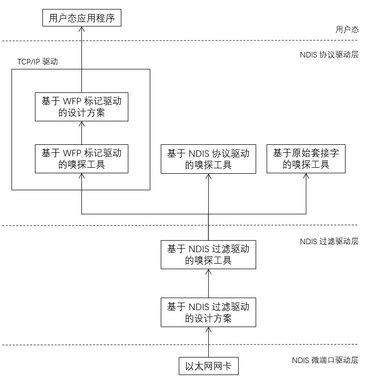
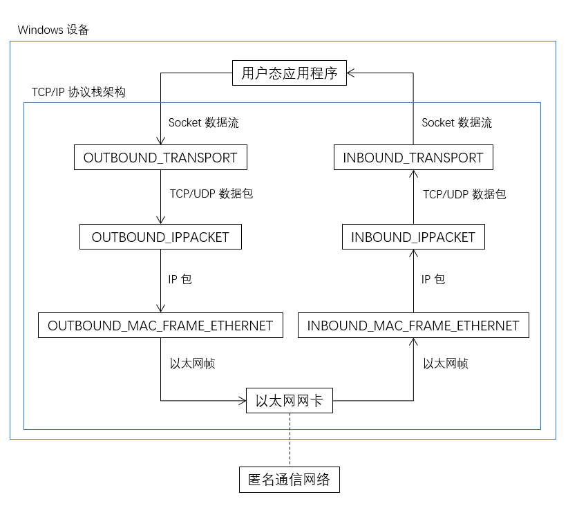
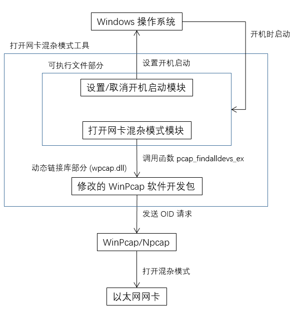
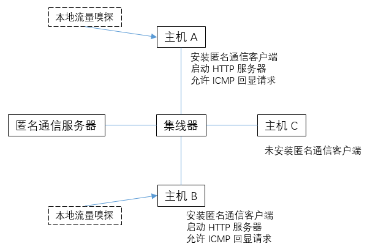

# 匿名通信 Windows 客户端的设计与实现

> 2018/6
>
> 毕设论文

[heading-numbering]

[page-break]

[align-center]

# 匿名通信 Windows 客户端的设计与实现 [no-number] [no-toc]

<br/>

[align-center]

## 摘要 [no-number] [no-toc]

目前许多企业网络面临着流量嗅探的安全威胁。不法分子通过技术手段，拦截、分析网络中的流量。为了防止恶意流量嗅探，可以使用匿名通信技术，将流量中的 MAC 地址、IP 地址、TCP/UDP 端口号进行伪造。匿名通信系统要求在主机上部署匿名通信客户端，用于实现匿名通信协议，同时防止本地恶意软件进行原始流量嗅探。

本课题基于 U-TRI 匿名通信系统，设计一个 Windows 匿名通信客户端。该客户端在匿名通信系统中扮演了重要角色，实现了两个重要功能：第一，实现匿名通信协议，拦截/修改主机流量，与匿名通信网络设备共同防止网络中的流量嗅探；第二，采用 WFP 标记驱动作为拦截/修改流量的内核，防止本地流量嗅探。该客户端包括三个部分：用于处理核心拦截/修改业务逻辑的匿名通信驱动程序、用于配合驱动程序工作的打开网卡混杂模式工具和为简化软件部署/移除流程而设计的客户端安装/卸载工具。经系统测试，该客户端通过了功能测试，并达到性能基本要求。

本文首先介绍了选题的背景、意义和相关技术；其次分析了系统需求，并根据需求对 Windows 匿名通信客户端进行设计与实现；再次对客户端进行功能测试和性能测试；最后总结了本课题的工作，并提出了存在的问题和对进一步完善的展望。

<br/>

**关键词** &nbsp;&nbsp;&nbsp;&nbsp; 匿名通信 &nbsp;&nbsp; 反嗅探 &nbsp;&nbsp; 网络驱动

[page-break]

[align-center]

# Design and Implementation of Windows Client for Anonymous Communication [no-number] [no-toc]

<br/>

[align-center]

## ABSTRACT [no-number] [no-toc]

Nowadays, many enterprise networks are faced with the security threat of traffic sniffing. Hackers are using technical means, intercepting and analysing the network traffic. In order to prevent malicious traffic sniffing, anonymous communication technology can be used to forgery MAC address, IP address and TCP/UDP port number in traffic. And the anonymous communication system requires deploying anonymous communication client on the host to implement anonymous communication protocol and preventing local malware from sniffing the original traffic.

Based on U-TRI anonymous communication system, a Windows anonymous communication client is designed in this thesis. This client plays an important role in the anonymous communication system and realizes two important functions. First, it implements the anonymous communication protocol, intercepts/modifies host traffic, and works with the anonymous communication network devices to prevent traffic sniffing in the network. Second, it uses WFP callout driver as the engine to intercept/modify traffic, which prevents traffic sniffing on the host. This client consists of three major parts: anonymous communication driver for handling core interceptions/modifications of business logic, tool for enabling NIC promiscuous mode to coordinate with the driver, and client installation/uninstallation tool designed to simplify the software deployment/removal process. Based on the system test, this client passed the function test, and achieved the basic performance requirements.

This thesis first introduces the background, significance and related technologies, then analyzes the system requirements, and designs and implements the Windows anonymous communication client in detail according to the requirements. Thirdly, the function tests and performance tests are carried out to the client. Finally, I summarize my work, put forward the existing problems, and prospect for the further improvement.

<br/>

**Keywords** &nbsp;&nbsp;&nbsp;&nbsp; anonymous communication &nbsp;&nbsp; anti-sniffing &nbsp;&nbsp; network driver

[page-break]

[align-center]

## 目录 [no-toc] [no-number]

[TOC]

[page-break]

[align-center]

## 引言

### 选题背景和意义

#### 选题背景

流量嗅探问题是企业网络面临的重要安全威胁之一。不法分子利用流量嗅探技术，劫持网络中的流量，再通过流量分析的方法，从被劫持流量中提取敏感数据，从而达到窃取敏感数据的目的。

从技术上来说，目前企业面临的网络嗅探问题，主要有两个方面：在网络设备上的流量嗅探和在主机本地的流量嗅探。网络设备上的流量嗅探指的是：不法分子利用漏洞等途径，入侵在企业网络中运行的网络设备（例如交换机、路由器等），对网络设备进行流量劫持，从而达到窃取敏感信息、注入恶意数据等目的。由于网络环境复杂、网络设备数量繁多，在网络设备上完全避免流量劫持是一个非常困难的事情。主机本地的流量嗅探指的是：不法分子利用植入木马、恶意软件等途径，入侵接入企业网络的终端设备，对终端设备进行本地流量劫持，从而实现流量嗅探的目的。相对于复杂繁多的网络设备，接入网络的终端更加难以集中管理、保护；所以，避免主机遭受本地流量嗅探势在必行。

#### 选题意义

为了减少流量嗅探给企业带来的损失，Yulong Wang 等人设计了 U-TRI 匿名通信系统，防范不法分子进行恶意嗅探，从而提升企业网络的安全性。[anonymous-communication] 该系统利用 SDN 技术，为交换机重新设计一套特殊的数据包转发规则。终端设备根据这套特殊的规则，伪造发包的 MAC 地址、IP 地址、TCP/UDP 端口号，并将收包的 MAC 地址、IP 地址、TCP/UDP 端口号还原成真实的地址、端口号；网络设备也基于同样的规则，根据数据帧的 MAC 地址进行转发，确保能把数据帧正确发送到目的主机上。这套转发规则，通过主机的 MAC 地址、IP 地址、TCP/UDP 端口号的转换，隐藏了通信端点的信息，防止不法分子直接从流量中提取；通过定时更新转换规则，增加不法分子利用流量统计方法还原通信端点信息的难度。基于这套转发规则，U-TRI 匿名通信系统隐藏了网络中通信的主机信息，避免不法分子从网络流量中窃取敏感数据。

U-TRI 匿名通信系统包含两个部分：网络设备程序和主机客户端。网络设备程序安装在企业网络中的交换机上，根据 U-TRI 系统定时随机生成的规则进行数据包转发。而主机客户端则扮演了更重要的角色：一方面，通过拦截/修改主机上的原始流量，根据转发规则，对原始流量的 MAC 地址、IP 地址、TCP/UDP 端口号进行转换；另一方面，利用网络安全技术，阻止恶意软件进行本地流量劫持。所以，在整个匿名通信过程中，主机客户端的设计与实现至关重要。

Windows 操作系统是微软公司最早在 1985 年推出的图形界面 PC 操作系统，最新版本为 Windows 10。目前，Windows 操作系统有着大量的企业、个人用户，已成为了主流的 PC 操作系统。（截至 2018 年 4 月，Windows 的市场占有率已达到了 88%）[os-market-share] 所以，在安装了 Windows 操作系统的主机上设计与实现匿名通信客户端，具有较大的商业价值。

### 课题任务

针对企业面临的流量嗅探问题，本课题基于 U-TRI 匿名通信系统 [anonymous-communication]，设计匿名通信 Windows 客户端。匿名通信 Windows 客户端主要从两方面防范流量嗅探：一方面，在部署了匿名通信系统的企业网络中，接入网络的主机上部署匿名通信客户端，实现原始流量的 MAC 地址、IP 地址、TCP/UDP 端口号转换，防止网络上的恶意流量嗅探，从而提高企业网络的安全性；另一方面，针对 Windows 操作系统平台下的本地流量嗅探工具，以及 Windows 操作系统网络架构，设计匿名通信客户端，防止主机上恶意软件对网卡流量的嗅探，进一步确保网络的安全性。

本课题设计的客户端将实现以下功能：

1. 拦截/修改网络通信流量，实现匿名通信协议：修改原始流量中发送数据包的 MAC 地址、IP 地址、TCP/UDP 端口号，伪造为用于网络设备转发的 MAC 地址、IP 地址、TCP/UDP 端口号；修改接收数据包的 MAC 地址、IP 地址、TCP/UDP 端口号，还原为对端主机发送修改前的 MAC 地址、IP 地址、TCP/UDP 端口号，并传给上层应用程序。并使得上述过程对上层应用程序透明，即两个通信端点主机上的上层应用程序利用原始的 MAC 地址、IP 地址、TCP/UDP 端口号通信。当安装了客户端的 Windows 主机接入匿名通信网络时，可以正常通信；没有安装客户端的主机接入匿名通信网络后，由于没有进行 MAC 地址、IP 地址、TCP/UDP 端口号转换，发出的数据包不能被网络设备识别，无法与网络中的其他主机通信。
2. 防止流量嗅探工具监听原始流量：针对 Windows 平台下主流的流量嗅探工具，调研他们的工作原理，设计一个能防止流量嗅探工具对网卡原始流量嗅探的技术方案。

在企业网络中，部署了匿名通信软件的网络设备和部署了匿名通信客户端的主机，协同工作，构成完整的匿名通信系统。

### 论文章节安排

本文分为七章：第一章是引言，主要介绍了本课题的选题背景、选题意义，并详细描述了课题的任务和要求。第二章是相关技术介绍，首先介绍了 Windows 网络驱动架构和 Windows TCP/IP 协议栈实现，其次分别重点介绍了 WFP 和 NDIS 技术，最后分析了 Windows 主流的流量嗅探工具的实现原理。第三章是系统需求分析，主要分析了 Windows 匿名通信客户端的四大需求，包括匿名通信需求、反流量嗅探需求、非功能性需求和性能需求。第四章是系统总体设计，首先结合了相关技术和需求分析进行技术选型，然后针对初步选择的技术方向设计系统架构。第五章是系统详细设计，主要针对系统总体设计中提到的三个核心部分进行详细设计与实现，包括匿名通信驱动程序设计与实现、打开网卡混杂模式工具设计与实现和客户端安装/卸载工具设计与实现。第六章是系统测试，首先描述了系统测试的方法和测试环境，再分别描述系统的功能测试和性能测试。第七章是结束语，首先总结了针对本课题开展的相关工作，其次提出现阶段仍然存在的问题，最后针对这些问题提出进一步完善的方案。

[page-break]

[align-center]

## 相关技术介绍

### Windows 网络架构介绍

Windows 操作系统基本支持了主流的网络协议：应用层的 HTTP 协议、FTP 协议、P2P 传输协议，传输层的 TCP/UDP 协议，网络层的 IPv4/IPv6 协议、ATM 协议，数据链路层的以太网协议（IEEE 802.3）、无线局域网协议（IEEE 802.11）、IEEE 1394 协议、PPP/SLIP 协议等。

根据 OSI 参考模型划分，Windows 操作系统的网络架构主要涵盖了六层：应用层的 Winsock 应用程序、P2P 应用程序、HTTP 应用程序、HTTP 服务应用程序，表示层的 Winsock 应用程序编程接口，会话层的传输服务提供接口，传输层的 Winsock 驱动程序、NetBIOS 驱动程序、HTTP 服务驱动程序、内核 Winsock 接口，网络层的 TCP/IP 驱动程序、RAW Socket 驱动程序、ATM 驱动程序，数据链路层的以太网驱动程序、无线局域网驱动程序、IEEE 1394 协议驱动程序、PPP/SLIP 协议驱动程序等。其中，应用层、表示层、会话层的应用程序、接口主要工作在用户态，而传输层、网络层、数据链路层的驱动程序主要工作在内核态。[windows-internals]

Windows 7 操作系统的网络架构和 OSI 参考模型的对应情况、与 CPU 工作状态的对应关系如图 2-[graph2|windows-network-architecture] 所示。

[graph2||windows-network-architecture]

[img=max-width:75%]

[align-center]


[align-center]

图 2-[graph2|windows-network-architecture] Windows 7 网络架构 [windows-internals]

Windows 操作系统上的网络驱动程序（例如网卡驱动等）主要由网络设备制造商和微软公司共同开发，网络应用程序（例如浏览器、即时通讯工具、下载器、网络游戏等）主要由提供特定网络服务的互联网软件公司开发。

使用 Windows 操作系统的最终用户，往往不需要关心 Windows 操作系统的网络架构实现细节，只需要安装网络驱动程序，就可以很方便地将自己的 Windows 设备接入网络；只需要安装网络应用程序，就可以直接使用应用程序提供的网络服务。例如，用户在 Windows 设备上安装了无线网卡后，只需要安装无线网卡制造商开发的驱动程序，就可以让该 Windows 设备接入无线局域网；在安装了无线网卡和无线网卡驱动程序的设备上，安装浏览器应用程序，就可以通过浏览器访问因特网。

尽管主流的网络协议种类繁多，但在互联网时代下，目前最主流的网络协议栈是 TCP/IP 协议栈。因此，微软公司看到了 TCP/IP 协议的潜质，在 Windows Vista 版本后，逐步重构了原有的网络架构，重新设计了下一代 TCP/IP 协议栈的新架构。[ng-tcp-ip-stack]

下一代 TCP/IP 协议栈以 TCP/IP 协议栈驱动为核心，数据链路层层通过网络驱动接口规范（Network Driver Interface Specification，下文简称 NDIS）连接网卡，网络层、传输层封装了 IPv4/IPv6 协议、TCP/UDP 协议等相关实现，为应用层提供了 Winsock 接口、内核 Winsock 接口（WSK）以及传输驱动接口（TDI）。同时，为了增强 TCP/IP 协议栈实现的可扩展性，微软公司设计了 Windows 过滤平台（Windows Filtering Platform，下文简称 WFP），并将 TCP/IP 协议栈的每层实现都与过滤平台提供的接口关联，提供在每层进行流量拦截、修改的能力。[wfp-overview]

Windows Vista 操作系统的下一代 TCP/IP 协议栈架构如图 2-[graph2|ng-tcp-ip-stack] 所示。

[graph2||ng-tcp-ip-stack]

[img=max-width:50%]

[align-center]


[align-center]

图 2-[graph2|ng-tcp-ip-stack] Windows Vista 下一代 TCP/IP 协议栈架构 [ng-tcp-ip-stack]

在下一代 TCP/IP 协议栈中，IPv4/IPv6 协议、TCP/UDP 协议等实现，和应用层的 Winsock、WSK、TDI 接口主要由微软公司开发，并对开发者提供应用程序编程接口，故不能用于实现匿名通信协议。而 NDIS 驱动为了适配各种不同的链路层网络协议，具有很好的灵活性，可以用于实现 Windows 匿名通信客户端。类似的，WFP 贯穿于 TCP/IP 协议栈的各层，也可以用于实现 Windows 匿名通信客户端。所以，下文将详细介绍 Windows 过滤平台和网络驱动接口规范两种技术，并分析使用两种技术作为 Windows 匿名通信客户端技术方案的优缺点和适用性。

### Windows 过滤平台介绍

Windows 过滤平台（WFP）是微软公司在 Windows Vista 后，为下一代 TCP/IP 协议栈设计的针对网络协议栈每层进行流量过滤的可扩展平台。微软公司利用 WFP 的可扩展平台，实现了 Windows 防火墙、IPsec 加密、网络地址转换（NAT）等功能。另外，许多开发者也使用 WFP 平台，实现了反病毒软件、网络监控、家长控制等功能。[wfp-overview]

WFP 平台架构如图 2-[graph2|wfp-architecture] 所示，主要包括三部分：过滤引擎、标记驱动、基础过滤引擎。其中，过滤引擎包括多个映射到操作系统网络栈各层的过滤层，用于拦截不同位置上的 TCP/IP 协议栈流量；标记驱动可以将过滤引擎捕获的流量进行自定义处理，提供除简单的放行/拦截之外的自定义动作；基础过滤引擎用于协调 WFP 各个组件，提供添加/移除过滤器、保存过滤配置、确保 WFP 配置安全等管理型功能。[wfp-architecture]

[graph2||wfp-architecture]

[img=max-width:100%]

[align-center]


[align-center]

图 2-[graph2|wfp-architecture] WFP 平台架构 [wfp-architecture]

整个 WFP 平台架构中，WFP 标记驱动为开发者提供了很好的可扩展性，用于实现复杂的过滤行为。WFP 标记驱动常用的过滤功能有四类：流量深度检查，即根据流量内容判断放行/拦截，例如反病毒软件检查病毒特征；数据包修改，即修改网络数据包的包头和数据，例如 NAT 修改 IPv4/IPv6 报头；数据流修改，即修改数据流中的特定数据，例如家长控制程序识别、过滤网页中的敏感词；记录数据流量，例如网络监控软件嗅探本地流量。[wfp-callout-drivers]

其中，WFP 标记驱动的数据包修改功能，可以用于实现 Windows 匿名通信客户端：拦截通过 TCP/IP 协议栈驱动的流量，通过修改数据包的包头，实现对 MAC 地址、IP 地址、TCP/UDP 端口号的修改，并放回 TCP/IP 协议栈驱动上重新处理。

### 网络驱动接口规范介绍

网络驱动接口规范（NDIS）是微软公司和 3Com 公司联合开发的一套网卡接口规范，主要用于 Windows 操作系统上。NDIS 构成了网络协议栈中的逻辑链路控制（LLC）子层的部分，作为操作系统和网卡之间的连接层，向下连接介质访问控制（MAC）子层，向上连接网络层。[ndis-wiki]

NDIS 驱动主要有四种：NDIS 微端口驱动、NDIS 中间层驱动、NDIS 过滤驱动、NDIS 协议驱动。[ndis-drivers] 其中，NDIS 微端口驱动工作在最下层，直接处理网卡接收的数据；NDIS 协议驱动工作在最上层，用于实现各种网络协议（例如 TCP/IP 协议栈驱动）；NDIS 中间层驱动和过滤驱动向下连接微端口驱动、向上连接协议驱动，实现了中间层的功能。开发 NDIS 中间层驱动比较复杂，需要同时开发向下对接微端口驱动和向上对接协议驱动的两个部分；所以，在最新的 NDIS 规范中，微软提供了开发流程简单的过滤驱动，用于替代原有中间层驱动。

Windows 7 操作系统的 NDIS 驱动架构如图 2-[graph2|ndis-drivers] 所示。其中，TCP/IP Protocol 对应了 NDIS 协议驱动。

[graph2||ndis-drivers]

[img=max-width:50%]

[align-center]


[align-center]

图 2-[graph2|ndis-drivers] NDIS 驱动架构 [windows-internals]

由于 NDIS 微端口驱动用于控制网卡、NDIS 中间层驱动已被更新的过滤驱动取代，本文不详细讨论这两种驱动。由于 Windows 平台下主流的流量嗅探工具常采用 NDIS 协议驱动、过滤驱动作为嗅探的驱动内核，且 NDIS 过滤驱动可以用于实现 Windows 匿名通信客户端，故下文将详细介绍这两种驱动。

#### NDIS 协议驱动

NDIS 协议驱动，又称为 NDIS 传输驱动，用于实现网络层、传输层协议（例如 TCP/IP 协议栈中的 IP/TCP/UDP 等协议）。协议驱动工作在 NDIS 驱动栈的最上层、传输协议栈的最下层，主要实现以下功能：一方面，将下层 NDIS 驱动接收到的数据，解析、构造为协议的数据包，并通过特定接口，将数据包传给应用程序；另一方面，将上层应用程序从特定接口传入的数据包，解析并传到下层 NDIS 驱动。[protocol-drivers]

Windows Vista 后的 TCP/IP 协议栈驱动就是通过 NDIS 协议驱动实现的。该驱动下层连接 NDIS 微端口驱动，上层连接下一代 TCP/IP 协议栈中的 Winsock、WSK、TDI 接口。从而，提供了稳定可靠的 IP/TCP/UDP 协议实现。[ng-tcp-ip-stack]

由于 NDIS 协议驱动可以获取到 NDIS 微端口驱动传入的数据，即网卡接收到的流量，故可以用于实现 Windows 流量嗅探工具。

#### NDIS 过滤驱动

NDIS 过滤驱动，又称为 NDIS 轻量过滤驱动，用于提供 NDIS 微端口驱动和协议驱动的中间层。过滤驱动主要实现以下功能：一方面，拦截下层 NDIS 驱动向上传输的数据，根据开发者需求，修改流量数据，再传给上层 NDIS 驱动；另一方面，拦截上层 NDIS 驱动向下传输的数据，根据具体需求，修改流量并传给下层 NDIS 驱动。[filter-drivers]

在 Windows 8 操作系统及往后版本中，WFP 标记驱动在数据链路层提供的过滤功能，就是通过 NDIS 过滤驱动实现的。[layer2-filtering] 同样的，即使不使用 WFP 标记驱动实现 Windows 匿名通信客户端，也可以直接使用 NDIS 过滤驱动，在数据链路层拦截、修改流量，实现对数据包 MAC 地址、IP 地址、TCP/UDP 端口号的修改。

另外，由于 NDIS 过滤驱动可以获取到任意通过 NDIS 协议栈的流量，故也可以用于实现 Windows 流量嗅探工具。

### Windows 流量嗅探工具介绍

从实现的角度划分，目前主流的 Windows 流量嗅探工具主要分为四类：基于 NDIS 协议驱动的嗅探工具、基于 NDIS 过滤驱动的嗅探工具、基于 WFP 标记驱动的嗅探工具和基于原始套接字的嗅探工具。

#### 基于 NDIS 协议驱动的嗅探工具

在 [sec|NDIS 协议驱动] NDIS 协议驱动中，提到了可以使用 NDIS 协议驱动接收到所有从 NDIS 微端口驱动捕获的流量，即网卡接收到的流量。基于这个功能，可以设计一个与微软 TCP/IP 协议栈驱动并列的协议驱动，用于监控所有经过网卡的流量。该驱动，一方面绑定到用于流量嗅探的网卡对应的微端口驱动上，接收所有微端口驱动传入的流量；另一方面注册为一个 IO 设备，向用户态程序发送捕获的数据。最终用户使用接收了发来数据的用户态程序，就可以获取网卡上的流量。

经调研，市场上许多 Windows 流量嗅探工具利用了这个原理实现网络监控。例如，Wireshark [wireshark-winpcap] 默认的流量监听引擎 WinPcap [winpcap] 就是实现了一个叫做 NPF 的协议驱动，用于监听所有经过网卡的流量。类似的，Win10Pcap [win10pcap] 基于 NDIS 6.0 技术，为 Windows 10 重新设计了协议驱动内核。

#### 基于 NDIS 过滤驱动的嗅探工具

在 [sec|NDIS 过滤驱动] NDIS 过滤驱动中，提到了 NDIS 过滤驱动可以拦截到下层 NDIS 驱动和上层 NDIS 驱动之间传输的数据，用于监控 NDIS 驱动栈上的流量。基于这个功能，可以设计一个挂载在 TCP/IP 协议栈驱动和微端口驱动之间的过滤驱动；并类似于 [sec|基于 NDIS 协议驱动的嗅探工具] 基于 NDIS 协议驱动的嗅探工具提到的，将捕获到的数据通过注册 IO 设备的方法，向用户态程序传输，从而实现流量嗅探功能。

经调研，开源组织 Nmap 为了提升流量嗅探的性能，设计了速度更快的 Npcap 引擎，用于替代之前的 WinPcap 引擎。[npcap] 类似的，微软公司设计了 Network Monitor 流量统计、分析工具，也使用了 NDIS 过滤驱动作为流量监听引擎。[network-monitor]

#### 基于 WFP 标记驱动的嗅探工具

在 [sec|Windows 过滤平台介绍] Windows 过滤平台介绍中，提到了 WFP 标记驱动具有记录数据流量的功能，可以用于网络流量监控。基于这个功能，可以设计一个在各层拦截/记录所有流量的 WFP 标记驱动，用于流量嗅探。

基于 WFP 标记驱动的流量嗅探工具，工作在 TCP/IP 协议栈驱动上，捕获的是经过 TCP/IP 协议栈的流量；而基于 NDIS 协议驱动/标记驱动的工具，工作在 NDIS 驱动栈上，捕获的是经过网卡的流量。前者相较于后者，可以捕获到不经过网卡的流量，例如 127.0.0.1 本地主机流量；而后者相较于前者，可以捕获到被 TCP/IP 协议栈丢弃的流量，例如校验和错误的 IP 包。

经调研，目前市场上还没有找到基于 WFP 标记驱动的流量嗅探产品。

#### 基于原始套接字的嗅探工具

原始套接字是一种能完全访问底层数据提供者的一类套接字，一般使用 `SOCK_RAW` 标志创建。如图 2-[graph2|windows-network-architecture] 所示，在 Windows 网络驱动架构中，原始套接字向下之间对接 NDIS 驱动，与 TCP/IP 协议栈驱动并列。因此，原始套接字可以直接发送原始的 IP 报文，接收 TCP/IP 驱动能接收到的流量。[raw-socket]

经调研，市场上主流的基于原始套接字的嗅探工具原理基本相似：首先，打开一个原始套接字；然后，设置该套接字为监听 NDIS 微端口驱动上传的所有流量；最后，开始监听网卡流量。例如，开源的 Winsock Sniffer 就通过上述方法实现。[winsock-sniffer]

### 本章小结

本章首先简单介绍了 Windows 网络架构和下一代 TCP/IP 协议栈架构，然后详细介绍了与 Windows 匿名通信客户端密切相关的 Windows 过滤平台和网络驱动接口规范，最后针对目前主流的 Windows 流量嗅探工具进行分析、总结。

下一章将结合本章介绍的下一代 TCP/IP 协议栈架构，针对本课题的任务要求，进行完整的需求分析。

[page-break]

[align-center]

## 系统需求分析

### 匿名通信需求

匿名通信需求要求 Windows 匿名通信客户端能实现完整的匿名通信协议。匿名通信协议基于 U-TRI 匿名通信系统 [anonymous-communication]，主要包括四个部分：注册、查询、反向查询、通信。每部分功能如下：

- 注册部分：接入匿名通信网络的主机需要定时向匿名通信服务器发送一个注册请求，从服务器获取该主机在匿名通信网络中的伪造 MAC 地址、伪造 IP 地址、伪造 TCP/UDP 端口号。
- 查询部分：当主机需要向同一网络中的另一主机发送数据时，发送方需要向匿名通信服务器发送一个查询请求，从服务器获取接收方在匿名通信网络中的伪造 MAC 地址、伪造 IP 地址、伪造 TCP/UDP 端口号。
- 反向查询部分：当主机从从网络中收到另一主机发来的数据时，接收方需要向匿名通信服务器发送一个反向查询请求，从服务器获取发送方在网络中的真实 MAC 地址、真实 IP 地址、真实 TCP/UDP 端口号。
- 通信部分：一方面，当主机需要发送数据包时，会根据从服务器查询到的信息，修改原始流量的 MAC 地址、IP 地址、TCP/UDP 端口号；另一方面，当主机接收到数据包时，也会根据从服务器反向查询到的信息，还原伪造流量的 MAC 地址、IP 地址、TCP/UDP 端口号。

针对匿名通信协议的三部分，对 Windows 匿名通信客户端的具体要求是：

- Windows 匿名通信客户端维护一个从真实地址（真实 MAC 地址、真实 IP 地址、真实 TCP/UDP 端口号）到伪造地址（伪造 MAC 地址、伪造 IP 地址、伪造 TCP/UDP 端口号）的映射表。
- 映射表的每条记录带有过期时间：如果记录没有过期，该记录项有效，可以用于通信；当记录超时后，该记录项失效，需要重新获取。
- 注册需求：Windows 匿名通信客户端定时用本机的真实地址，查询映射表；如果表项不存在或失效，就会往匿名通信服务器发送注册请求，使用服务器返回的伪造地址，更新本机真实地址对应的表项。
- 查询需求：当主机需要发送数据时，Windows 匿名通信客户端用对端的真实地址，查询映射表；如果表项不存在或失效，就会往匿名通信服务器发送查询请求，使用服务器返回的伪造地址，更新对端真实地址对应的表项。
- 反向查询需求：当主机接收到数据时，Windows 匿名通信客户端用对端的伪造地址，查询映射表；如果表项不存在或失效，就会往匿名通信服务器发送反向查询请求，使用服务器返回的真实地址，更新对端伪造地址对应的表项。
- 通信需求：当主机发送数据时，Windows 匿名通信客户端用对端的真实地址，获取有效的映射表项，将原始流量的真实地址修改为伪造地址，再发往网络中；当主机接收数据时，客户端用对端的伪造地址，获取有效的映射表项，将流量的伪造地址还原为真实地址，再传给上层应用程序。

### 反流量嗅探需求

反流量嗅探需求要求安装了 Windows 匿名通信客户端的 Windows 设备能防止流量嗅探软件监听到原始流量。具体要求是：

- 注册/查询/反向查询过程中，主机与服务器之间的通信经过 IPsec 加密，即不能被流量嗅探工具监听到通信明文。
- 通信过程中，两台主机之间通信的原始流量不能被流量嗅探工具监听。满足以下两点之一：
  - 流量嗅探工具监听不到两台通信主机之间的任何流量（原始流量或伪造流量）；
  - 流量嗅探工具能监听到两台通信主机之间的伪造流量，不能通过流量嗅探的方法监听到原始流量。

### 非功能性需求

非功能性需求要求 Windows 匿名通信客户端：

- 具有安全性：安装了 Windows 匿名通信客户端的 Windows 设备接入部署了匿名通信网络设备的网络时，能与在同一网络中的其他安装同样客户端的设备进行通信；没有安装 Windows 匿名通信客户端的设备接入部署了匿名通信网络设备的网络时，不能与任何网络中的设备进行通信。
- 具有可靠性：运行 Windows 匿名通信客户端的 Windows 设备能正常运行，即 Windows 匿名通信客户端不会导致系统出现异常、崩溃等情况。
- 具有健壮性：Windows 匿名通信客户端能处理各种数据异常情况，即当网络上出现格式或内容错误的数据包时，能妥善处理异常数据，不会导致崩溃。另外，Windows 匿名通信客户端能处理网络状况异常的情况，即当网络上出现大面积拥塞或丢包时，能保证原有的 Windows 拥塞控制、重传机制正常运行，不会导致崩溃。
- 具有易用性：Windows 匿名通信客户端支持一键安装、一键卸载。另外，任一 Windows 设备安装匿名通信客户端后，原有的网络驱动程序、网络应用程序都能正常运行；Windows 匿名通信客户端的存在对设备的最终用户和设备上的网络程序程序透明，即设备的最终用户和设备上的网络程序不需要知道客户端的存在。
- 具有可维护性：Windows 匿名通信客户端的设计结构清晰、符合编码规范、有完备的文档，易于维护。
- 具有可移植性：尽管 Windows 匿名通信客户端仅仅运行在 Windows 操作系统平台上，但要求设计时将与平台紧耦合的部分和与平台无关的部分分离；当客户端需要从 Windows 平台移植到其他平台时，要求可以复用与平台无关的模块；当客户端需要从目前支持的 Windows 版本迁移到其他 Windows 版本时，也要求能复用仅与业务逻辑相关的模块。
- 具有可重用性：Windows 匿名通信客户端的模块划分精准，即尽可能减少模块之间多余的依赖，尽可能避免不同模块有冗余的功能，尽可能复用已有模块的功能。

### 性能需求

性能需求要求 Windows 匿名通信客户端不能影响原有的网络传输性能。具体要求是，在同一实验环境下，两台相互通信主机之间要求：

- 不影响丢包率：安装 Windows 匿名通信客户端和不安装的情况，丢包率相差不超过 10%。
- 不影响平均传输时延：安装 Windows 匿名通信客户端和不安装的情况，平均传输时延相差不超过 100%。
- 不影响最大传输时延：安装 Windows 匿名通信客户端和不安装的情况，最大传输时延相差不超过 100%。
- 不影响最小传输时延：安装 Windows 匿名通信客户端和不安装的情况，最小传输时延相差不超过 100%。

### 本章小结

根据课题任务的描述，本课题需要实现匿名通信、防止流量监听两个基本功能。本章围绕着这两个基本任务，进一步细化任务要求，将 Windows 匿名通信客户端的需求细分四个：匿名通信需求、反流量嗅探需求、非功能性需求和性能需求。

下一章针对上述需求，选择能满足要求的技术，并设计系统总体技术架构。

[page-break]

[align-center]

## 系统总体设计

### 技术选型

针对最核心的匿名通信需求，可以选用 [sec|Windows 过滤平台介绍] WFP 标记驱动或 [sec|NDIS 过滤驱动] NDIS 过滤驱动，实现网络流量拦截、修改。两种技术在实现这个需求上，原理类似：设置一个过滤层（WFP 过滤层或 NDIS 过滤驱动层），用于拦截通过过滤层的流量；对流量进行修改，再重新放回流量的传输路径上。区别在于：WFP 标记驱动只能拦截到经过 TCP/IP 协议栈驱动的流量，不能拦截到所有经过网卡的流量；而 NDIS 过滤驱动相反，能拦截到网卡流量，不能拦截到所有 TCP/IP 协议栈上的流量。针对这个需求，两种技术都可以选用。

为了实现反流量嗅探需求，我们需要针对主流的 Windows 流量嗅探工具实现原理，选择适当的技术。经调研，由于难以实现防止流量嗅探工具监听到任何流量的方案，故选择实现让流量嗅探工具只能监听到伪造流量的方案。如果要让流量嗅探工具监听到伪造流量，Windows 匿名通信客户端必须工作在流量嗅探工具在驱动栈上位置的上层，从而保证能在流量嗅探工具嗅探到原始流量之前，修改原始流量为伪造流量。WFP 标记驱动、NDIS 过滤驱动和[sec|Windows 流量嗅探工具介绍] 介绍的各个流量嗅探工具的层次关系如图 4-[graph4|sniffer-layers] 所示。

[graph4||sniffer-layers]

[img=max-width:75%]

[align-center]



[align-center]

图 4-[graph4|sniffer-layers] WFP 标记驱动、NDIS 过滤驱动和各个流量嗅探工具的层次关系

针对 WFP 标记驱动和 NDIS 过滤驱动，如果选用 NDIS 过滤驱动，Windows 匿名通信客户端工作在 NDIS 协议驱动的下层，不能防止任何流量嗅探工具对原始流量的监听。如果选用 WFP 标记驱动，Windows 匿名通信客户端工作在 TCP/IP 协议栈驱动内，处在 NDIS 过滤驱动的上层，和 NDIS 协议驱动、原始套接字工作在同一层，可以避免基于这些技术的几类流量嗅探工具监听到原始流量，从而满足反流量嗅探需求。

采用 WFP 标记驱动的方案可以实现安全性需求，即在没有安装客户端的设备接入匿名通信网络时，由于没有经过驱动的流量修改，不能访问网络。采用 WFP 标记驱动的方案可以通过编写测试良好的代码的方式，实现可靠性、健壮性需求。采用 WFP 标记驱动的方案可以通过遵循 WFP 编码规范、维护文档的方式，实现可维护性需求。在设计 WFP 标记驱动的方案时，可以采用桥接模式的设计模式，实现平台独立的模块划分，实现可移植性、可重用性需求。另外，WFP 标记驱动处于 TCP/IP 协议栈架构中，和 TCP/IP 协议栈驱动共同工作，具有良好的性能，易于满足性能需求。

由于 NDIS 协议驱动、原始套接字与 TCP/IP 协议栈驱动不在同一个驱动栈上工作，属于并列关系。如果使用了这两种技术，即使捕获了流量，也不能将流量放回传输路径上。因此，本文不考虑只有这两种技术实现匿名通信需求。

[align-center]

[table4||compare-usability]

表 4-[table4|compare-usability] 各技术方案针对匿名通信需求和反流量嗅探需求的可用性对比

[align-center]

技术方案 | 匿名通信需求 | 反流量嗅探需求
--------|-------------|-------------
WFP 标记驱动 | 可以实现匿名通信 | 可以防止流量嗅探
NDIS 过滤驱动 | 可以实现匿名通信 | 不能防止流量嗅探
NDIS 协议驱动 | 不能实现匿名通信 | 不能防止流量嗅探
原始套接字 | 不能实现匿名通信 | 不能防止流量嗅探

经认真分析，最后 Windows 匿名通信客户端将采用 WFP 标记驱动作为流量拦截/修改的核心技术方案。各技术方案在匿名通信需求和反流量嗅探需求方面的可用性对比如表 4-[table4|compare-usability] 所示。

由于在默认情况下，以太网网卡会检查以太网帧的目的 MAC 地址是不是本网卡的 MAC 地址：如果是，则接收并传给本网卡对应的 NDIS 微端口驱动；如果不是，则直接将该以太网帧丢弃。如果将网卡设置为混杂模式，网卡就不会检查接收到的以太网帧的目的 MAC 地址是否与本网卡相符，直接传给对应的 NDIS 微端口驱动。由于匿名通信过程中，伪造的以太网帧使用的是伪造的 MAC 地址，与接收主机的真实 MAC 地址不相符，默认情况下会被丢弃。所以，如果要使 Windows 匿名通信客户端能正确工作，就需要提前打开网卡的混杂模式。

经调研，Windows 不允许用户态应用程序通过调用系统应用程序编程接口的方式，直接打开网卡混杂模式。经进一步调研，发现 Wireshark 底层使用的 WinPcap 引擎，在启动流量嗅探时会使用 NDIS 驱动程序打开网卡混杂模式。为了节省开发成本，避免重复开发不必要的 NDIS 驱动程序，将使用 WinPcap 提供的软件开发包打开网卡混杂模式。[winpcap-dev]

最后，为了实现易用性需求中提到的一键部署/移除 Windows 匿名通信客户端，需要一个客户端安装/卸载工具。由于该功能相对简单，可以直接通过编写 Windows 批处理脚本（BAT）实现。最终用户只需要运行批处理文件，就可以实现一键部署/移除软件的功能。

### 总体架构

Windows 匿名通信客户端主要包括三个部分：匿名通信驱动程序、打开网卡混杂模式工具和软件安装/卸载工具。同时，客户端还依赖于 WinPcap [winpcap] 或 Npcap [npcap]，用于处理打开网卡混杂模式工具发出的请求。系统各部分关系如图 4-[graph4|client-architecture] 所示。

[graph4||client-architecture]

[img=max-width:75%]

[align-center]


[align-center]

图 4-[graph4|client-architecture] Windows 匿名通信客户端架构

匿名通信驱动程序是 Windows 匿名通信客户端的核心部分，主要负责实现匿名通信过程中的注册/查询/反向查询/通信功能，同时在内存中维护一个从真实地址（真实 MAC 地址、真实 IP 地址、真实 TCP/UDP 端口号）到伪造地址（伪造 MAC 地址、伪造 IP 地址、伪造 TCP/UDP 端口号）的映射表。驱动程序启动后，会定时向服务器发起注册请求，并将本机真实地址对应的伪造地址写入映射表。匿名通信过程中，驱动会根据是否存在有效的映射表项，向服务器发起查询/反向查询请求，并写入映射表。匿名通信过程中，驱动会拦截流量，并根据映射表进行流量伪造/还原，再放回流量的传输路径。从实现上看，匿名通信驱动程序通过 WFP 标记驱动发送/接收与服务器之间的注册/查询/反向查询数据包，再利用 WFP 标记驱动实现流量拦截/修改。

为了实现打开网卡混杂模式，Windows 匿名通信客户端使用一个 Win32 应用程序打开网卡的混杂模式。该工具使用 WinPcap 提供的软件开发包，调用 WinPcap 在用户态的应用程序编程接口，向 WinPcap 在内核态的 NPF 协议驱动发送 OID 请求；NPF 驱动接收到请求后，设置网卡的混杂模式。[oid-packet-filter] 因此，安装 Windows 匿名通信客户端同时，需要安装 WinPcap 或 Npcap 处理 OID 请求。

软件安装/卸载工具用于向最终用户提供方便的一键安装/一键卸载功能：Windows 匿名通信客户端通过软件安装工具安装，同时设置匿名通信驱动程序和打开网卡混杂模式工具为开机自动启动；客户端通过软件卸载工具卸载，同时取消设置匿名通信驱动程序和打开网卡混杂模式工具的开机自动启动。利用软件安装/卸载工具，安装了 Windows 匿名通信客户端的用户，每次启动计算机后，不需要手动打开或设置任何参数，就可以直接使用计算机；在卸载 Windows 匿名通信客户端后，客户端不会再计算机上有任何残留文件或配置。

### 本章小结

本章针对系统需求分析，进行综合考虑，进行技术选型；并利用选出的技术方案，设计系统总体架构，分为三部分：匿名通信驱动程序、打开网卡混杂模式工具和软件安装/卸载工具。

下一章将详细介绍 Windows 匿名通信客户端的系统设计，并从匿名通信驱动程序设计与实现、打开网卡混杂模式工具设计与实现和客户端安装/卸载工具设计与实现三部分进行详细介绍。

[page-break]

[align-center]

## 系统详细设计与实现

### 匿名通信驱动程序设计与实现

作为 Windows 匿名通信客户端的核心部分，匿名通信驱动程序主要实现了两个与匿名通信协议密切相关的功能：匿名通信注册/查询/反向查询功能和匿名通信通信功能。该驱动程序是一个标准的 Windows 内核态驱动程序，整体架构参考了微软驱动开发包（Windows Driver Kit, WDK）的流量检查样例 [inspect]。

匿名通信驱动程序代码使用 C 语言编写，基于微软驱动开发包实现。开发过程中，使用三台 Windows 设备，完成开发。其中，一台 Windows 设备用于开发，成为开发机；另外两台 Windows 设备用于调试，成为测试机。三台机器使用集线器连接，通过手动设置 IP 地址，组成一个基于以太网的小型局域网。

在开发匿名通信驱动程序的过程中，使用的编码、部署工作流程：在开发机上，安装微软驱动开发包（Windows Driver Kit, WDK）、Visual Studio 2017 等开发工具，使用 Visual Studio 2017 编写基于微软驱动开发包的代码；编码完成后，将生成的驱动二进制文件打包，使用 Windows 远程桌面连接测试机，将生成的驱动二进制文件拷贝到测试机上。在测试机上，打开从开发机拷贝的驱动二进制文件，安装匿名通信驱动程序，完成部署。

在开发匿名通信驱动程序的过程中，使用的调试、分析工作流程：在测试机上，使用 Windbg 启动调试，并配合 DbgView 查看驱动程序调试输出日志。当程序出现错误，Windows 操作系统产生系统崩溃并重新启动；在机器崩溃重启后，可以在 Windows Minidump 路径下找到崩溃对应的 dump 文件，将 dump 文件拷贝到开发机上。在开发机上，使用 Windbg 打开测试机的崩溃对应的 dump 文件，并为 Windbg 设置驱动程序源代码所在的路径，使用 `!analyze -v` 指令进行崩溃位置分析。结合 Windbg 分析结果与 DbgView 输出调试日志，可以方便的实现对程序出现的问题进行分析。

在开发过程中，编码工作是从驱动程序源代码生成驱动程序二进制文件，部署工作是将生成的驱动程序二进制文件安装在测试机上，调试工作是运行安装的驱动程序并发现问题，分析工作是根据出现问题的场景、出现问题的位置和对应代码的位置综合分析问题所在。编码、部署和调试、分析过程构成一个闭环：前两者为后两者提供了实验环境，后两者为前两者提供了完善代码的基础。

#### 匿名通信驱动程序整体框架设计

匿名通信驱动在内存中维护两个核心的数据结构：一个从真实地址（真实 MAC 地址、真实 IP 地址、真实 TCP/UDP 端口号）到伪造地址（伪造 MAC 地址、伪造 IP 地址、伪造 TCP/UDP 端口号）的映射表 `addr_map` 和一个保存待处理数据包（IP 包、以太网帧）的队列 `packet_queue`。该驱动的模块有四个：驱动入口函数 `DriverEntry`、驱动卸载函数 `EvtDriverUnload`、标记分类函数 `InspectClassify` 和工作线程函数 `InspectWorker`。该驱动的核心数据结构和各模块之间关系如图 5-[graph5|driver-architecture] 所示。

[graph5||driver-architecture]

[img=max-width:75%]

[align-center]


[align-center]

图 5-[graph5|driver-architecture] 匿名通信驱动程序架构

从真实地址到伪造地址的映射表 `addr_map` 需要实现两个方向的查询功能：一方面，在发送数据包时，给定真实地址，查询伪造地址；另一方面，在接收数据包时，给定伪造地址，查询真实地址。为了实现高效的查询功能，映射表 `addr_map` 使用两个哈希表（hash map）实现：一个哈希表以真实地址的哈希值为键、以映射表记录项作为值；另一个哈希表以伪造地址作为键，以映射表记录项作为值。当利用真实地址查询记录项时，首先计算真实地址的哈希值，再用该哈希值查询记录项；当利用伪造地址查询记录时，类似的，先计算伪造地址的哈希值，再利用该哈希值查询记录项。由于映射表 `addr_map` 存在一定的数据冗余，维护映射表时需要对两个哈希表进行同步：当插入以真实地址为键的映射表项时，也需要以该记录表项的伪造地址为键插入同一表项；当删除以真实地址为键的映射表项时，也需要删除以伪造地址为键的记录表项。实现上，可以利用封装的原理，将映射表 `addr_map` 实现的两张哈希表，和对两张哈希表的操作封装起来，便于其他模块调用。

由于保存待处理数据包的队列 `packet_queue` 功能简单，只需要使用基本的单向队列（queue）数据结构就可以实现。对于其他模块，只需要调用队列的压入、弹出操作，就可以实现基本的数据包保存、取出功能。

标准 Windows 内核态驱动程序的入口是 `DriverEntry` 函数，主要负责实现：初始化驱动程序、分配 NDIS 内存池、创建 WFP 注入句柄、注册 WFP 标记、启动工作线程等功能。在初始化驱动程序时，设置驱动卸载事件回调函数 `EvtDriverUnload`。在注册标记时，驱动添加 WFP 过滤子层，并根据需求，注册四个过滤层上的标记对象，为每个标记对象添加过滤器：`FWPM_LAYER_OUTBOUND_IPPACKET_V4`（发送的 IP 包）、`FWPM_LAYER_INBOUND_IPPACKET_V4`（接收的 IP 包）、`FWPM_LAYER_OUTBOUND_MAC_FRAME_ETHERNET`（发送的以太网帧）、`FWPM_LAYER_INBOUND_MAC_FRAME_ETHERNET`（接收的以太网帧）。所有过滤层的标记，在注册时关联到标记分类回调函数 `InspectClassify` 上。每个过滤层在 WFP 架构中的位置及过滤层输入输出数据类型如图 5-[graph5|wfp-layers] 所示。

[graph5||wfp-layers]

[img=max-width:75%]

[align-center]



[align-center]

图 5-[graph5|wfp-layers] WFP 各过滤层位置及输入输出数据类型

驱动卸载事件回调函数用于在驱动卸载时，释放驱动程序申请的系统资源，避免因资源未及时释放导致的内存泄露。函数 `EvtDriverUnload` 主要负责实现：停止工作线程、注销 WFP 标记、销毁 WFP 注入句柄、释放 NDIS 内存池等功能。

在注册了标记的过滤层拦截到数据包时，TCP/IP 协议栈驱动会调用标记分类回调函数，决定放行/拦截该数据包。因此，函数 `InspectClassify` 主要负责处理匿名通信协议的核心业务逻辑：判断过滤层拦截的数据包是否为和业务相关的数据包，直接放行与业务无关的数据包，例如剔除 ARP 包、只保留 IP 包；判断数据包是否为重新注入的数据包，避免重复拦截/修改，导致死循环；拦截与业务相关的 IP 包和以太网帧，放到队列 `packet_queue` 中，让工作线程函数 `InspectWorker` 异步修改并放回 TCP/IP 协议栈处理。

工作线程函数 `InspectWorker` 用于处理异步修改/注入数据包的场景。因为标记分类回调函数 `InspectClassify` 由 TCP/IP 驱动同步调用，不能在函数里处理耗时过高的操作（例如网络 IO 操作），否则会导致系统假死，引发 `DPC_WATCHDOG_VIOLATION` 崩溃。对于匿名通信驱动，客户端和服务器之间的注册/查询/反向查询操作需要进行网络 IO，不能放在回调函数 `InspectClassify` 里，而需要放到工作线程进行异步处理。因此，函数 `InspectWorker` 主要负责处理：定时向服务器发送注册请求；提取队列 `packet_queue` 中的数据包，判断在映射表 `addr_map` 中是否存在可以用于发送时修改/接收时还原的有效表项；如果不存在表项，向服务器发送查询/反向查询请求；如果表项存在，则修改/还原该数据包，并向 TCP/IP 协议栈驱动注入该数据包。

整个匿名通信驱动程序只和微软 TCP/IP 协议栈驱动程序交互，不直接访问用户态应用程序和网卡的数据。当用户态应用程序和网卡直接进行数据传输时，TCP/IP 驱动会捕获传输的数据包，传入匿名通信驱动程序处理；匿名通信驱动程序处理完成后，再将修改后的数据包注入原有路径，从而实现对数据包的拦截/修改基本功能。

#### 匿名通信驱动程序拦截/修改功能设计

匿名通信驱动程序最核心的两个模块是：标记分类函数 `InspectClassify` 和工作线程函数 `InspectWorker`。两个模块之间通过线程同步机制，协同工作，共同实现匿名通信协议。

其中，标记分类函数 `InspectClassify` 被注册为回调函数，由 TCP/IP 协议栈驱动调用；工作线程函数 `InspectWorker` 是一个线程函数，由匿名通信驱动程序启动并调用。由于两个函数工作环境的不同，函数 `InspectClassify` 只能进行简单同步调用操作，例如决定拦截/放行数据包、读写 `addr_map` 和 `packet_queue` 数据结构、通知工作线程等；而函数 `InspectWorker` 可以实现复杂的 IO 操作，例如向服务器发送网络请求、向 TCP/IP 注入数据包等。

由于两个模块需要读写共享数据，可以针对数据结构 `addr_map` 和 `packet_queue` 使用两个读写自旋锁（Reader/Writer Spin Lock）实现读写的协同调度。另外，函数 `InspectClassify` 需要通知函数 `InspectWorker` 处理队列 `packet_queue` 中的数据包，可以使用内核事件（KEVENT）实现单项通知机制。

在匿名通信驱动启动后，函数 `InspectClassify` 在注册的 TCP/IP 过滤层捕获到数据包时，进行如下判断和操作：

- 捕获到匿名通信服务器返回的响应，就读取并解密响应数据，写入 `addr_map` 记录；如果响应数据不是本机的伪造地址，就通知 `InspectWorker` 处理数据包。
- 捕获到其他任意的 IP 包或载荷是 IP 包的发送以太网帧，会放入 `packet_queue` 中，并通知 `InspectWorker` 进行处理。
- 捕获到其他任意的载荷是 IP 包的接收以太网帧，会判断是目的 IP 地址是否为本机的伪造 IP 地址，如果是则放入 `packet_queue` 并通知 `InspectWorker` 处理，否则直接丢弃。
- 捕获到其他非 IP 包或载荷非 IP 包的以太网帧，直接放行该数据包，不进行拦截。

函数 `InspectClassify` 处理捕获数据包的工作原理可以总结为：判断捕获数据包的内容，决定是否放行/拦截该数据包，并决定是否通知 `InspectWorker` 处理数据包。函数 `InspectClassify` 针对数据包类型的对应操作如表 5-[table5|classify-condition-action] 所示。

[align-center]

[table5||classify-condition-action]

表 5-[table5|classify-condition-action] 函数 `InspectClassify` 针对数据包类型的对应操作

[align-center]

数据包类型 | 对应操作
----------|--------
匿名通信服务器响应 | 处理并写入 `addr_map`；若不是本机伪造地址，则通知 `InspectWorker`
IP 包、载荷是 IP 包的发送以太网帧 | 放入 `packet_queue`，通知 `InspectWorker`
载荷是 IP 包的接收以太网帧 | 若目的 IP 地址是本机伪造地址，则放入 `packet_queue`，通知 `InspectWorker`；否则直接丢弃
非 IP 包、载荷非 IP 包的以太网帧 | 放行

在匿名通信驱动启动后，函数 `InspectWorker` 进行如下操作：

- 定时向服务器发起注册请求。
- 收到 `InspectClassify` 的通知后，从 `packet_queue` 中取出数据包，根据数据包类型和方向进行判断：
  - 对于发送的 IP 包，查询 `addr_map`，是否存在目的 IP 地址作为真实地址对应的伪造 IP 地址；
  - 对于接收的 IP 包，反向查询 `addr_map`，是否存在源 IP 地址作为伪造地址对应的真实 IP 地址；
  - 对于发送的以太网帧，查询 `addr_map`，是否存在目的 MAC 地址作为真实地址对应的伪造 MAC 地址；
  - 对于接收的以太网帧，不需要查询/反向查询 `addr_map`，当作查询到有效表项情况处理。
- 如果查询/反向查询到有效的映射表项，根据数据包类型和方向进行对应操作：
  - 对于发送的 IP 包，读取 `addr_map`，将源/目的 TCP/UDP 端口修改为伪造端口，将目的 IP 地址修改为伪造地址，再注入 TCP/IP 驱动；
  - 对于接收的 IP 包，读取 `addr_map`，将源/目的 TCP/UDP 端口还原为真实端口，将源 IP 地址还原为真实地址，再注入 TCP/IP 驱动；
  - 对于发送的以太网帧，读取 `addr_map`，将源 IP 地址修改为伪造地址，将源/目的 MAC 地址分别修改为伪造地址，再注入 TCP/IP 驱动；
  - 对于接收的以太网帧，读取 `addr_map`，将目的 IP 地址还原为真实地址，再注入 TCP/IP 驱动。
- 如果查询/反向查询不到有效映射表项，即表项不存在或表项过期，根据数据包类型和方向进行对应操作：
  - 对于发送的 IP 包，利用目的 IP 地址向匿名通信服务器发送查询请求，查询对应数据包的伪造 IP 地址；
  - 对于接收的 IP 包，利用源 IP 地址向匿名通信服务器发送反向查询请求，反向查询对应数据包的真实 IP 地址；
  - 对于发送的以太网帧，利用目的 MAC 地址向匿名通信服务器发送查询请求，查询对应数据包的伪造 MAC 地址；
  - 对于接收的以太网帧，由于不需要查询/反向查询，不会进入该分支。

函数 `InspectWorker` 处理 `InspectClassify` 通知的工作原理可以总结为：从数据包队列取出数据包，根据数据包的类型和方向检查 `addr_map`；如果查询到有效表项，再根据不同的数据包类型和方向，修改并注入数据包；如果查询不到有效表项，就向服务发起查询/反向查询请求。函数 `InspectWorker` 针对数据包类型/方向的检查条件和针对检查结果的对应操作如表 5-[table5|worker-condition-action] 所示。

[align-center]

[table5||worker-condition-action]

表 5-[table5|worker-condition-action] 函数 `InspectWorker` 针对数据包的检查条件和对应的操作

[align-center]

数据包类型/方向 | 检查条件 | 找到有效表项时 | 找不到有效表项时
--------------|---------|---------------|---------------
发送 IP 包 | 用目的 IP 地址查询伪造 IP 地址 | 修改源/目的 TCP/UDP 端口修改为伪造端口，修改目的 IP 地址为伪造地址 | 用目的 IP 地址向服务器查询伪造 IP 地址
接收 IP 包 | 用源 IP 地址查询真实 IP 地址 | 还原源/目的 TCP/UDP 端口为真实端口，还原源 IP 地址为真实地址 | 用源 IP 地址向服务器反向查询真实 IP 地址
发送以太网帧 | 用目的 MAC 地址查询伪造 MAC 地址 | 修改源 IP 地址为伪造地址，修改源/目的 MAC 地址为伪造地址 | 用目的 MAC 地址向服务器查询伪造 MAC 地址
接收以太网帧 | 不检查 | 还原目的 IP 地址为真实地址 | 不会进入该分支

另外，在向匿名通信服务器发送查询/反向查询请求时，可能出现不能正确接收到服务器响应的情况，即函数 `InspectClassify` 无法接收到服务器返回的响应，从而无法通知 `InspectWorker` 处理数据包。为了解决服务器响应缺失的问题，可以为 `packet_queue` 中的数据包加入超时机制。具体实现为：每当 `InspectWorker` 收到 `InspectClassify` 的通知时，会检查当前等待的数据包插入队列的时间戳；如果当前时间和插入数据包时间不超过 100ms，则重发查询/反向查询请求；如果超过 100ms，即数据包超时，则之间丢弃当前数据包，循环处理队列中所有的数据包。

在实现上，在接收以太网帧时，需要注意混杂模式的问题：由于接收的以太网帧的目的 MAC 地址部署本机网卡的 MAC 地址，在默认情况下，会被网卡直接丢弃。所以，为了能让网卡接收带有伪造 MAC 地址的以太网帧，需要将网卡置于混杂模式。网卡的混杂模式通过打开网卡混杂模式工具实现。另外，由于打开网卡混杂模式后，TCP/IP 驱动会接收到所有能到达本机网卡的数据包，所以我们需要根据载荷 IP 包的目的 IP 地址，判断是不是本机的伪造 IP 地址，决定对应的以太网帧是否发送到本机。

另外，实现修改 IP/TCP/UDP 报头时，需要注意校验和的问题：由于修改了 IP/TCP/UDP 报头，对应的包头校验和也需要重新计算。IP 报头的校验和计算比较简单，仅需要循环累加 IP 头各个字段即可；而 TCP/UDP 报头的校验和计算比较复杂，需要先构造 IP 伪报头，再将伪报头、TCP/UDP 报头和报文进行循环累加。所以，用软件的方法计算 TCP/UDP 校验和比较耗时。网卡制造商为了解决这个问题，提供了 Checksum Offload 机制，即网卡利用硬件并行计算的优势，在发送数据包之前计算、填充校验和，在接收数据包后校验数据包的校验和。因此，当匿名通信驱动检测到本机网卡支持 Checksum Offload 时，不会用代码计算、校验数据包的校验和。

### 打开网卡混杂模式工具设计与实现

打开网卡混杂模式工具主要用于匿名通信驱动在接收以太网帧时，打开网卡混杂模式，接收目的 MAC 地址不是本机网卡 MAC 地址的数据包。出于安全性考虑，Windows 操作系统不允许用户态应用程序直接打开网卡混杂模式，只允许内核态的 NDIS 驱动程序设置混杂模式。

WinPcap 的 NPF 驱动就是一个 NDIS 协议驱动，能实现打开网卡混杂模式的功能，并向用户态程序提供了编程接口。为了避免重复开发 NDIS 驱动，工具依赖于 NPF 驱动实现，即使用 WinPcap 提供的软件开发包，向 NPF 驱动发起打开混杂模式的请求。[winpcap-dev] 由于 WinPcap 提供的软件开发包没有提供仅用于打开混杂模式的接口，需要对开发包进行简单的修改。

从实现上，打开网卡混杂模式工具分为三个模块：修改的 WinPcap 软件开发包、打开网卡混杂模式模块和设置/取消开机启动模块。其中，修改的 WinPcap 软件开发包编译生成为 `wpcap.dll`，替换开发包原有的动态链接库；打开网卡混杂模式模块和设置/取消开机启动模块封装到打开网卡混杂模式工具的可执行文件内。生成后，动态链接库和可执行文件一起发行。三个模块在打开网卡混杂模式工具架构中的关系如图 5-[graph5|enable-promisc-architecture] 所示。

[graph5||enable-promisc-architecture]

[img=max-width:75%]

[align-center]



[align-center]

图 5-[graph5|enable-promisc-architecture] 打开网卡混杂模式工具各模块关系

#### 修改的 WinPcap 软件开发包

在 WinPcap 软件开发包源代码中，函数 `pcap_activate_win32` 用于根据名称找到网卡、打开网卡混杂模式、启动 NPF 驱动流量监听。根据需求，打开网卡混杂模式工具只需要在找到网卡后，打开网卡混杂模式；而不需要启动 NPF 驱动启动流量监听。为了实现这个需求，在函数 `pcap_activate_win32` 调用 `PacketSetHwFilter` 设置网卡混杂模式后，将函数直接返回即可。实现原理代码如下：

``` c
// in function pcap_activate_win32
  PacketSetHwFilter(p->adapter, NDIS_PACKET_TYPE_PROMISCUOUS);
  return 0;
  
  // the rest code is unreachable
  // ...
```

#### 打开网卡混杂模式模块

在 WinPcap 软件开发包接口中，函数 `pcap_findalldevs_ex` 提供了查询主机上所有网卡的功能。该函数会找到所有的网卡，并对每个网卡调用软件开发包实现中的 `pcap_activate_win32` 函数。基于修改后的 WinPcap 软件开发包，函数 `pcap_activate_win32` 在打开混杂模式后直接返回，从而实现了调用函数 `pcap_findalldevs_ex` 打开所有网卡混杂模式的功能。具体实现代码如下：

``` c
// in function main
  pcap_if_t* alldevs;
  char errbuf[PCAP_ERRBUF_SIZE];
  pcap_findalldevs_ex(PCAP_SRC_IF_STRING, NULL, &alldevs, errbuf);
```

#### 设置/取消开机启动模块

为了化简用户操作，打开网卡混杂模式工具需要开机启动。在 Windows 操作系统中，只需要在注册表 `HKEY_LOCAL_MACHINE\Software\Microsoft\Windows\CurrentVersion\Run` 添加一个带有可执行文件路径的项目，就可以实现开机自动启动该程序。

打开网卡混杂模式工具通过解析参数的方式，设置/取消开机启动。使用参数 `-i` 启动工具，该工具添加带工具可执行文件路径的启动注册表项，设置开机自动启动；使用参数 `-u` 启动工具，删除之前添加的启动注册表项，取消开机启动。

### 客户端安装/卸载工具设计与实现

客户端安装/卸载工具主要用于 Windows 匿名通信客户端的安装、卸载，使用 Windows 批处理脚本实现。使用时，需要将所有依赖的文件放入同一任意路径下，用管理员权限打开安装/卸载脚本即可。

Windows 匿名通信客户端包含的文件有：

- `AnonymousClientInstall.bat` 客户端安装工具
- `AnonymousClientUninstall.bat` 客户端卸载工具
- `AnonymousDriver.cat` 匿名通信驱动签名
- `AnonymousDriver.inf` 匿名通信驱动配置信息
- `AnonymousDriver.sys` 匿名通信驱动程序
- `EnablePromisc.exe` 打开网卡混杂模式工具
- `wpcap.dll` 打开网卡混杂模式工具依赖的动态链接库

#### 客户端安装工具实现

脚本 `AnonymousClientInstall.bat` 具体代码如下：

``` bat
MKDIR "%ProgramFiles%\AnonymousClient"
COPY /Y EnablePromisc.exe "%ProgramFiles%\AnonymousClient\"
COPY /Y wpcap.dll "%ProgramFiles%\AnonymousClient\"
%ProgramFiles%\AnonymousClient\EnablePromisc.exe -i

COPY /Y AnonymousDriver.* %WinDir%\System32\Drivers\
RunDLL32.Exe syssetup,SetupInfObjectInstallAction DefaultInstall 132 %WinDir%\System32\Drivers\AnonymousDriver.Inf
NET START AnonymousDriver
```

代码中执行的操作分别是：在 Windows 应用程序目录下创建 `AnonymousClient` 文件夹，拷贝 `EnablePromisc.exe` 和 `wpcap.dll` 到该目录下，并执行 `EnablePromisc.exe` 自动设置为开机启动；拷贝 `AnonymousDriver.cat`、`AnonymousDriver.cat`、`AnonymousDriver.cat` 到 Windows 系统驱动目录下，并使用 `syssetup` 安装匿名通信驱动，最后启动 `AnonymousDriver` 驱动服务。

另外，Windows 匿名通信客户端要求计算机安装 WinPcap 或 Npcap，处理 `EnablePromisc.exe` 的打开网卡混杂模式请求。

#### 客户端卸载工具实现

脚本 `AnonymousClientUninstall.bat` 具体代码如下：

``` bat
NET STOP AnonymousDriver
RunDLL32.Exe SETUPAPI.DLL,InstallHinfSection DefaultUninstall 132 %WinDir%\System32\Drivers\AnonymousDriver.Inf
ERASE /F /Q %WinDir%\System32\Drivers\AnonymousDriver.*

%ProgramFiles%\AnonymousClient\EnablePromisc.exe -u
ERASE /F /Q "%ProgramFiles%\AnonymousClient"
RMDIR "%ProgramFiles%\AnonymousClient"
```

代码中执行的操作分别是：停止 `AnonymousDriver` 驱动服务，使用 `syssetup` 卸载匿名通信驱动，并删除 Windows 系统驱动目录下的匿名通信驱动文件；执行 `EnablePromisc.exe` 取消开机启动，并删除 Windows 应用程序目录下的 `AnonymousClient` 文件夹及文件。

### 本章小结

本章详细介绍了 Windows 匿名通信客户端在匿名通信驱动程序、打开网卡混杂模式工具和客户端安装/卸载工具三部分的设计与实现原理。针对匿名通信驱动程序设计，具体介绍了驱动程序整体框架设计和拦截/修改功能设计与实现。对于打开网卡混杂模式工具设计与实现，分别介绍了修改的 WinPcap 软件开发包、打开网卡混杂模式模块和设置/取消开机启动模块的设计思路。最后介绍了客户端安装/卸载工具的设计与实现，并分析了工具使用的脚本代码。

下一章将针对现有的 Windows 匿名通信客户端进行功能测试和性能测试。

[page-break]

[align-center]

## 系统测试

### 测试方法

本课题主要实现的是匿名通信系统中的 Windows 客户端部分。因此，为了排除匿名通信网络设备对测试的干扰、方便进行对照实验，可以组建一个最简单实验网络进行测试。

测试的实验网络用一个集线器，将两台安装了 Windows 匿名通信客户端的设备（记为主机 A、主机 B）、一台没有安装客户端的设备（记为主机 C）和匿名通信服务器连接，组成一个小型局域网。在局域网内，为主机 A/B/C 分别分配固定的 IP 地址，服务器使用保留 IP 地址。

在主机 A/B 上，除了安装 Windows 匿名通信客户端之外，还需要：

1. 启动微软 IIS 服务器，监听 80 端口，处理 `HTTP GET /` 请求，主机 A/B 分别返回 `hello from host A`/`hello from host B` 纯字符响应。
2. 安装流量嗅探工具，即基于 WinPcap 引擎的 Wireshark [wireshark-winpcap]、Network Monitor [network-monitor] 和 Winsock Sniffer [winsock-sniffer]。
3. 启用两个 ICMP 相关的防火墙选项，即回显请求-ICMPv4-in 和回显请求-ICMPv6-in。

系统测试的实验环境部署情况如图 6-[graph6|test-architecture] 所示。

[graph6||test-architecture]

[img=max-width:75%]

[align-center]



[align-center]

图 6-[graph6|test-architecture] 系统测试的实验环境部署

系统测试使用上述实验网络，分别使用基于 IP 协议的 TCP 协议/ ICMP 协议进行功能/性能测试。

### 功能测试

系统功能测试主要测试 Windows 匿名通信客户端是否满足 [sec|匿名通信需求] 匿名通信需求和 [sec|反流量嗅探需求] 反流量嗅探需求。

#### 功能测试方法

对于匿名通信功能，主要测试 Windows 匿名通信客户端是否能正确进行匿名通信。具体需要进行两个测试实验：

1. 在主机 A/B 启动 Windows 匿名通信客户端前，主机 A/B/C 使用浏览器访问主机 A/B 上的 80 端口 HTTP 服务：主机 A/B/C 的浏览器中显示文本 `hello from host A`/`hello from host B`，表示测试通过；否则不通过。
2. 在主机 A/B 启动 Windows 匿名通信客户端后，主机 A/B/C 使用浏览器访问主机 A/B 上的 80 端口 HTTP 服务：主机 A/B 的浏览器中显示文本 `hello from host A`/`hello from host B`，主机 C 的浏览器提示无法连接到服务器，表示测试通过；否则不通过。

对于反流量嗅探功能，主要测试 Windows 匿名通信客户端是否能防止 Wireshark、Network Monitor 和 Winsock Sniffer 监听到主机上的原始流量。具体需要进行两个测试实验：

1. 在主机 A/B 启动 Windows 匿名通信客户端前，主机 A 使用浏览器访问主机 B 上的 80 端口 HTTP 服务，并启动主机 A/B 上的 Wireshark、Network Monitor 和 Winsock Sniffer 进行流量监听：主机 A/B 上的流量嗅探工具嗅探到原始流量，表示测试通过；否则不通过。
2. 在主机 A/B 启动 Windows 匿名通信客户端后，主机 B 使用浏览器访问主机 A 上的 80 端口 HTTP 服务，并启动主机 A/B 上的 Wireshark、Network Monitor 和 Winsock Sniffer 进行流量监听：主机 A/B 上的流量嗅探工具嗅探到伪造流量，表示测试通过；否则不通过。

#### 功能测试结果

匿名通信功能测试结果如表 6-[table6|anonymous-communication-test] 所示：在客户端启动前，主机 A/B/C 均可以访问部署在主机 A/B 上的 HTTP 服务，表明主机 A/B/C 上的浏览器工作正常，且主机 A/B 上的 HTTP 服务器工作正常；在客户端启动后，主机 A/B 可以访问部署在主机 A/B 上的 HTTP 服务，而主机 C 不再能访问主机 A/B 上的 HTTP 服务了，表明 Windows 匿名通信客户端在启动后，可以实现匿名通信的功能，且未安装客户端的主机不能和启动了客户端的主机进行通信。上述测试结果均符合预期，测试通过。

[align-center]

[table6||anonymous-communication-test]

表 6-[table6|anonymous-communication-test] 匿名通信测试结果

[align-center]

用例 | 客户端启动前 | 客户端启动后
-----|-------------|-------------
主机 A 访问主机 A 服务 | 显示 `hello from host A` | 显示 `hello from host A`
主机 B 访问主机 A 服务 | 显示 `hello from host A` | 显示 `hello from host A`
主机 C 访问主机 A 服务 | 显示 `hello from host A` | 提示无法连接到服务器
主机 A 访问主机 B 服务 | 显示 `hello from host B` | 显示 `hello from host B`
主机 B 访问主机 B 服务 | 显示 `hello from host B` | 显示 `hello from host B`
主机 C 访问主机 B 服务 | 显示 `hello from host B` | 提示无法连接到服务器

反流量嗅探功能测试结果如表 6-[table6|anti-sniffer-test] 所示：在客户端启动前，主机本地流量嗅探工具 Wireshark、Network Monitor 和 Winsock Sniffer 可以嗅探到主机上的原始流量，表明安装在主机上的流量嗅探工具工作正常；在客户端启动后，嗅探工具 Wireshark、Network Monitor 和 Winsock Sniffer 嗅探不到原始流量，仅能嗅探到经客户端伪造后的流量，表明客户端可以防止流量嗅探工具监听原始流量。上述测试结果均符合预期，测试通过。

[align-center]

[table6||anti-sniffer-test]

表 6-[table6|anti-sniffer-test] 反流量嗅探测试结果

[align-center]

用例 | 客户端启动前 | 客户端启动后
-----|-------------|-------------
主机 A 访问主机 B 服务 | Wireshark、Network Monitor 和 Winsock Sniffer 均嗅探到原始流量 | Wireshark、Network Monitor 和 Winsock Sniffer 均嗅探到伪造流量
主机 B 访问主机 A 服务 | Wireshark、Network Monitor 和 Winsock Sniffer 均嗅探到原始流量 | Wireshark、Network Monitor 和 Winsock Sniffer 均嗅探到伪造流量

综上，Windows 匿名通信客户端功能测试通过。

### 性能测试

系统性能测试主要测试 Windows 匿名通信客户端是否满足 [sec|性能需求] 性能需求。

#### 性能测试方法

性能测试主要对比启动 Windows 匿名通信客户端前后，网络性能的变化。测试使用 `ping` 工具进行，以丢包率和响应时间（round-trip time, RTT）作为指标。其中，响应时间方面使用平均响应时间、最大响应时间、最小响应时间作为三个指标。具体需要进行如下三个测试实验：

1. 主机 A 使用 `ping` 工具向主机 B 发送 120 个 ICMP 回显请求（持续 2 分钟），统计主机 B 返回的回显响应：在主机 A/B 启动 Windows 匿名通信客户端前后，分别记录丢包率/平均响应时间/最大响应时间/最小响应时间。
2. 主机 B 使用 `ping` 工具向主机 A 发送 120 个 ICMP 回显请求（持续 2 分钟），统计主机 A 返回的回显响应：在主机 A/B 启动 Windows 匿名通信客户端前后，分别记录丢包率/平均响应时间/最大响应时间/最小响应时间。
3. 主机 A 与 主机 B 之间同时使用 `ping` 工具相互发送 120 个 ICMP 回显请求（持续 2 分钟），并统计主机 B 与 主机 A 返回的回显响应：在主机 A/B 启动 Windows 匿名通信客户端前后，分别记录丢包率/平均响应时间/最大响应时间/最小响应时间。

上述各测试用例均在前置条件相同的情况下，反复进行三次，取数据平均值。

#### 性能测试结果

丢包率性能测试结果如表 6-[table6|loss-test] 所示，客户端启动前后数据变化均小于 10%，满足性能需求。

[align-center]

[table6||loss-test]

表 6-[table6|loss-test] 丢包率性能测试结果

[align-center]

用例 | 客户端启动前 | 客户端启动后 | 变化率
-----|-------------|-------------|----------------
主机 A ping 主机 B（单向）| 0% | 9% | +9%
主机 B ping 主机 A（单向）| 0% | 6% | +6%
主机 A ping 主机 B（双向）| 0% | 8% | +8%
主机 B ping 主机 A（双向）| 0% | 7% | +7%

平均响应时间性能测试结果如表 6-[table6|avg-response-test] 所示，客户端启动前后数据变化均小于 100%，满足性能需求。

[align-center]

[table6||avg-response-test]

表 6-[table6|avg-response-test] 平均响应时间性能测试结果

[align-center]

用例 | 客户端启动前 | 客户端启动后 | 变化率
-----|-------------|-------------|----------------
主机 A ping 主机 B（单向）| 0.781 ms | 1.277 ms | +63%
主机 B ping 主机 A（单向）| 0.793 ms | 1.261 ms | +59%
主机 A ping 主机 B（双向）| 0.788 ms | 1.234 ms | +56%
主机 B ping 主机 A（双向）| 0.804 ms | 1.211 ms | +50%

最大响应时间性能测试结果如表 6-[table6|max-response-test] 所示，客户端启动前后数据变化均小于 100%，满足性能需求。

[align-center]

[table6||max-response-test]

表 6-[table6|max-response-test] 最大响应时间性能测试结果

[align-center]

用例 | 客户端启动前 | 客户端启动后 | 变化率
-----|-------------|-------------|----------------
主机 A ping 主机 B（单向）| 1.025 ms | 1.942 ms | +89%
主机 B ping 主机 A（单向）| 1.145 ms | 2.180 ms | +90%
主机 A ping 主机 B（双向）| 1.376 ms | 1.349 ms |  -2%
主机 B ping 主机 A（双向）| 1.266 ms | 1.578 ms | +24%

最小响应时间性能测试结果如表 6-[table6|min-response-test] 所示，客户端启动前后数据变化均小于 100%，满足性能需求。

[align-center]

[table6||min-response-test]

表 6-[table6|min-response-test] 最小响应时间性能测试结果

[align-center]

用例 | 客户端启动前 | 客户端启动后 | 变化率
-----|-------------|-------------|----------------
主机 A ping 主机 B（单向）| 0.670 ms | 1.096 ms | +63%
主机 B ping 主机 A（单向）| 0.709 ms | 1.180 ms | +66%
主机 A ping 主机 B（双向）| 0.709 ms | 1.170 ms | +65%
主机 B ping 主机 A（双向）| 0.718 ms | 1.107 ms | +54%

综上，Windows 匿名通信客户端性能测试通过性能需求。

### 本章小结

本章首先介绍了系统测试的基本方法，然后利用这些方法进行功能测试和性能测试，最后分析测试结果。

下一章将总结本课题工作，归纳遇到的问题，并提出对下一步改进的展望。

[page-break]

[align-center]

## 结束语

### 工作总结

从 2017 年 12 月到 2018 年 6 月，利用半年时间，学习了匿名通信协议内容，了解了 Windows 平台下 TCP/IP 协议栈网络架构，调研了 Windows 平台下主流的流量嗅探工具，掌握了 Windows 内核态驱动的编码、调试、测试、部署等技术，设计了能防止本地流量监听的 Windows 匿名通信客户端。最终实现了能用于匿名通信的 Windows 客户端。

在课题开始的前两个月里，主要学习了匿名通信的基本流程，并调研 Windows 操作系统的网络架构，以及 Windows 平台下主流流量嗅探工具的基本原理。调研的过程中，不断提出假设，设计 PoC (Proof of Concept)，验证猜想，再进一步修改 PoC，最后设计出简单的 Windows 匿名通信客户端原型。

在完成相关技术调研后，花了两个月时间，学习、实践 Windows 内核驱动开发技术。通过阅读 MSDN 文档、Microsoft Docs 文档和微软驱动开发包样例的源代码，一步步从零开始，学习、积累、实践内核开发的编码、调试、测试、部署等技术。使用原型迭代的开发方法，将业务逻辑相关功能添加到原型中，实现 Windows 匿名通信客户端。但在实现客户端的过程中，遇到了驱动崩溃问题。

在完成了基本功能后，持续投入两个月时间，继续调研如何解决驱动崩溃问题。尽管该问题最后并没有得到解决，但在调研解决方案的过程中，对 Windows 网络架构有了更深的理解，并利用学到的知识，进一步优化了原先的设计。

最终，经过了六个月时间，本人在该课题研究、实践上的成果以本论文的形式展示。

### 问题与展望

#### 存在的问题

目前的实现方案主要存在两个问题：

1. 崩溃问题：在运行 Windows 匿名通信客户端的主机上，打开 WinPcap 进行流量嗅探，经过一段不确定的时间后，会出现 `DRIVER_IRQL_NOT_LESS_OR_EQUAL` 内存越界错误，导致系统崩溃。如果使用其他流量嗅探工具进行监听，不会出现崩溃问题。该问题没有固定的复现路径、崩溃位置在网卡驱动上，较难定位。
2. 性能问题：尽管 Windows 匿名通信客户端基本通过了性能需求的标准，但仍存在严重的延迟、丢包问题。而且在客户端运行时间越长的时候，性能下降越明显。该问题需要利用有效的技术有段，分析性能平均，并针对瓶颈进行优化来解决。

#### 进一步完善

针对上述问题，匿名通信客户端需要进一步完善：

1. 解决崩溃问题：经过长期调研、试验，发现崩溃场景是在 `FWPM_LAYER_INBOUND_MAC_FRAME_ETHERNET`（接收以太网帧）过滤层，向数据包原路径注入数据时引起的；并初步猜想引起崩溃问题的原因是 WinPcap 的 NPF 驱动和 WFP 标记驱动在数据链路层的实现之间出现数据竞争。下一阶段将针对数据链路层接收以太网帧的流程进一步调研，并解决这个问题。
2. 解决性能问题：针对性能问题，进行性能瓶颈分析后，发现可以从两个方面进行优化：
  - 在 `InspectClassify` 拦截到数据包后，检查 `addr_map` 是否存在可以用于修改数据包的有效映射表项；如果存在，可以直接在 `InspectClassify` 中同步完成修改、注入工作；如果不存在，再使用 `InspectWorker` 进行异步处理。将异步操作转化为同步操作，可以缩短因线程调度带来的时延，提升性能。
  - 可以取消在 IP 包层的数据包过滤，将数据包的拦截/修改工作全部放入以太网帧层，即仅注册 `FWPM_LAYER_OUTBOUND_MAC_FRAME_ETHERNET` 和 `FWPM_LAYER_INBOUND_MAC_FRAME_ETHERNET` 层的过滤标记，并将所有业务逻辑移入这两层。减少过滤次数，可以缩短重复过滤带来的时延，提升性能。

Windows 匿名通信客户端将在下一阶段的完善中，解决存在问题，添加更丰富的功能。

[not-print]

但不由我来实现了。Don't fuck it anymore. 🖕

[page-break]

[align-center]

## 参考文献 [no-number]

[cite-sec]

- [anonymous-communication]: Yulong Wang, Qingyu Chen, Junjie Yi, et al. U-TRI: Unlinkability Through Random Identifier for SDN Network. In Proceedings of the 2017 Workshop on Moving Target Defense (MTD '17). 2017, 10: 3-15
- [os-market-share]: NetMarketShare. Operating System Market Share. https://www.netmarketshare.com/operating-system-market-share.aspx
- [windows-internals]: Mark E. Russinovich, David A. Solomon, Alex Ionescu. Windows Internals, 6th Edition (Part 1). Microsoft Press. 2012
- [ng-tcp-ip-stack]: Wikipedia. Windows Vista networking technologies. https://en.wikipedia.org/wiki/Windows_Vista_networking_technologies
- [wfp-overview]: Microsoft MSDN. Windows Filtering Platform. https://docs.microsoft.com/en-us/windows/win32/fwp/windows-filtering-platform-start-page
- [wfp-architecture]: Microsoft MSDN. WFP Architecture. https://docs.microsoft.com/en-us/windows/win32/fwp/windows-filtering-platform-architecture-overview
- [wfp-callout-drivers]: Microsoft Docs. Windows Filtering Platform Callout Drivers. https://docs.microsoft.com/en-us/windows-hardware/drivers/network/windows-filtering-platform-callout-drivers2
- [ndis-wiki]: Wikipedia. Network Driver Interface Specification. https://en.wikipedia.org/wiki/Network_Driver_Interface_Specification
- [ndis-drivers]: Microsoft Docs. NDIS driver types. https://docs.microsoft.com/en-us/windows-hardware/drivers/network/ndis-drivers
- [protocol-drivers]: Microsoft Docs. Protocol drivers. https://docs.microsoft.com/en-us/windows-hardware/drivers/network/ndis-protocol-drivers2
- [filter-drivers]: Microsoft Docs. Filter drivers. https://docs.microsoft.com/en-us/windows-hardware/drivers/network/ndis-filter-drivers
- [layer2-filtering]: Microsoft Docs. Using Layer 2 Filtering. https://docs.microsoft.com/en-us/windows-hardware/drivers/network/using-layer-2-filtering
- [wireshark-winpcap]: Wireshark Wiki. WinPcap. https://wiki.wireshark.org/WinPcap
- [winpcap]: Fulvio Risso, Loris Degioanni. An Architecture for High Performance Network Analysis. Proceedings of ISCC 2001, Hammamet. 2001, 05: 686-693
- [win10pcap]: SoftEtherVPN. Win10Pcap. https://github.com/SoftEtherVPN/Win10Pcap
- [npcap]: nmap. npcap. https://github.com/nmap/npcap
- [network-monitor]: Microsoft Support. Information about Network Monitor 3. https://support.microsoft.com/en-us/help/933741/information-about-network-monitor-3
- [raw-socket]: Microsoft MSDN. TCP/IP Raw Sockets (Windows). https://docs.microsoft.com/en-us/windows/win32/winsock/tcp-ip-raw-sockets-2
- [winsock-sniffer]: Silver Moon. Packet Sniffer Code in C using Winsock. https://www.binarytides.com/packet-sniffer-code-in-c-using-winsock/
- [winpcap-dev]: WinPcap. Using WinPcap in your programs. https://www.winpcap.org/docs/docs_412/html/group__wpcapsamps.html
- [oid-packet-filter]: Microsoft Docs. OID_GEN_CURRENT_PACKET_FILTER. https://docs.microsoft.com/en-us/windows-hardware/drivers/network/oid-gen-current-packet-filter
- [inspect]: Microsoft. Windows Filtering Platform Traffic Inspection Sample. https://github.com/Microsoft/Windows-driver-samples/tree/master/network/trans/inspect

[page-break]

[align-center]

## 致谢 [no-number]

首先，感谢王玉龙老师给我这次机会，指导、督促我完成 Windows 匿名通信客户端的设计与实现。其次，感谢易俊杰学长为我讲解匿名通信协议基本流程，并在我遇到困难的时候给予帮助。再次，感谢亲人、朋友、同事对我工作的大力支持，在我陷入困境的时候给予鼓励。最后，感谢开源社区中的 @WalkerJG、@thiefuniverse、@hghwng 等人对我的文档、代码上的帮助，感谢开源社区中的 @duncanmacmichael 对文档相关的热心解答。

由衷感谢每一位帮助过、支持过我的人。

[not-print]

Delivered under MIT License &copy; 2018, BOT Man
