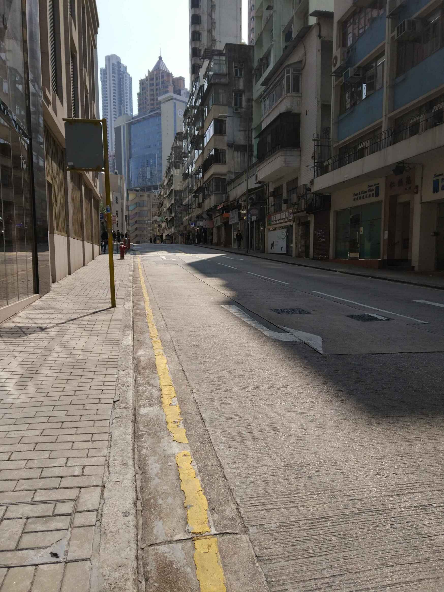

# 旅行归来

> 2018/2/15
>
> 一只船孤独的航行在海上，它既不寻求幸福，也不逃避幸福，它只是向前航行，底下是沉静碧蓝的大海，而头顶是金色的太阳。—— 莱蒙托夫 作 / 柴静 译

## 旅行

> 读万卷书，行万里路。

尽管很长一段时间没有读书了，但这段时间里，倒是走了不少的路。走在不同的路上，踩到不同的坑里，产生不同的感受，形成不同的想法。

> 你越是不开始书写，总是拿有限的思维缓存去默想一个问题，就越是没有内容可以写。如果你逼着自己将一些不成熟的想法写下来，看着自己写的内容，试着进一步拓展它们，就有可能在理性的道路上走得很远，很远。—— [《书写是为了更好的思考》](http://mindhacks.cn/2009/02/09/writing-is-better-thinking/) 刘未鹏

于是，我记下它们，分享给大家，也留给自己。

### 生活之旅

回想去年这个时候，[自己仍对未来感到无比的迷茫，甚至后悔之前的走的一些弯路](../2017/Thinking-College.md)。大概就像这样：

> 同样的是选择。你的人生一帆风顺的时候，你很容易相信你自己的选择；但是当人生一次次给你亮红灯的时候，甚至告诉你此路不通的时候，你就会慢慢后悔自己的选择，怀疑自己的选择，甚至再有机会到来的时候，你会彷徨纠结，总是对自己做出的选择唏嘘不已，也许山那边风景更好呢。—— [《成长不是顿悟，而是练习》](https://time.geekbang.org/column/article/3227) 朱赟

而现在，很多事情确定下来了 —— 放弃读研的机会，留在 **大城市 工作**。尽管不知道对不对，但至少已经选择了这条路。因为，在大城市里工作的很多人，都会 [敬畏时间的回报](http://insights.thoughtworks.cn/revere-time/)。

### 思想之旅

非常有意思：有人曾问过我，BOT Man 的 _BOT_ 是 _chat bot_（聊天机器人）的意思吗？

没错，我很喜欢聊天 —— **和人聊天**（不是和机器人聊天）—— 喜欢 **面对面聊天**。

> 两个人交换苹果，每个人手里还是一个苹果；两个人交换思想，每个人就同时拥有了两种思想。——萧伯纳

不论他/她是大朋友还是小朋友，每次和不同的朋友交流，总有不同的收获。比如最近的两个印象比较深的：

- “有时候，要想自己想要什么，而不是不想要什么。因为错过的可能是你想要的，但不会再来。” 让我才意识到，为什么总是 **得不到想要的** 东西。
- “机会不能靠等待，而是要争取。” 让我明白了 **强者和弱者** 在思维上的本质区别。

这些大道理，大家都 “懂”，但又不懂；而朋友站在不同的角度和你交流，能让你更快的 “悟” 出来。

### 香港之旅

> 有钱的时候没时间，有时间的时候没钱。

上周，趁着现在既能挤出一点时间，又能攒下一点小钱，去了一趟 **香港**。然后，顺道和 **深圳、广州** 的朋友们小聚了一次。

虽然上了大学之后很少去旅行，但我还是非常享受 **旅行的时光**。和许多人不一样，如果去城市旅行，我喜欢的是去 **感受**（当然还有吃吃吃和买买买 😂）。

这次旅行，我很多时间都是 **一个人** —— 晃荡在熙熙攘攘的街道上，穿梭在鱼龙混杂的集市里；坐上一站又一站的地铁巴士，一路上看着鳞次栉比的高楼店铺，和形形色色的路人商贩。和不同的人打交道 —— 有淳朴的，有诡谲的，有冷漠的 —— 体验了九龙的市井，感受了香港岛的繁华。

不知道是自己走进了他们的世界，还是他们的世界融入了我。也许这就是 **城市的活力**。

## 归来

> 思而不学则殆。—— 《论语》

长时间停止学习、停止产出、停留在 [微阅读](https://baike.baidu.com/item/微阅读) 的状态里，让我感到停止 “输入” 的彷徨。虽然自己仍然还是很弱，还有一大段路要走，但在新的猎场上，唯有努力生存。

2018 新年快乐~ 🙂🎉🎈✨🙃

如果有什么问题，**欢迎交流**。😄

Delivered under MIT License &copy; 2018, BOT Man
