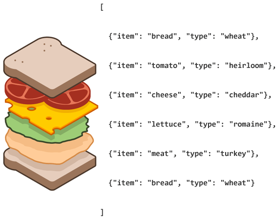

# C++ 引用在函数式编程中的应用

> 2018/12/15
> 
> 如何更高效的使用现代 C++ 实现函数式编程 🙃

最近要用 C++ 实现 [PageRank 算法](https://en.wikipedia.org/wiki/PageRank#Iterative)；于是趁着这个机会，搭上现代 C++ 的快车，体验了一把现代 C++ 函数式编程。

> 由于上一篇 [高阶函数简介](Higher-Order-Functions.md#写在最后) 提到的 [range-v3](https://github.com/ericniebler/range-v3) 没有被 C++ 17 纳入标准，所以本次需求使用的还是 C++ 11 提供的函数式编程能力。

为了实现 **“纯” 函数式** _(pure functional)_ 编程，我们要消灭函数的 **副作用** _(side-effect)_；而为了更高效，我们需要避免 **不必要的拷贝**。（参考：[Purely functional languages and monads (yinwang0)](https://yinwang0.wordpress.com/2013/11/16/pure-fp-and-monads/) 的 _Side-effects are real_ 部分）

对于没有垃圾回收机制的 C++，我们可以通过 **传递引用** 的方式，避免在函数调用/返回时拷贝对象。

## 目录 [no-toc]

[TOC]

## 传递引用，避免拷贝

> [代码链接](Cpp-Reference-in-Functional/functional-transpose.cpp)

PageRank 算法基于网页之间的链接关系，需要定义一个 [**邻接矩阵** _(adjacency matrix)_](https://en.wikipedia.org/wiki/Adjacency_matrix) 数据结构 `Matrix`，存储页面链接关系的有向图：

``` cpp
template <typename K>
using Matrix = std::multimap<K, K>;

template <typename K>
using Edge = typename Matrix<K>::value_type;
```

- `Matrix` 定义为 [**多重映射** _(multimap)_](https://en.cppreference.com/w/cpp/container/multimap)，可以实现同一个 key 映射到多个 value，即给定某个节点，可以映射到链接的多个节点上
- `Edge` 定义为映射的元素类型（[**序对** _(pair)_](https://en.cppreference.com/w/cpp/utility/pair)，即 `std::pair<K, K>`），每一个序对表示一组节点之间的链接关系，即图的一条有向边
- 数学上表示：$(u, v) \in G \implies (u, v) \in M$，其中 $G$ 表示有向图，$M$ 表示邻接矩阵 `Matrix`

PageRank 算法需要在有向图中，找出链接到给定网页的所有网页，即 [**反向链接** _(backlink)_](https://en.wikipedia.org/wiki/Backlink)。为了更方便的查询某个节点的入边，我们可以通过 [**转置** _(transpose)_](https://en.wikipedia.org/wiki/Transpose) 原始邻接矩阵，得到 反向连接的邻接矩阵 [_(transpose graph)_](https://en.wikipedia.org/wiki/Transpose_graph)：

```
0 1 0     0 0 1
0 0 1  -> 1 0 0
1 0 0     0 1 0
```

- 将原矩阵 $M$ 的每个有向边反转，得到新矩阵 $M^T$
- 数学上表示：$(u, v) \in M \implies (v, u) \in M^T$

### 如何跟踪对象生命周期

在实现矩阵转置算法前，我们定义 `CopyGuard` 来跟踪对象的生命周期，观察 `Matrix` 及其元素的拷贝情况：

``` cpp
class CopyGuard {
 public:
  explicit CopyGuard(int flag) : flag_(flag) {
    std::cout << "ctor" << flag_ << std::endl;
  }
  CopyGuard(const CopyGuard& rhs) {
    flag_ = rhs.flag_;
    std::cout << "copy" << flag_ << std::endl;
  }
  CopyGuard(CopyGuard&& rhs) {
    flag_ = rhs.flag_;
    std::cout << "move" << flag_ << std::endl;
  }

 private:
  int flag_;
};
```

- 对象显式构造时，输出 `ctor`
- 对象拷贝构造时，输出 `copy`
- 对象移动构造时，输出 `move`

由于 `Matrix` 是一个 `std::multimap` 容器，我们可以使用 `Matrix<CopyGuard>` 跟踪 `Matrix` 在转置过程中的生命周期变化，即当 `Matrix` 或内部元素被拷贝时，会触发 `CopyGuard::CopyGuard(const CopyGuard& rhs)`，输出 `copy`。

> 实验代码使用 `clang++/g++ -std=c++11` 编译，默认开启 **返回值优化** _(return value optimization, RVO)_（参考：[拷贝省略](Cpp-Rvalue-Reference.md#拷贝省略)）。

### 命令式实现

用命令式的方法实现矩阵转置 `TransposeImperative`：

``` cpp
template <typename K>
Matrix<K> TransposeImperative(const Matrix<K>& matrix) {
  Matrix<K> transposed{};
  for (const Edge<K>& edge : matrix) {
    transposed.emplace(edge.second, edge.first);
  }
  return transposed;
}
```

- 定义一个 新矩阵 `transposed` 作为返回值
- 遍历 原矩阵 `matrix` 的 有向边 `edge`
- 将 有向边 $(u, v)$ 反转为 $(v, u)$，并插入 新矩阵 `transposed`

### 函数式实现

用函数式的方法 —— [折叠 _(fold)_ 操作](https://en.wikipedia.org/wiki/Fold_%28higher-order_function%29) —— 实现矩阵转置 `TransposeFunctional`：

``` cpp
template <typename K>
Matrix<K> TransposeFunctional(const Matrix<K>& matrix) {
  return std::accumulate(
      std::begin(matrix), std::end(matrix), Matrix<K>{},
      [](const Matrix<K>& transposed, const Edge<K>& edge) -> Matrix<K> {
        Matrix<K> new_transposed = transposed;
        new_transposed.emplace(edge.second, edge.first);
        return new_transposed;
      });
}
```

- 使用 `std::accumulate` 遍历 原矩阵 `matrix`，累加到 新矩阵 `Matrix<K>{}` 上
- 迭代过程中，每次在 上一轮迭代得到的矩阵 `transposed` 的基础上，插入反转后的有向边，得到 `new_transposed` 为下一轮迭代的输入矩阵

根据实验结果，上述代码有 2 处拷贝：

- 拷贝上一轮迭代得到的矩阵 `Matrix<K> new_transposed = transposed;`
- 插入反转后的有向边 `new_transposed.emplace(edge.second, edge.first);`

假设矩阵里有 $N$ 条边：

| 操作 | 触发 `CopyGuard` 拷贝的次数 | 是否必需 |
|---|---|---|
| 拷贝上一轮迭代得到的矩阵 | $O(N^2)$ | 非必需，不需要每次迭代都生成新矩阵 |
| 插入反转后的有向边 | $O(N)$ | 必需，转置得到的矩阵和原矩阵独立 |

为了使用函数式编程，而又不因为过度拷贝影响性能，我们可以将不必要的 `Matrix<K> new_transposed = transposed;` 操作优化掉。

### 函数式优化：传递左值引用

为了避免额外的拷贝，我们可以从模板 [`std::accumulate`](https://en.cppreference.com/w/cpp/algorithm/accumulate) 的实现寻找灵感：

``` cpp
// accumulate: (first, last, init, op) -> init
  for (; first != last; ++first)
    init = op(init, *first);
  return init;
```

- `op` 的第一个参数可以接受 `init` 的 **左值引用**，避免传入 `init` 时发生拷贝
- `op` 的返回值可以返回 `init` 的 **左值引用**，避免传出 `init` 时发生拷贝

根据上述思路，我们可以将 `TransposeFunctional` 改写为 `TransposeLref`：

> 参考：[Efficient accumulate - Stack Overflow](https://stackoverflow.com/questions/19664196/efficient-accumulate/19664335#19664335)

``` cpp
template <typename K>
Matrix<K> TransposeLref(const Matrix<K>& matrix) {
  return std::accumulate(
      std::begin(matrix), std::end(matrix), Matrix<K>{},
      [](Matrix<K>& transposed, const Edge<K>& edge) -> Matrix<K>& {
        transposed.emplace(edge.second, edge.first);
        return transposed;
      });
}
```

- `std::accumulate` 使用的 lambda 表达式传递 **左值引用**：
  - 参数类型 `const Matrix<K>&` 改为 `Matrix<K>&`
  - 返回值类型 `Matrix<K>` 改为 `Matrix<K>&`
- 迭代过程中，每次插入反转后的有向边，操作的都是 **同一个** 新矩阵 `Matrix<K>{}`

### 函数式优化：传递右值引用

实际上，`std::accumulate` 在迭代时直接传递 `init` 的缺陷很早前已经被发现了（C++ 20 可能会修复）。

正确的做法是现有的 `op(init, *first)` 改用 [移动语义](Cpp-Rvalue-Reference.md#移动语义) `op(std::move(init), *first)` 传递每轮迭代产生的局部变量 `init`：

> 参考：[c++ accumulate with move instead of copy - Stack Overflow](https://stackoverflow.com/questions/13725425/c-accumulate-with-move-instead-of-copy/13740937#13740937)

``` cpp
// accumulate: (first, last, init, op) -> init
  for (; first != last; ++first)
    init = op(std::move(init), *first);  // std::move since C++20
  return init;
```

- op 传入参数 `init` 的 [右值引用](Cpp-Rvalue-Reference.md#右值引用)，由 `init` 的类型实现移动语义，从而避免对象 [**深拷贝** _(deep copy)_](https://en.wikipedia.org/wiki/Object_copying#Deep_copy)
- op 传出的返回值直接通过 [拷贝省略](Cpp-Rvalue-Reference.md#拷贝省略) 优化

基于修改后的 `cpp20::accumulate`，我们可以将 `TransposeFunctional` 改写为 `TransposeRref`：

> 参考：[Efficient Pure Functional Programming in C++ Using Move Semantics – C++ on a Friday](https://blog.knatten.org/2012/11/02/efficient-pure-functional-programming-in-c-using-move-semantics/)

``` cpp
template <typename K>
Matrix<K> TransposeRref(const Matrix<K>& matrix) {
  return cpp20::accumulate(
      std::begin(matrix), std::end(matrix), Matrix<K>{},
      [](Matrix<K>&& transposed, const Edge<K>& edge) -> Matrix<K> {
        transposed.emplace(edge.second, edge.first);
        return std::move(transposed);
      });
}
```

- `std::accumulate` 使用的 lambda 表达式传递 **右值引用**：
  - 参数类型 `const Matrix<K>&` 改为 `Matrix<K>&&`
  - 传入的 **右值引用** 会 [在函数内退化为 **左值引用**](Cpp-Rvalue-Reference.md#误解-返回时-不移动右值引用参数)
  - 在返回时强制转回 **右值引用** `return std::move(transposed);`
- 迭代过程中，虽然生成了很多 `Matrix` 对象，但在 [移动语义](Cpp-Rvalue-Reference.md#移动语义) 和 [拷贝省略](Cpp-Rvalue-Reference.md#拷贝省略) 下，这些临时的 `Matrix` 对象做的都是 [**浅拷贝** _(shallow copy)_](https://en.wikipedia.org/wiki/Object_copying#Shallow_copy)，不会触发 `CopyGuard`

## 双缓冲优化迭代过程

> [代码链接](https://github.com/BOT-Man-JL/BUPT-Projects/blob/master/0-0-Misc/pagerank.cpp)

PageRank 算法可以通过 [迭代的方法](https://en.wikipedia.org/wiki/PageRank#Iterative) 实现（伪代码）：

```
IteratePageRank: (ranks) -> ranks
  next_ranks <- StepPageRank(ranks)
  return <- IsConvergent(ranks, next_ranks)
      ? next_ranks
      : IteratePageRank(next_ranks)
```

- 每轮迭代调用 `StepPageRank` 生成 `next_ranks`
- 然后比较 `ranks` 和 `next_ranks`，判断是否收敛：
  - 如果收敛了，迭代结束，返回 `next_ranks`
  - 如果未收敛，递归调用 `IteratePageRank`，传递 `next_ranks` 进入下一轮迭代

`IteratePageRank` 每次迭代都会生成一个新的 `next_ranks`，如果不通过传递引用优化，会导致严重的拷贝问题。

如果使用传递引用的优化方法，每次 **原地** _(in-place)_ 修改 `ranks` 得到 `next_ranks`，会引入另一个问题：在 `IsConvergent(ranks, next_ranks)` 判断是否收敛时，原来的 `ranks` 对象已经失效：

- 左值引用优化的情况下，`ranks` 被更新为 `next_ranks`
- 右值引用优化的情况下，`ranks` 变成了一个空对象

另外，在 `StepPageRank` 计算 `next_ranks` 的过程中，需要使用参数 `ranks` 的完整数据；对于原地修改的方法，一边读取、一边修改同一个对象，会导致数据不完整的问题。

这里可以引入 [**双缓冲** _(double buffering)_](https://en.wikipedia.org/wiki/Multiple_buffering) 机制：

``` cpp
Vector<K, V> StepPageRank(const Vector<K, V>& ranks,
                          Vector<K, V>&& temp_ranks) {
  // ... update |temp_ranks| according to |ranks|
  return std::move(temp_ranks);
}

Vector<K, V> IteratePageRank(Vector<K, V>&& ranks,
                             Vector<K, V>&& temp_ranks) {
  return [&ranks](Vector<K, V>&& next_ranks) -> Vector<K, V> {
    return IsConvergent(ranks, next_ranks)
               ? std::move(next_ranks)
               : IteratePageRank(std::move(next_ranks),
                                 std::move(ranks));
  }(StepPageRank(ranks, std::move(temp_ranks)));
}
```

- `StepPageRank` 每次读取 `ranks` 的完整数据，将新的数据写入并返回 `temp_ranks`
- `IteratePageRank` 每次将 `StepPageRank` 返回的 `temp_ranks` 作为 `next_ranks`，然后检查是否收敛
- `IteratePageRank` 如果需要进入下一轮迭代，就将新生成的 `next_ranks` 作为用于读取的数据，而已经过期的 `ranks` 作为用于写入的缓存

基于双缓冲的方法，迭代过程只需要构造两个 `Vector<K, V>` 对象即可 —— 一方面避免了额外的拷贝，另一方面不会导致读写冲突的问题。

## 向左值引用参数传递右值对象

> [代码链接](Cpp-Reference-in-Functional/functional-iostream.cpp)

在 C++ 中，许多和 IO 相关的接口继承于 `std::istream`/`std::ostream`；而对输入输出流的操作往往需要修改流的本身，所以很多输入输出流相关的操作接口，只接受 **左值引用** 作为输入：

``` cpp
std::ifstream ifs = argc >= 2 ? std::ifstream(argv[1]) : std::ifstream();
std::ofstream ofs = argc >= 3 ? std::ofstream(argv[2]) : std::ofstream();
std::copy(std::istream_iterator<std::string>(ifs),
          std::istream_iterator<std::string>(),
          std::ostream_iterator<std::string>(ofs, "\n"));
```

- 以参数 `argv[1]` 构造文件输入流 `ifs`，参数 `argv[2]` 构造文件输出流 `ofs`
- 使用 `ifs`/`ofs` 的左值引用构造迭代器 `stream_iterator`
- 从 `ifs` 读取 `std::string`，直接输出到 `ofs` 中

### 右值 -> 左值引用

为了消除局部变量 `ifs`/`ofs`，我们可以直接在 `stream_iterator` 构造函数的参数里构造 `fstream` 对象：

``` cpp
std::copy(std::istream_iterator<std::string>(
              argc >= 2 ? std::ifstream(argv[1]) : std::ifstream()),
          std::istream_iterator<std::string>(),
          std::ostream_iterator<std::string>(
              argc >= 3 ? std::ofstream(argv[2]) : std::ofstream(), "\n"));
```

但代码无法编译：

```
candidate constructor not viable: no known conversion
    from 'std::ifstream' to 'istream_type &' for 1st argument
candidate constructor not viable: no known conversion
    from 'std::ofstream' to 'ostream_type &' for 1st argument
```

- 在表达式里构造 `fstream` 对象是一个 **右值**
- 而 `stream_iterator` 构造函数只接受 `stream` 的 **左值引用**
- 这里无法将 **右值** 直接转换成 **左值引用**

### 右值 -> 右值引用 -> 左值引用

为了解决这个问题，我们可以使用 [右值引用的技巧](Cpp-Rvalue-Reference.md#右值引用) 进行优化：

``` cpp
[](std::ifstream&& ifs, std::ofstream&& ofs) -> void {
  std::copy(std::istream_iterator<std::string>(ifs),
            std::istream_iterator<std::string>(),
            std::ostream_iterator<std::string>(ofs, "\n"));
}(argc >= 2 ? std::ifstream(argv[1]) : std::ifstream(),
  argc >= 3 ? std::ofstream(argv[2]) : std::ofstream());
```

- 使用一个参数为 `ifs`/`ofs` **右值引用** 的 lambda 表达式
- 将临时构造出的 `fstream` **右值** 对象传入 lambda 表达式
- 而 **右值引用** 参数会 [在函数内退化为左值引用](Cpp-Rvalue-Reference.md#误解-返回时-不移动右值引用参数)
- 所以在 lambda 表达式内，`ifs`/`ofs` 会被当成 **左值引用** 看待，可以直接构造 `stream_iterator`

基于这个技巧，我们就离 **告别局部变量** 更近了一步~ 😊

## 写在最后 [no-toc]

使用 **函数式编程** 可以让代码看起来 **更简洁**，使用 **引用优化** 可以让代码 **更高效**~ 🙃

[align-center]

[img=max-width:70%]



[align-center]

图片来源：[Declarative Programming And The Web](https://www.smashingmagazine.com/2014/07/declarative-programming/)

如果有什么问题，**欢迎交流**。😄

Delivered under MIT License &copy; 2018, BOT Man
