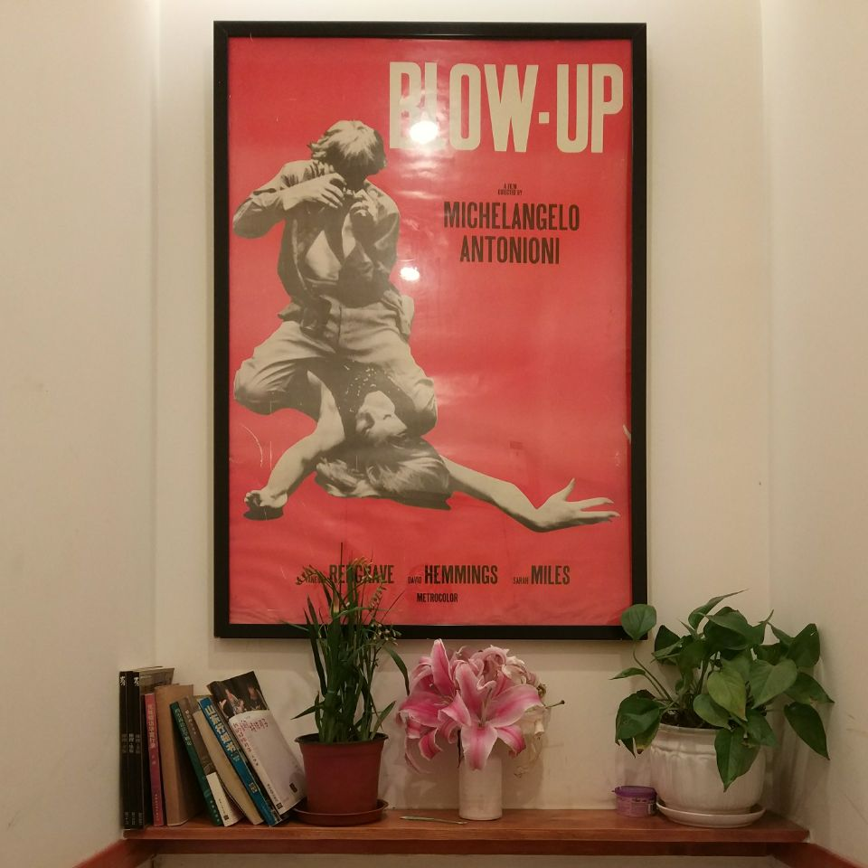

# 咖啡、酒精、牛奶、花茶

> 2018/4/1
>
> I'm only human after all. Don't put your blame. —— _Human_, Rag'n'Bone Man

## 1 咖啡

最近在做 Windows 网络驱动开发，搜索 WFP _(Windows Filter Platform)_ 的时候，偶然看到一位前辈的博客，里边有一段话让我深有感触：

> 总说程序员是孤独的，因为，大部分的时间都在和机器打交道。大部分的时间都在自言自语。我的内心需要足够的强大。
>
> [align-right]
>
> —— [z18_28_19 的博客](https://blog.csdn.net/z18_28_19/article/details/12979297)

很多程序员喜欢咖啡，甚至把自己比作 “从咖啡到代码的转化机器”。在很多人看来，咖啡可以用来缓解孤独的感觉，减缓一人独处的痛苦。

而对于我，咖啡因带来的是一种平静 —— 戴上耳机，处在一个人的世界里 ——

- 在这个世界里，没有浮躁和纷扰，享受着专注的乐趣；
- 在这个世界里，能够冷静的思考，进行着缜密的推理；
- 在这个世界里，任何的创造都可以成为艺术，你就是 Pablo Picasso，and nobody can judge。

听完一辑歌单，摘下耳机，回到熟悉的世界，welcome back。

## 2 酒精

放假的时候，心血来潮，花了三小时看了一部 09 年的电影《守望者》。我不喜欢英雄电影，不喜欢个人英雄主义，不喜欢千篇一律的结局。我喜欢这部现实主义英雄电影，它刻画的是超级英雄作为常人的生活 —— 作为英雄，生活里充斥着光环和荣耀；作为常人，也要为生活而苦恼。

其中，笑匠 _(Comedian)_ 这个角色让我印象最深刻：他不是一个好人，但也不算是个坏人 —— 他只是个人 ——

> I thought I knew how the world was. I've done some bad things. I did bad things to women. I shot kids... But that was fucking war.
>
> [align-right]
>
> —— _笑匠台词_《守望者》

没人喜欢战争，没人想成为战争的机器。但是，你一旦成了 _the one the battles always choose_，就会发现生活是苦的 —— 不管你往里加多少糖，总能透出那一丝丝的苦味 ——

> I heard a joke once.
> Man goes to doctor, says he's depressed. Life seems harsh and cruel. Says he feels all alone in a threatening world.
> Doctor says "Treatment is simple. The great clown, Pagliacci, is in town. Go see him. That should pick you up".
> Man bursts into tears. "But doctor", he says, "I am Pagliacci."
>
> 我听过一个笑话。
> 说一个男人去看医生，说他很沮丧，人生看起来很无情、很残酷，说他在这个充满威胁的世界上觉得很孤独。
> 医生说疗法很简单，“伟大的小丑帕格里亚齐来了，去看他的表演吧。他能让你振作起来的。”
> 那男人突然大哭，“但是医生”，他说，“我就是帕格里亚齐”。
>
> [align-right]
>
> —— _罗夏独白_《守望者》

Yeah, _no one wants the tears of a clown._ 虽然我不喜欢酒，但喜欢一个人坐瘫沙发上，小酌一杯，模糊平日里清晰的思路，融成一片空白，化入肠子里。

## 3 牛奶

在咖啡加点牛奶，可以冲淡咖啡的苦味。如果说，黑色是夜的忍者，无所畏惧；那么，白色是光的信徒，纯洁明净。黑色的咖啡配上白色的牛奶，也许是一种命中注定的偶然。

虽然我不属于光，但我向往着光。在饥寒交迫的时候，我总会讨一杯温暖的牛奶滋润干枯的胃，在寒冷的冬夜里感受阳光的温暖。

虽然我向往着光，却不是光的信徒。常走夜路的人，不习惯长时间浸在牛奶里的感觉，也不会让牛奶的味道麻痹自己的味觉。

> 年轻时就释怀与淡泊，是没有希望的。
>
> [align-right]
>
> —— 王石

每当一阵寒风吹来，听到有人在叫自己的名字，脚歇够了，该走了。

## 4 花茶

虽然咖啡、酒精、牛奶可以把人带入不同的心境，但凡人的身体并不能与心同去。咖啡、酒精、牛奶喝多了，也会胃疼、肝难受。

偶尔泡杯花茶，放慢脚步，静下心看看走过的路。有时候，我们努力改变可以改变的事情；也有时候，也需要坦然接受不可改变的事情。就像这段话所说：

> 所有不再钟情的爱人，渐行渐远的朋友，不相为谋的知己，都是当年我自云云人海中独独看到了你，如今我再将你好好地还回人海中。
>
> [align-right]
>
> —— 未知出处

珍惜眼前，活在当下，live it real. 感谢你读完了这篇文章 :-)

---

如果有什么问题，**欢迎交流**。😄

Delivered under MIT License &copy; 2018, BOT Man
