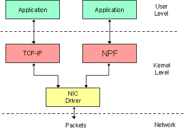
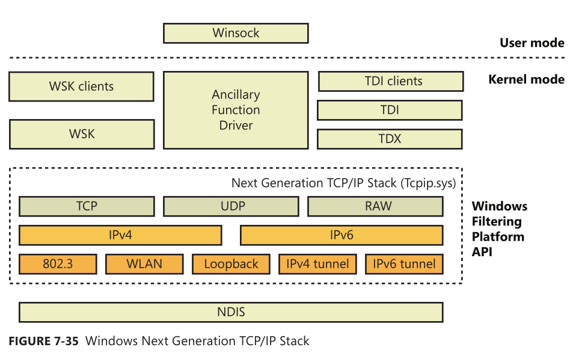
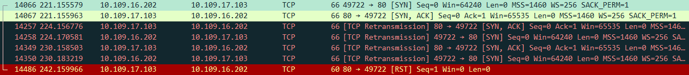
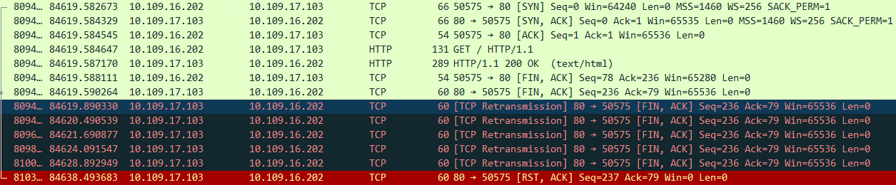
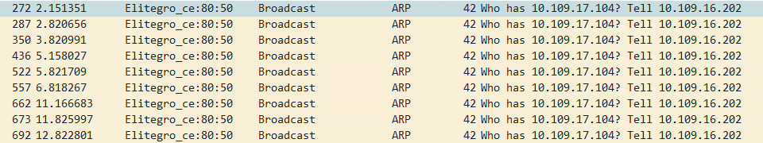
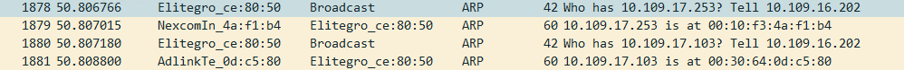

# 从 Windows Filtering Platform 学习 TCP/IP（1）

> 2018/4/16
>
> 彼节者有间，而刀刃者无厚；以无厚入有间，恢恢乎其于游刃必有余地矣。——《庄子·养生主》

[heading-numbering]

实现代码：
https://github.com/BOT-Man-JL/WFP-Traffic-Redirection-Driver

## [no-toc] [no-number] TOC

[TOC]

## 背景

毕业设计要求开发一个匿名通信客户端（Windows 网络驱动）：

- 拦截/修改主机和外网之间的流量，实现 [匿名通信协议](https://dl.acm.org/citation.cfm?doid=3140549.3140554)；
- 防止 [WinPcap (Wireshark)](https://www.winpcap.org/docs/iscc01-wpcap.pdf) 对原始流量的嗅探，隐藏 TCP/UDP 端口、IP 地址、以太网 MAC 地址

换句话说，就是需要：

- 拦截/修改 **上层应用程序** 传输的数据包，我们驱动的工作对其 **透明**
  - 需要实现修改（源/目的）TCP/UDP 端口、IP 地址、以太网 MAC 地址的能力
  - 例如，主机 A 访问 Baidu，而链路上黑客嗅探到的数据是 主机 B 在访问 Google
- 必须在 WinPcap 嗅探数据 **之前修改发送数据**，在嗅探 **之后修改接收数据**，从而避免其嗅探到原始流量
  - 主机上黑客（恶意软件等）主要使用类似于 WinPcap 的工具进行流量嗅探，需要重点保护
  - 如果主机被黑客攻击，原始流量被嗅探，链路上伪造的流量也会被轻易还原

借此机会，学习了 TCP/IP 协议栈、Windows 驱动开发、Windows 网络架构。

## 调研

### WinPcap 流量嗅探原理

[WinPcap 的核心](https://www.winpcap.org/docs/docs_412/html/group__internals.html) 是一个叫做 NPF _(Netgroup Packet Filter)_ 的 [NDIS _(Network Driver Interface Specification)_ 协议驱动](https://docs.microsoft.com/en-us/windows-hardware/drivers/network/ndis-protocol-drivers2)，在 Windows 网络驱动栈的较底层（下层直接对接网卡驱动），实现了对经过网卡（物理网卡/虚拟网卡）的所有流量的嗅探。

[align-center]



[align-center]

图 [NPF 在 NDIS 中的位置](https://www.winpcap.org/docs/docs_412/html/group__NPF.html)

> 注：
>
> - Wireshark/WinDump 均使用 WinPcap 作为嗅探引擎
> - [npcap](https://nmap.org/npcap/) 和 [Win10Pcap](http://www.win10pcap.org/) 是对 WinPcap 改进的版本，原理相似
>   - https://github.com/nmap/npcap
>   - https://github.com/SoftEtherVPN/Win10Pcap

### 技术方案

在 Windows Vista 以后，TCP/IP 成为了主流，微软升级了 TCP/IP 栈的驱动架构，将 **TCP/IP 的核心逻辑** 处理放入 `tcpip.sys` 驱动实现（例如，TCP 的建立连接三次握手、释放连接四次挥手、传输的过程中的可靠性和效率保障，IP 的维护 ARP 表、校验 checksum 等），对上层应用只暴露 **简单的接口**（例如 socket 调用 `connect/accept` 函数，TCP 驱动就实现了三次握手；在 `send/recv` 函数背后，TCP 驱动实现了重传、差错控制、拥塞控制等机制）。

[align-center]



[align-center]

图 Windows 下一代 TCP/IP 协议栈（来源：Windows Internals, 6th Edition, Part 1）

> 彼节者有间

微软的 TCP/IP 驱动设计时，为了提供更好的 **灵活性**（例如定制 TCP/IP 协议，实现 NAT、IPsec 等），在 TCP/IP 协议栈上 应用层、传输层、网络层（Windows 8 加入了 MAC 子层）暴露一系列 [Windows Filter Platform _(WFP)_](https://docs.microsoft.com/en-us/windows/win32/fwp/windows-filtering-platform-start-page) 接口。

> 以无厚入有间

利用这些接口，我们不仅可以过滤（放行/拦截）经过 TCP/IP 驱动的流量，还可以实现对流量的修改（修改 **包头** _(header)_ 或 **载荷** _(payload)_）。进一步的，修改包头中的源/目的地址（TCP/UDP 端口号、IP 地址、MAC 地址），在进入下一层之前，可以实现对包的重定向（例如，NAT 驱动 `ipnat.sys` 就是通过 WFP 实现的）。

> 恢恢乎其于游刃必有余地矣

恰好，TCP/IP 驱动和 WinPcap 的 NPF 驱动都是 NDIS 协议驱动，处于 **平级关系**。利用 WFP 提供的接口，在 TCP/IP 驱动内完成对流量的修改，一方面能更深入 TCP/IP 流程，另一方面可以绕过 WinPcap 的嗅探。

## 试验 —— 流量重定向

为了体验 WFP 的强大威力，我们基于微软官方的 [WFP 流量拦截样例](https://github.com/Microsoft/Windows-driver-samples/tree/master/network/trans/inspect) 进行修改，实现一个流量重定向的 proof of concept _(PoC)_：

- 修改 TCP/UDP **端口号**
- 修改 **远端主机 IP 地址**
  - 修改 **发往** 主机 A 包的 **目的 IP 地址**，**重定向** 到主机 B
  - 修改从主机 B **收到** 包的 **源 IP 地址**，**还原** 为主机 A 的地址
- 对上层应用 **透明**，即上层应用不知道上述修改的存在（用户用浏览器打开 Baidu，经过驱动修改后，可以变成 Google）

我们在同一个局域网内部署了两个主机，分别记作 `202` 和 `103`。在主机 `202` 上进行如下测试：

- 访问主机 `104`（一个不存在的主机），将流量重定向到主机 `103` 上
- 访问主机 `103` 的 `81` 端口，将流量重定向到 `80` 端口上
- 访问主机 `104` 的 `81` 端口，将流量重定向到主机 `103` 的 `80` 端口上

### 传输层修改收包

最初，我们的 PoC 是从官方的 WFP 拦截样例改过来的，分别在 `OUTBOUND_TRANSPORT` 和 `INBOUND_TRANSPORT` 层上完成对发送/接收的包的修改。架构模型大致如下：

```
          socket              socket
            |                   ^
            |  TCP stream data  |
            ~                   |
  :--- TCP Driver --------- TCP Driver ---:
  |         |                   ^         |
  |         |    TCP segment    |         |
  |         ~                   |         |
  | OUTBOUND_TRANSPORT  INBOUND_TRANSPORT |  <- modify here!
  |         |                   ^         |
  |         |    TCP segment    |         |
  |         ~                   |         |
  :--- TCP Driver --------- TCP Driver ---:
            |                   ^
            |     IP packet     |
            ~                   |
        IP Driver           IP Driver
            |                   ^
            |   Ethernet frame  |
            ~                   |
```

#### 结果

- `OUTBOUND_TRANSPORT` 层成功重定向 IP 地址、端口，并送达主机 `103`
- 主机 `202` 能接收到主机 `103` 的 `80` 端口发回的数据包（pcap 能抓到）
- 但是，`INBOUND_TRANSPORT` 层 **没有拦截到** 接收的数据包
- 从而导致，两个主机超时重传 `SYN`；最后主机 `103` 发送 `RST` 结束这个过程



#### 分析

每个 socket 都可以用一个 **五元组** _(5-tuple)_ 标识 —— 源 IP、源端口、目的 IP、目的端口、协议（TCP/UDP）。TCP/IP 驱动会根据五元组，识别接收数据的 socket：

- 当 IP 驱动收到一个 IP 包，就会检查承载的内容是什么协议的
- 如果是 TCP 协议，就会转交给 TCP 驱动处理
- TCP 驱动会检查五元组，查找关联的 socket，并将这个数据传递给这个 socket

由于从主机 `103` 接收的包，没有及时把 IP 地址还原到 `104` / 端口还原到 `81`，TCP 驱动 **根据五元组**，**找不到** 对应的 **socket**，就会直接丢弃（有时候还会发送 RST），导致 `INBOUND_TRANSPORT` 层不能拦截到这个包。

```
          ^
          |
  INBOUND_TRANSPORT -> we update 103:80 to 104:81 here!
          ^
          |  (unreachable)
          |
     TCP Driver -> 103:80 not found (expect 104:81)! discard packet!
          ^
          |  (103:80 -> 202:xx / TCP)
          |
      IP Driver -> IP 103/202 is fine, pass to upper layer
          ^
          |  (103:80 -> 202:xx / TCP)
          |
```

所以，我们要在到达 **传输层** 之前，即在 **网络层**，修改收包的 IP/端口。

### 传输层修改发包

重新设计后，我们在 **传输层**（`OUTBOUND_TRANSPORT`）修改发包，**网络层**（`INBOUND_NETWORK`）修改收包。架构模型大致如下：

```
          socket              socket
            |                   ^
            |  TCP stream data  |
            ~                   |
  :--- TCP Driver --------- TCP Driver ---:
  |         |                   ^         |
  |         |    TCP segment    |         |
  |         ~                   |         |
  | OUTBOUND_TRANSPORT          |         |  <- modify here!
  |         |                   |         |
  |         |    TCP segment    |         |
  |         ~                   |         |
  :--- TCP Driver --------- TCP Driver ---:
            |                   ^
            |     IP packet     |
            ~                   |
  :---- IP Driver ---------- IP Driver ---:
  |         |                   ^         |
  |         |     IP packet     |         |
  |         |                   |         |
  |         |             INBOUND_NETWORK |  <- modify here!
  |         |                   ^         |
  |         |     IP packet     |         |
  |         ~                   |         |
  :---- IP Driver ---------- IP Driver ---:
            |                   ^
            |   Ethernet frame  |
            ~                   |
```

#### 结果

- `INBOUND_NETWORK` 层正常工作，TCP 建立连接三次握手、TCP 数据传输都没问题
- 但是，释放连接的第四次挥手（主机 `202` 最后一个 `ACK`）发不出去，导致
  - 主机 `202` 先关闭了 socket（发完了最后一个 `ACK` 就可以关闭了）
  - 主机 `103` 等待最后一个 `ACK`，不断重传 `FIN+ACK`，最后发送 `RST` 结束这个过程



#### 分析

在传输层，发送数据需要关联特定的 socket；在 `OUTBOUND_TRANSPORT` 层发送的数据包，调用 `FwpsInjectTransportSendAsync` 函数也需要指定 socket（上层句柄）对应端点的 `endpointHandle`（底层内核对象）。

根据 [MSDN 描述](https://docs.microsoft.com/en-us/windows-hardware/drivers/ddi/content/fwpsk/nf-fwpsk-fwpsinjecttransportsendasync1)，如果不及时发送数据，socket 关闭、端点资源释放后，会导致数据无法发送。（详见 [Github Issue](https://github.com/Microsoft/Windows-driver-samples/issues/234)）

在我们的试验中，主机 `202` 收到了 `FIN+ACK` 后，发送最后一个 `ACK`，就可以 **直接关闭 socket**。而这个 `ACK` 被我们的驱动 **拦截**，在修改后 **重新发送**，端点资源可能已经 **被释放**，导致不能正确发送。

```
     TCP Driver -> send last ACK in response to FIN+ACK
          |
          |  (last ACK / 202:xx -> 104:81 / TCP)
          ~
  OUTBOUND_TRANSPORT -> we update 104:81 to 103:80 here!
          |
          |  (last ACK / 202:xx -> 103:80 / TCP)
          ~
     TCP Driver -> endpoint was closed! discard packet!
          |
          |  (unreachable)
          ~
      IP Driver
          |
          ~
```

为了解决这个问题，我们推迟到无状态的 **网络层** 修改发包的 IP/端口。

### 网络层修改发包

现在，收包、发包的修改都放到了 **网络层** 上，即 `OUTBOUND_NETWORK` 和 `INBOUND_NETWORK`。

```
          socket              socket
            |                   ^
            |  TCP stream data  |
            ~                   |
       TCP Driver           TCP Driver
            |                   ^
            |     IP packet     |
            ~                   |
  :---- IP Driver ---------- IP Driver ---:
  |         |                   ^         |
  |         |     IP packet     |         |
  |         |                   |         |
  |  OUTBOUND_NETWORK     INBOUND_NETWORK |  <- modify here!
  |         |                   ^         |
  |         |     IP packet     |         |
  |         ~                   |         |
  :---- IP Driver ---------- IP Driver ---:
            |                   ^
            |   Ethernet frame  |
            ~                   |
```

#### 结果

- 出人意料，`OUTBOUND_NETWORK` 层 **没有拦截到** 发送的数据包
- 当然，pcap 也抓不到任何流量

#### 分析

从原理上：

- 如果一个 IP 包要通过网卡发到以太网上，必须要知道目的主机的 MAC 地址，才能构造出完整的 **以太网帧** _(ethernet frame)_
- 如果要知道目的 MAC 地址，就需要带着目的主机的 IP 地址，利用 ARP 协议进行查询
- 如果目的主机的 IP 地址查不到对应的 MAC 地址，就不能构造出正确的以太网帧，IP 驱动会将其丢弃

为了验证这个猜想，我们利用 pcap 嗅探了 ARP 流量 —— 不出所料，主机 `202` 一直在询问主机 `104` 的 MAC 地址。



由于主机 `104` 并不存在，主机 `202` 收不到对应的 ARP 响应，无法构造发往主机 `104` 的以太网帧，从而导致 `OUTBOUND_NETWORK` 层不能拦截到发往主机 `104` 的包。

```
    TCP Driver -> construct IP packet and send
         |
         |  (202:xx -> 104:81 / TCP)
         ~
     IP Driver -> search ARP table for host 104, but not found
         |
         |  (unreachable)
         ~
  OUTBOUND_NETWORK -> we update 104:81 to 103:80 here!
         |
         |  (unreachable)
         ~
     IP Driver
         |
         ~
```

为了进一步验证这个猜想，我们把主机 `104` 换成了局域网内的一台真实存在的主机 `253` —— 即把试验改为：重定向访问主机 `253` 的 `81` 端口的流量到主机 `103` 的 `80` 端口上。然后，再用 pcap 嗅探 ARP 流量。

果然，`OUTBOUND_NETWORK` 层拦截到了发往主机 `253` 的数据包；pcap 也能看出：主机 `202` 先询问了主机 `253` 的 MAC 地址，再询问了主机 `103` 的 MAC 地址。



```
    TCP Driver -> construct IP packet and send
         |
         |  (202:xx -> 253:81 / TCP)
         ~
     IP Driver -> search ARP table for host 253, and found
         |
         |  (202:xx -> 253:81 / TCP)
         ~
  OUTBOUND_NETWORK -> we update 253:81 to 103:80 here!
         |
         |  (202:xx -> 103:80 / TCP)
         ~
     IP Driver -> search ARP table for host 103, and found
         |
         |  (202:xx -> 103:80 / TCP)
         ~
```

在传输层上，即使随意设置端口，不需要知道远端主机的端口是否打开，也能构造出正确的 IP 包（例如，[端口扫描](https://en.wikipedia.org/wiki/Port_scanner)）；但网络层中，如果设置的 IP 地址没有对应的主机，就不能构造出对应的以太网帧了。

由于在实际业务中，匿名通信系统会响应的主机发送的所有 ARP 请求（并设置用于匿名通信的 MAC 地址），所以我们的 PoC 最后采用这套方案。

## 未完

[下一篇文章](Learn-TCP-IP-from-WFP-2.md) 里，将

- 进一步讨论 IP 驱动如何构造以太网帧
- 试验 匿名通信
  - 实现隐藏 **本机 IP 地址** 的 PoC，即修改发送包的源地址、接收包的目的地址
  - 设计在 MAC 层修改 **源/目的 MAC 地址** 的 PoC
- 总结 Windows TCP/IP 驱动架构实现

如果有什么问题，**欢迎交流**。😄

Delivered under MIT License &copy; 2018, BOT Man
