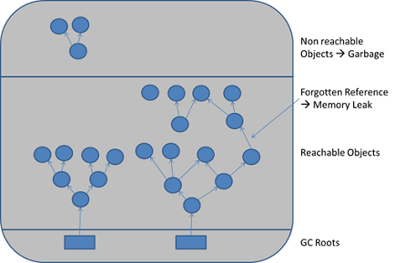

# 资源管理小记

> 2018/1/10
>
> 主要讨论 面向对象程序设计中的资源管理，以及 跨系统边界资源管理的相关问题。

[heading-numbering]

## [no-toc] [no-number] TOC

[TOC]

## 为什么要做资源管理

**资源** _(resource)_ 是 _使用前需要被获取、使用后需要被释放_ 的东西。

- 从计算机的角度来看，常见的资源有：内存、锁、网络连接、文件等
- 从人类的角度来看，资源还可以是业务逻辑上的 **实体** _(entity)_ 在计算机中的表示，例如人员、社区、物资等

资源管理是程序设计中的一个重要问题：

- 资源是 **有限的**
  - 如果程序获取了资源后不释放，就会导致资源 **泄露** _(leak)_
  - 由于资源的有限性，其他程序就会申请不到这些资源
- 资源 **需要被释放**
  - 如果程序访问了已经被释放的资源，可能出现 **异常** _(exception)_
  - 如果程序没有做相应的检查，就会崩溃

## 资源和对象生命周期

> Item 13: Use objects to manage resources. —— Meyer Scott, _Effective C++ 3rd Edition_

一般的程序里，资源的 **生命周期** _(lifetime)_ 主要涉及三种操作：

| 资源生命周期 | 举例 C 标准库函数 |
|---|---|
| 获取资源 | [打开文件](https://en.cppreference.com/w/c/io/fopen) `fopen(filename, open_mode)` |
| 使用资源 | [读](https://en.cppreference.com/w/c/io/fread) / [写](https://en.cppreference.com/w/c/io/fwrite) 文件 `fread/fwrite(buffer, size, count, file)` |
| 释放资源 | [关闭文件](https://en.cppreference.com/w/c/io/fclose) `fclose(file)` |

在面向过程语言中，对资源的操作往往通过函数调用的方式实现：

- 调用 open 函数获取资源，返回资源 **句柄** _(handle)_
- 以句柄作为参数，调用资源操作函数（例如 read/write）使用资源
- 使用结束后，以句柄作为参数，调用 close 函数释放资源

由于面向过程语言没有对象的概念，资源的 **所有权** _(ownership)_ 往往并不明确，从而容易导致忘记释放资源（参考：[基于 C 语言函数指针的回调 | 深入 C++ 回调](../2019/Inside-Cpp-Callback.md#为什么要区分一次和多次回调)）

在面向对象程序设计中，资源往往以对象为载体，资源对象 **拥有** _(own)_ 资源，通过对象的生命周期管理实现资源管理：

| 对象生命周期 | 举例 C++ 标准库 [`std::basic_fstream`](https://en.cppreference.com/w/cpp/io/basic_fstream) |
|---|---|
| 对象创建时，获取资源 | 构造 `fstream` 时根据 `filename/open_mode` 打开对应文件 |
| 通过访问对象，使用资源 | 调用 `fstream` 的 [`read`](https://en.cppreference.com/w/cpp/io/basic_istream/read)/[`write`](https://en.cppreference.com/w/cpp/io/basic_ostream/write) 函数读写文件 |
| 对象销毁时，释放资源 | 析构 `fstream` 关闭对应文件 |

### 资源对象的访问

在面向对象语言中，对资源的操作就被封装到了对象里 —— 对象成员方法的访问，会被 **映射** 为资源的使用。例如，调用 `file_object.read` 会映射为读取文件的操作，`file_object.write` 会映射为写入文件的操作。

在面向对象程序中，访问资源对象的接口 和 使用资源的实际操作，不一定直接相关。例如，C++ 标准库中 [`std::basic_fstream`](https://en.cppreference.com/w/cpp/io/basic_fstream) 提供的读取数据接口 [`std::basic_istream::read`](https://en.cppreference.com/w/cpp/io/basic_istream/read) 并不属于 `fstream`，而属于其基类 `istream`。

而在调用 `istream.read` 时，使用者并不关心具体使用的是哪种来源读取数据 —— 支持 `read` 操作的来源可能是 标准输入输出流（`iostream`）/ 字符串流（`stringstream`）/ 文件流（`fstream`）。只有传入的 `istream` 是 `fstream` 时，才会访问文件资源。

在面向对象语言中，由于 [**多态** _(Polymorphism)_](Object-Oriented-Programming.md#多态-Polymorphism) 概念的引入，把资源对象的 **访问操作** 和 **创建/销毁** 分离 —— 可以通过资源对象的基类接口，隐式地把 **基类接口的访问** 映射到 **资源的使用** 上。

### 资源对象的销毁

程序设计语言中，对象的销毁主要有两种方式：

- [手动销毁](https://en.wikipedia.org/wiki/Manual_memory_management) —— 需要在 **代码显式** 销毁对象
- 自动销毁 —— 一般通过 **运行时系统** 提供的 [垃圾回收](https://en.wikipedia.org/wiki/Garbage_collection_%28computer_science%29) 机制完成，不由程序主动销毁

对于资源对象的销毁，这两种方式在不同应用场景下各有利弊。例如：

- 手动销毁
  - **不释放不再使用** 的资源，会导致 **泄露** 问题（可以使用 **RAII 机制** 避免）
  - **使用被释放** 的资源，会导致 **悬垂引用** 问题（可以使用 [sec|弱引用关系] **弱引用机制** 避免）
  - **释放正在使用** 的资源，会导致 **崩溃** 问题
    - 单线程常见于：在对象回调栈上删除对象本身（例如 UI 弹出上下文菜单，点击按钮后，立即删除菜单对象；可以通过 **异步释放** 避免）
    - 多线程常见于：通过弱引用使用资源，但同时资源却被强引用的持有者释放（使用前把弱引用 **固定** _(pin)_ 为强引用，持有对象所有权）
- 自动销毁
  - 资源的释放 **位置和时机不可控**，往往依赖于垃圾回收系统的实现机制
  - 基于 [计数](https://en.wikipedia.org/wiki/Reference_counting#Variants_of_reference_counting) 的自动管理：如果对象之间出现 **循环引用**，也会导致 **资源泄露** 问题（可以使用弱引用避免，[sec|弱引用关系]）
  - 基于 [跟踪](https://en.wikipedia.org/wiki/Tracing_garbage_collection) 的自动管理：对于不再使用的对象，如果忘记断开对它的引用，就会出现 **不可达引用**（例如把资源对象放入 cache 但从不清理），同样导致 **资源泄露** 问题（需要资源的申请者注意）

[align-center]

[align-center]

图：被遗忘的引用 导致内存泄露（[来源](https://www.dynatrace.com/resources/ebooks/javabook/how-garbage-collection-works/)）

### 在 C++ 里的实现

C++ 为了保证语言本身的性能，不支持自动销毁机制。为了解决 C 语言里资源所有权不明确的问题，现代 C++ 提供了更方便的 **资源安全** _(memory safe)_ 机制：

- 引入 [**RAII** _(resource acquisition is initialization)_ 机制](https://en.wikipedia.org/wiki/Resource_acquisition_is_initialization)，明确资源的所有权，避免资源泄露（例如，[`unique_ptr`](https://en.cppreference.com/w/cpp/memory/unique_ptr) / [`shared_ptr`](https://en.cppreference.com/w/cpp/memory/shared_ptr)）
- 支持 [**基于区域的内存管理** _(region-based memory management)_](https://github.com/CppCon/CppCon2016/blob/master/Presentations/Lifetime%20Safety%20By%20Default%20-%20Making%20Code%20Leak-Free%20by%20Construction/Lifetime%20Safety%20By%20Default%20-%20Making%20Code%20Leak-Free%20by%20Construction%20-%20Herb%20Sutter%20-%20CppCon%202016.pdf)，提供类似自动销毁的垃圾回收机制，并允许使用者 **控制** 回收的 **位置和时机**（例如，[`deferred_ptr`](https://github.com/hsutter/gcpp)）

## 资源和对象的映射关系

> Item 14: Think carefully about copying behavior in resource-managing classes. —— Meyer Scott, _Effective C++ 3rd Edition_

用于资源管理的对象，往往需要注意它的 **拷贝语义**：

- 如果资源是不可拷贝的，那么这个对象也是不可拷贝的
- 如果资源可以拷贝，那么对象的拷贝会导致相应资源的拷贝
- 另外，有时候仅需要使用资源，而不需要拥有资源

这里，就涉及到了资源和对象的 **映射关系**。

### 一对一关系

同一个资源，在系统中由一个对象来管理。一般这个对象是 **不可拷贝** _(non-copyable)_ 的（如果不希望资源被拷贝，可以使用这种方法）。

- **互斥所有权** _(exclusive ownership)_：这个对象创建时申请资源，销毁时释放资源
- 读取和修改这个可变对象，直接映射到对资源的读取和修改上

### 多对一关系

同一个资源，在系统中有多个对象来表示。多个对象 **共享** 同一个资源。

- **共享所有权** _(shared ownership)_：在第一个对象创建时申请资源，所有对象都销毁时释放资源
- 读取任意一个对象，都直接映射到对资源的读取上
- 修改其中一个对象：
  - 如果使用 **可变** _(mutable)_ 对象（引用语义）实现，不仅会修改当前对象表示的资源，还会 **自动** 把修改应用到其他对象上
  - 如果使用 **不变** _(immutable)_ 对象（值语义）实现，相当于只操作了资源的一个副本，不影响其他对象；为了保证数据的一致性，往往需要 **手动** 把修改同步到其他对象上

> 关于 mutable/immutable 对象的讨论参考：
>
> - https://stackoverflow.com/questions/214714/mutable-vs-immutable-objects
> - https://stackoverflow.com/questions/8056130/immutable-vs-mutable-types
> - https://www.martinfowler.com/bliki/AliasingBug.html

### 弱引用关系

有时候，我们仅需要使用一个资源对象，而不需要管理它的生命周期，即 **不拥有** _(not own)_ 这个资源。例如，[sec|资源对象的访问] 使用基类的通用接口读取数据，不需要关心文件资源申请和释放。

一般使用 **强引用** 表示 拥有资源的引用关系（[sec|一对一关系] 一对一 / [sec|多对一关系] 多对一）；而使用 [弱引用](https://en.wikipedia.org/wiki/Weak_reference) 表示 不拥有资源的引用关系：

- 不涉及资源的申请和释放，但需要指定引用一个强引用对象
- 如果被引用对象还有效，读取和修改这个弱引用对象，和直接操作被引用对象一致
- 如果被引用对象无效，不能读取或修改这个弱引用对象

### 在 C++ 里的几种实现

| 实现方式 | 映射关系 | 可拷贝 | 修改同步 | 失效同步 |
|---------|----------|-------|---------|----------|
| `unique_ptr` | 一对一 强引用 | × | √ | - |
| `shared_ptr` | 多对一 强引用 | √ | √ | √ |
| 值对象       | 多对一 强引用 | √ | × | × |
| `weak_ptr`   | 弱引用       | √ | √ | √ |
| 普通指针     | 弱引用        | √ | √ | × |

注：

- C++ 98 的 [`auto_ptr`](https://en.cppreference.com/w/cpp/memory/auto_ptr) 由于没有明确的所引用资源的 一对一/多对一 关系，导致资源所有权不明确，已经被弃用了。
- 关于 C++ 智能指针的使用指南：[R.20: Use unique_ptr or shared_ptr to represent ownership](https://isocpp.github.io/CppCoreGuidelines/CppCoreGuidelines#Rr-owner)
- 关于 C++ 基类析构函数的规范：
  - [C.35: A base class destructor should be either public and virtual, or protected and nonvirtual](https://isocpp.github.io/CppCoreGuidelines/CppCoreGuidelines#Rc-dtor-virtual)
  - [C.127: A class with a virtual function should have a virtual or protected destructor](https://isocpp.github.io/CppCoreGuidelines/CppCoreGuidelines#Rh-dtor)
  - 如果需要基类的使用者管理对象生命周期，那么需要 `public virtual` 的基类析构函数，允许从基类指针安全的析构任意子类对象（例如 [strategy 对象](../2017/Design-Patterns-Notes-2.md#Strategy) 一般让使用者管理）
  - 如果基类的使用者仅是通过基类接口使用对象，那么需要 `protected non-virtual` 的基类析构函数，禁止从基类指针析构子类对象（例如 [observer 对象](../2017/Design-Patterns-Notes-2.md#Observer) 一般和使用者的生命周期独立）
- 关于 C++ 基类的不可拷贝性：
  - [C.67: A polymorphic class should suppress copying](https://isocpp.github.io/CppCoreGuidelines/CppCoreGuidelines#Rc-copy-virtual)
  - [C.130: For making deep copies of polymorphic classes prefer a virtual clone function instead of copy construction/assignment](https://isocpp.github.io/CppCoreGuidelines/CppCoreGuidelines#Rh-copy)

## 超出系统边界的资源管理

> 由于没有这部分进行深入实践，只是简单提一下。

- 在 **一个系统** 内，一个资源往往可以利用 **一个实体**（业务上）表示，一个实体可以用 **一个或多个对象**（代码上）表示
- 而当一个资源被 **多个系统** 共享时，逻辑上就会出现 **多个实体** 表示同一个资源（一个系统存在一个实体），资源对象的管理也变得复杂

用科幻小说的角度来看 系统/实体/对象：

- 一个系统相当于一个世界，多个系统构成了 **多个平行世界**
- 一个实体相当于世界里的一个人，不同系统里的同一个实体可以看作是 **平行世界里的同一个人**
- 一个系统内，用于表示实体的各个对象就类似于 **同一个世界里，一个人的多个分身**
- 总结起来，多系统共享资源的情况就类似于 **多个平行世界里，同一个人，有着许许多多的分身**
- 所以，跨系统边界的资源同步问题也就类似于 **多个平行世界里，各个分身的状态同步**

如果有 $M$ 个系统，每个系统里的一个资源平均使用 $N$ 个对象表示，那么管理这个资源就需要协同 $M \times N$ 个副本。

### 中心化管理

- 在一个系统内，资源可以由一个（或多个）对象（协同）管理
- 而多个系统间，资源往往需要一个中心进行协调管理（[master-slave 形式](https://en.wikipedia.org/wiki/Master/slave_%28technology%29)），将资源管理化简为单个系统的管理

例如，一个操作系统下运行多个应用程序，每个应用程序是一个独立的系统；操作系统作为中心，负责申请和释放资源；应用程序只是提交申请、释放、使用资源的请求，操作系统响应这些请求进行实际操作。

### 使用资源标识

- 在一个系统内，一个资源对应一个实体；操作实体对应的对象，就实现了对资源的操作
- 而多个系统间，一个资源对应了多个实体；任意一个系统内，对实体（对象）的操作，需要同步到其他系统里的实体（对象）上
  - 同一个资源在不同系统里，使用同一个 **唯一标识** _(identifier)_ 或 **句柄** _(handle)_ 表示资源对应的实体（唯一性需要保证：如果一个资源被销毁，那么它曾经使用过的 ID/handle 不能再分配给其他的资源）
  - 对资源的操作往往封装为 **事务** _(transaction)_，对所有操作进行 [事务处理](https://en.wikipedia.org/wiki/Transaction_processing)，保证数据的一致性

例如，在不同设备上，同步浏览器的书签，每条书签项目需要用一个唯一的 ID 表示；当一个设备上，修改了某一条书签，需要通过 ID 找到其他设备上的同一条书签，并给它们应用同样的修改。

> 最佳实践：
> 
> - [面向资源设计 _(Resource Oriented Design)_ | API 设计指南](https://cloud.google.com/apis/design/resources)
> - [RESTful _(Representational State Transfer)_ | Wikipedia](https://en.wikipedia.org/wiki/Representational_state_transfer)

## 写在最后 [no-number]

之后会继续阅读 **系统设计** 相关的文献，**不断完善** 这篇文章。😊

如果有什么问题，**欢迎交流**。😄

Delivered under MIT License &copy; 2018, BOT Man
