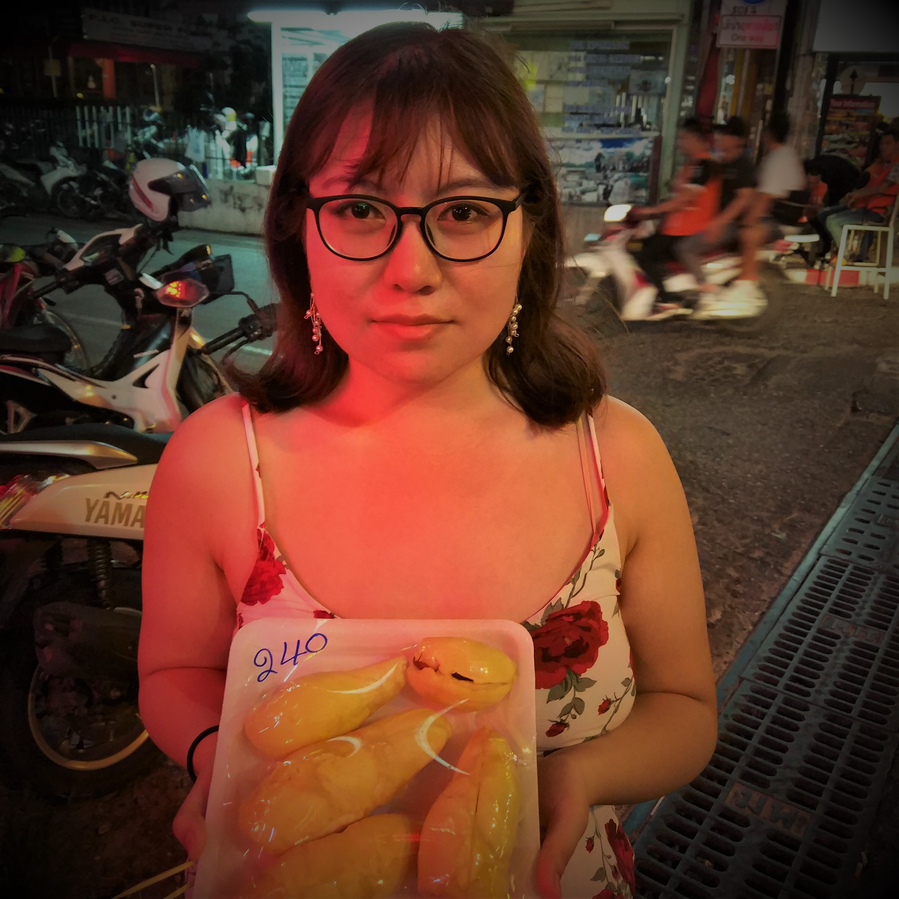

# 工作一年的感受

> 2019/11/9
> 
> 路漫漫其修远兮，吾将上下而求索。—— 屈原

## TL;DR [no-toc]

之前，有位朋友（ID: `tab`）留言让我写一篇回顾成长的文章，一是给自己一个交代，二是给别人引导和启发。然而，个人一直不太喜欢 **鸡汤/成功学/励志故事**，因为照着做也不一定会成功（我也试过），而没人会倾听失败者的故事：

> Dead Men Tell No Tales.

所以，本文 **没有干货**，主要谈谈 **工作一年** 的一些 **想法和收获** 和一些 **个人价值观** 的转变，不希望给人任何 **引导** ~~（误导）~~，只是给自己一个 **交代**。

[TOC]

## 关于工作

- 学习：Windows + Chromium + Modern C++
- 产品思维，数据思维
- 大公司，小团队 -> 小闭环，大协同
- 逆水行舟，无功便是过
- 紧急/重要 原则，例如 性能优化，寻找瓶颈

## 关于技术

- git 工作流（分支模型）
- https://www.fluentcpp.com/2019/09/13/the-surprising-limitations-of-c-ranges-beyond-trivial-use-cases/
- http://aras-p.info/blog/2018/12/28/Modern-C-Lamentations/
- 新技术如果能在狭缝中生存、壮大，那必定有他的独特优势：桌面性能好，移动性能差
- [“有时候你费劲优化了半天，结果新CPU加了几条指令，直接在硬件层面把问题解决了。”](http://www.cppblog.com/Solstice/archive/2013/08/12/202489.html)
- [“我对于市面上绝大部分开发类图书都不满——它们基本上都是面向知识体系本身的，而不是面向读者的。... 毫无重点地平铺直叙，不分轻重地陈述细节，往往在第三章以前就用无聊的细节谋杀了读者的热情。”](https://blog.csdn.net/myan/article/details/5877305)
- [“编程其实是以逻辑为表象体现作者哲学和世界观的非常直观的途径。耍小聪明的，不求甚解的，抓小放大的，有大格局的，凡此种种，淋漓尽致。”](https://zhuanlan.zhihu.com/p/88749279#comment-778450096)

## 关于能力

- 使用工具 F12/bash
  - https://docs.python.org/2/faq/design.html
  - https://docs.python.org/3/faq/design.html
  - `JSON.stringify($('#contents ul li ul li').map((i, e) => $(e).text()).toArray())`
  - `document.designMode`
- 使用工具 Debugger everywhere
  - Process Monitor 排查公司 OA 客户端问题：中文用户名解码失败
  - 开源软件崩溃，用 gdb 调试汇编，配合源码：MySQL Client 未连接的空指针问题
- 概念/背景 + 行文/惯用法
  - 借助 IDE 只能提示写代码
- 想清楚事情背后的来龙去脉，需要深入基础，例如 崩溃分析，程序员的基本修养
  - https://www.zhihu.com/question/35194924/answer/62096697
- 知识体系融汇贯通，例如 从时空的维度看 I/O 模型
  - 人脑lru清理不可达记忆
  - 树状结构的知识管理，只是知识网络的一个视图

> 下载项目仓库当作 “一本故事书” 来看，而不只是看 “一份源码”：
> 
> 可以在静态比较新旧代码的同时，看一看log，为什么这么做，以前出现了多少问题，是如何一步一步过来的，为项目减少了多少成本，如果有这样一个数据，就真正的是跟随一个项目在演进，会更生动和有说服力。
> 
> 我比较喜欢动态的看，包括多少坑，然后为什么不该用rust之类的，看看一条条提交慢慢的理出思路，那是Googler思考的方式。
> 
> 如果静态的比较会损失一些风景。

## 关于面试

- 面试随缘，很难面面俱到，例如 红黑树
- 面试别人比被别人面试更紧张
- https://www.zhihu.com/question/34574154/answer/601164260

## 关于心态

- 获得
  - 粉丝
  - 收入
- 理想
  - 生活追求 房子？户口？
  - 技术追求 https://abcdabcd987.com/google-internship-2019/
  - 现实很骨感
- 焦虑
  - 差距 山外有山，越学越不会，例如 并发设计，编程语言
  - 得失
  - 努力但又无力
- 浮躁
  - 知识爆炸 定期取关，分类整理
  - 人心浮躁 https://zhuanlan.zhihu.com/p/86921774
- 自律
  - 锻炼
  - 学习 https://www.zhihu.com/question/273631529/answer/867707748
  - 笔记
- 不忘初心，砥砺前行
  - https://coolshell.cn/articles/20276.html
- 女朋友

如果有什么问题，**欢迎交流**。😄

Delivered under MIT License &copy; 2019, BOT Man
