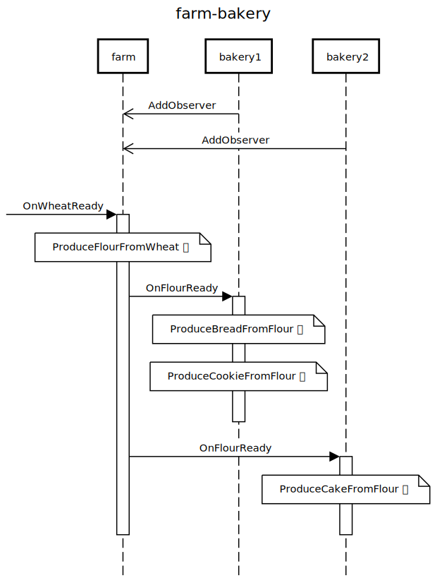
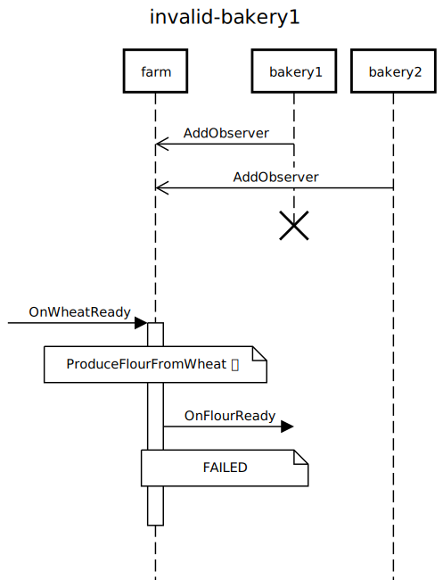
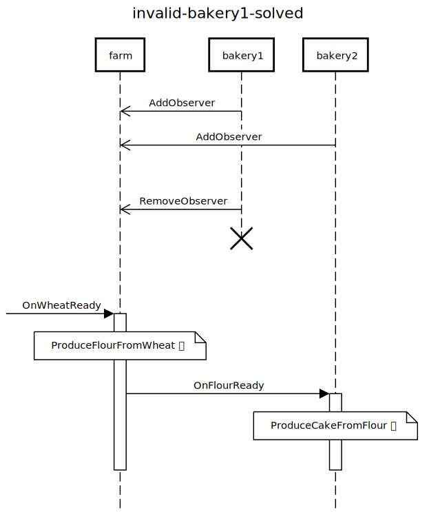
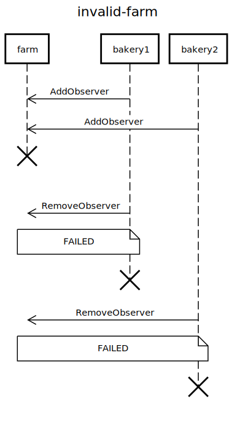
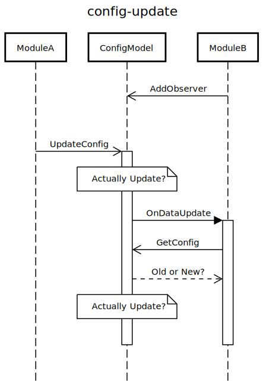
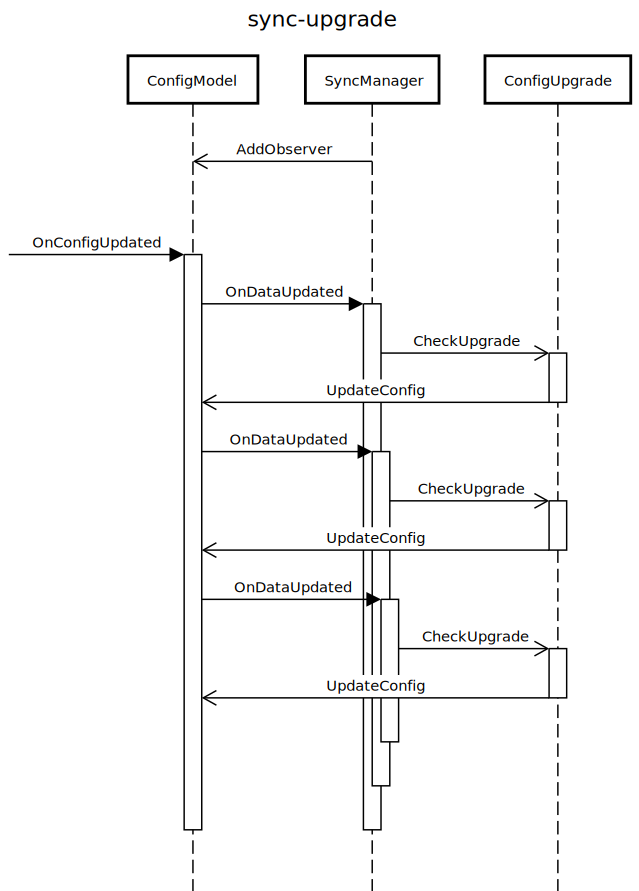
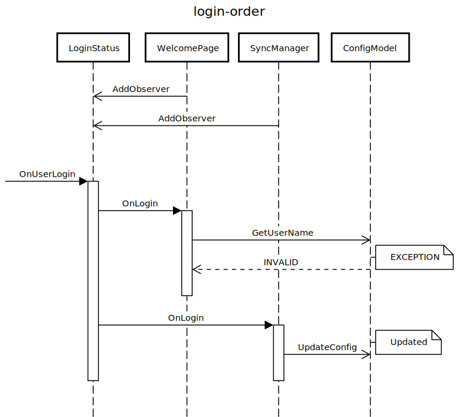

# 令人抓狂的观察者模式

> 2019/1/30
> 
> 本文总结了 C++ 实现观察者模式的一些问题，并给出基于 Chromium 的解决方案。

读完这篇文章，带你绕过 C++ 观察者模式的那些坑。

## TOC [no-toc]

[TOC]

## 背景 TL;DR [no-toc]

[观察者模式](../2017/Design-Patterns-Notes-3.md#Observer) 是一个大家所熟知的设计模式。如果对观察者模式还不是很了解，可以先阅读 [理解观察者、中介者模式](../2017/Observer-Mediator-Explained.md)。

观察者模式主要用于解耦消息的发送者和接收者，能让代码更具有可扩展性。

> 用生活中的例子解释观察者模式 —— 有一家 **农场** 🚜 生产面粉，有多家 **面包房** 🏠 从他们那里购进面粉：
> 
> - 如果不采用观察者模式，农场只卖库存的面粉 —— 每次生产了新一批的面粉，就需要派人去各个面包房 **推销** 面粉（农场只能把面粉卖给推销员能到达的面包房）
> - 如果采用观察者模式，农场可以接收预定 —— 哪些面包房需要面粉，留下电话号码预定；等生产出新一批面粉，就从电话簿里逐个 **通知**（农场不需要关心最终把面粉卖给了哪些面包房，只需要卖出去就行）
> 
> 基于后一种模式：农场可以更快的开拓销路，甚至把面粉卖给更远的面包房；面包房可以引入更多的供应商，不仅仅从当地农场购买面粉。

定义面粉观察者 `FarmObserver`：

``` cpp
class FarmObserver {
 public:
  virtual void OnFlourReady() = 0;

 protected:
  virtual ~FarmObserver() = default;
};
```

定义农场 `Farm`：

``` cpp
class Farm {
 public:
  void AddObserver(FarmObserver* ob);
  void RemoveObserver(FarmObserver* ob);

 private:
  void NotifyFlourReady();
};
```

定义面包房 `Bakery`：

``` cpp
class Bakery : public FarmObserver {
 protected:
  void OnFlourReady() override;
};
```

假设有 1 个农场 和 2 个面包房：

``` cpp
Farm farm;
Bakery bakery1, bakery2;
```

面包房签订了农场的面粉购买合同，成为面粉观察者：

``` cpp
farm.AddObserver(&bakery1);
farm.AddObserver(&bakery2);
```

当麦子 🌾 成熟时，农场 🚜 开始生成面粉 📦，然后通知所有观察者 🕵️‍；面包房 🏠 买回面粉后，开始生成 面包 🍞、曲奇 🍪、蛋糕 🎂...

<!--
# https://sequencediagram.org/
-->

<!--
title farm-bakery
participant farm
participant bakery1
participant bakery2

bakery1->>farm: AddObserver
bakery2->>farm: AddObserver
space

[->farm: OnWheatReady
activate farm
note over farm: ProduceFlourFromWheat 🌾

farm->bakery1: OnFlourReady
activate bakery1
note over bakery1: ProduceBreadFromFlour 🍞
note over bakery1: ProduceCookieFromFlour 🍪
space
deactivate bakery1

farm->bakery2: OnFlourReady
activate bakery2
note over bakery2: ProduceCakeFromFlour 🎂
space
deactivate bakery2

deactivate farm
-->



> 理想很丰满，现实很骨感。

如果系统内 **滥用观察者模式**，可能会出现令人抓狂的问题。

## 生命周期问题

> 兄弟们，我先撤了。

### 问题：观察者先销毁

> 农场还在，面包房跑路了。

假设 bakery1 对象失效了，导致 `farm.NotifyFlourReady()` 调用的 `bakery1.OnFlourReady()` 会出现异常。

<!--
title invalid-bakery1
participant farm
participant bakery1
participant bakery2

bakery1->>farm: AddObserver
bakery2->>farm: AddObserver
destroyafter bakery1
space

[->farm: OnWheatReady
activate farm
note over farm: ProduceFlourFromWheat 🌾

farm->bakery1: OnFlourReady
note over farm,bakery1: FAILED

space
deactivate farm
-->



**解决办法**（约定俗成的）：

如果观察者不再继续观察，那么需要把它从被观察者的列表中移除：

``` cpp
farm.RemoveObserver(&bakery1);
```

<!--
title invalid-bakery1-solved
participant farm
participant bakery1
participant bakery2

bakery1->>farm: AddObserver
bakery2->>farm: AddObserver
space
bakery1->>farm: RemoveObserver
destroyafter bakery1
space

[->farm: OnWheatReady
activate farm
note over farm: ProduceFlourFromWheat 🌾

farm->bakery2: OnFlourReady
activate bakery2
note over bakery2: ProduceCakeFromFlour 🎂
space
deactivate bakery2

deactivate farm
-->



**更安全的方法**：

- 使用 [RAII _(resource acquisition is initialization)_](https://en.wikipedia.org/wiki/Resource_acquisition_is_initialization) 风格的资源管理，例如
  - 引入 [`ScopedObserver`](https://github.com/chromium/chromium/blob/master/base/scoped_observer.h)，在它析构时自动调用 `RemoveObserver`
  - 注意：在 `ScopedObserver` 析构调用 `RemoveObserver` 时，需要确保观察者和被观察者仍然有效
- 使用 **弱引用** 检查观察者的有效性，例如
  - [`base::ObserverList`](https://github.com/chromium/chromium/blob/master/base/observer_list.h) + [`base::CheckedObserver`](https://github.com/chromium/chromium/blob/master/base/observer_list_types.h) 在通知前检查观察者的有效性，避免因为通知无效观察者导致崩溃
  - 对于自动垃圾回收的语言（例如 Java），如果不使用弱引用机制，容易导致 [失效监听者问题 _(lapsed listener problem)_](https://en.wikipedia.org/wiki/Lapsed_listener_problem)

### 问题：被观察者先销毁

> 面包房还在，农场跑路了。

由于 `Bakery` 在生命周期里，需要引用 `farm_` 对象（面包房从农场购买面粉），所以往往会把 `AddObserver/RemoveObserver` 放到 `Bakery` 的构造函数/析构函数里：

``` cpp
class Bakery : public FarmObserver {
 public:
  Bakery(Farm* farm) : farm_(farm) {
    if (farm_)
      farm_->AddObserver(this);
  }
  ~Bakery() {
    if (farm_)
      farm_->RemoveObserver(this);
  }

 private:
  Farm* farm_ = nullptr;
};
```

假设 farm_ 对象失效了，导致 `~Bakery()` 调用的 `RemoveObserver()` 可能出现异常。

<!--
title invalid-farm
participant farm
participant bakery1
participant bakery2

bakery1->>farm: AddObserver
bakery2->>farm: AddObserver
space

destroy farm
space

bakery1->>farm: RemoveObserver
note over farm,bakery1: FAILED
destroyafter bakery1

bakery2->>farm: RemoveObserver
note over farm,bakery2: FAILED
destroyafter bakery2
-->



**解决办法**：

- 引入 **外部协调者**，完成注册/反注册操作，例如
  - 让 `farm` 和 `bakery1`/`bakery2` 的生命周期管理者，添加/移除观察关系（例如引入 [`ScopedObserver`](https://github.com/chromium/chromium/blob/master/base/scoped_observer.h)）
  - 而不是在 `Bakery` 的构造函数/析构函数里实现
- 被观察者销毁时，**通知观察者反注册**，例如
  - 在 `views::View` 析构时，通知观察者 [`views::ViewObserver::OnViewIsDeleting`](https://github.com/chromium/chromium/blob/master/ui/views/view_observer.h)
  - 注意：在回调时，不能直接从 `std::list`/`std::vector` 容器中移除观察者；而应该标记为“待移除”，然后等迭代结束后移除（参考 [`base::ObserverList::RemoveObserver`](https://github.com/chromium/chromium/blob/master/base/observer_list.h)）
  - 循环内删除节点，会导致迭代器失效：`for(auto it = c.begin(); it != c.end(); ++it) c.erase(it);  // bad`
- 用 **弱引用** 替换裸指针，移除时检查被观察者的有效性，例如
  - 使用 [`base::WeakPtr`](https://github.com/chromium/chromium/blob/master/base/memory/weak_ptr.h) 把 `Farm* farm_` 替换为 `base::WeakPtr<Farm> farm_`（比较灵活）

## 调用关系问题

> 这些细节之前没说清楚。

### 问题：时机不明

> 东西还没准备好就别来找我！

**问题**：

被观察者提供事件接口时，需要明确 **回调时刻在状态变化前，还是状态变化后**；必要时，需要同时分别提供 **变化前/变化后** 两个事件通知。

**例子**：

一般的软件中，用户数据（例如书签/联系人/云笔记/设置项）常常存储在统一的位置（配置数据）；很多业务逻辑中，一个模块修改配置数据后，会立即影响另一个模块。由于模块只依赖于配置数据，之间没有相互依赖，所以一般使用观察者模式：

- 模块 `ModuleB` 监听配置数据 `ConfigModel` 的变化，即
  - `class ModuleB : public ConfigObserver`
- 当模块 `ModuleA` 修改配置数据时，`ConfigModel` 通知观察者 `ConfigObserver::OnDataUpdate`（既不是 `OnDataUpdating` 也不是 `OnDataUpdated`）
  - 模块 `ModuleB` 在处理 `ModuleB::OnDataUpdate` 时，可能会读取配置数据
  - 这时，读取到的 `ConfigModel` 不确定是更新前的，还是更新后的

<!--
title config-update
participant ModuleA
participant ConfigModel
participant ModuleB

ModuleB->>ConfigModel: AddObserver
space

ModuleA->>ConfigModel: UpdateConfig
activate ConfigModel

note over ConfigModel: Actually Update?

ConfigModel->ModuleB: OnDataUpdate
activate ModuleB

ModuleB->>ConfigModel: GetConfig
ModuleB<<--ConfigModel: Old or New?

note over ConfigModel: Actually Update?
space

deactivate ModuleB
deactivate ConfigModel
-->



**解决办法**：

- 分别使用两个回调事件，表示 **状态正在变化** `OnDoing` 和 **状态变化完成** `OnDone`，例如
  - 在 `views::Widget` 销毁时，通知观察者 [`views::WidgetObserver::OnWidgetDestroying`](https://github.com/chromium/chromium/blob/master/ui/views/widget/widget_observer.h)
  - 在 `views::Widget` 销毁后，通知观察者 [`views::WidgetObserver::OnWidgetDestroyed`](https://github.com/chromium/chromium/blob/master/ui/views/widget/widget_observer.h)
- 一般监听 `OnDoing`，是为了
  - 阻止变化生效，**提前拦截操作**（例如，关闭文档编辑器窗口前，提示用户确认保存）
  - **在其他观察者收到 `OnDone` 之前**，先做一些操作（例如，[sec|问题：顺序耦合] 提到的问题）
- 一般监听 `OnDone` 是为了
  - **读取变化后的状态**，进行特定操作（例如，更新给用户展示的书签/联系人列表）
  - **确保变化正确结束后**，再执行操作（例如，连接 WiFi 网络后，自动更新手机 app）

### 问题：死循环

> how old are you? —— 怎么老是你？

**问题**：

在回调时，要避免 **观察者同步修改被观察者状态**，从而再次触发当前回调，导致 **重入**；否则，一旦逻辑变得复杂，很容易进入 **死循环**。

**例子**：

登录用户修改配置数据后，需要同步到服务器上（之后再同步到其他设备上）；而对于新用户，配置一开始不是空的，其中可能包含预置数据（例如内置书签/客服联系人）：

- 同步管理器 `SyncManager` 监听配置数据 `ConfigModel` 的变化，即
  - `class SyncManager : public ConfigObserver`
- 当 `ConfigModel` 更新后，通知观察者 `ConfigObserver::OnDataUpdated`
  - 同步管理器在处理 `SyncManager::OnDataUpdated` 时，调用 `ConfigUpgrade` 将跟随用户配置的内置数据进行升级（例如，更新联系人中的客服号码）
  - 配置升级器 `ConfigUpgrade` 如果检测到 `ConfigModel` 包含需要升级的数据，会 **无条件更新** 为最新数据
- 由于 `ConfigModel` 更新，再次通知观察者 `ConfigObserver::OnDataUpdated`，从而进入了死循环

<!--
title sync-upgrade
participant ConfigModel
participant SyncManager
participant ConfigUpgrade

SyncManager->>ConfigModel: AddObserver
space

[->ConfigModel: OnConfigUpdated
activate ConfigModel

ConfigModel->SyncManager: OnDataUpdated
activate SyncManager
SyncManager->>ConfigUpgrade :CheckUpgrade

activate ConfigUpgrade
ConfigUpgrade->>ConfigModel: UpdateConfig
deactivate ConfigUpgrade

ConfigModel->SyncManager: OnDataUpdated
activate SyncManager
SyncManager->>ConfigUpgrade :CheckUpgrade

activate ConfigUpgrade
ConfigUpgrade->>ConfigModel: UpdateConfig
deactivate ConfigUpgrade

ConfigModel->SyncManager: OnDataUpdated
activate SyncManager
SyncManager->>ConfigUpgrade :CheckUpgrade

activate ConfigUpgrade
ConfigUpgrade->>ConfigModel: UpdateConfig
deactivate ConfigUpgrade

space
deactivate SyncManager

space
deactivate SyncManager

space
deactivate SyncManager

deactivate ConfigModel
-->



**解决办法**：

- （绕开）根据具体情况，**打破循环的条件**，例如
  - 配置升级器 `ConfigUpgrade` 检查配置数据 `ConfigModel` 是否需要升级，仅在需要时更新
  - 即，将 无条件更新 变为 有条件更新，只会出现一次重入
- （根治）重构逻辑，避免 **观察者同步修改被观察者状态**，例如
  - 让 `ConfigModel` 直接调用 `ConfigUpgrade` 检查/升级数据
  - 使 `SyncManager` 收到 `OnDataUpdated` 时，就拿到已是最新的数据了
- （避免）在迭代时，使用标识检查是否重入（参考 [`base::ObserverList`](https://github.com/chromium/chromium/blob/master/base/observer_list.h)）

### 问题：顺序耦合

> 别插队！

**问题**：

理想情况下，观察者之间应该是相互独立的 —— **通知顺序不影响观察者的处理逻辑**。而实际情况下，可能有 **多个相互依赖的观察者，观察同一个事件** —— 处理逻辑依赖于通知顺序，通知顺序依赖于注册顺序；而注册顺序一般难以保证，偶然的正确很容易被隐式打破。

**例子**：

用户登录成功后弹出欢迎界面提示，而用户名记录在用户配置里；用户配置需要在登录时，从服务器上同步下来：

- 欢迎界面 `WelcomePage` 和 同步管理器 `SyncManager` 监听登录状态 `LoginStatus` 的变化，即
  - `class WelcomePage : public LoginObserver`
  - `class SyncManager : public LoginObserver`
- 当 `LoginStatus` 登录/登出时，通知观察者 `LoginObserver::OnLogin/OnLogout`
  - 欢迎界面在处理 `WelcomePage::OnLogin` 时，从配置数据 `ConfigModel` 中读取用户名
  - 同步管理器在处理 `SyncManager::OnLogin` 时，从服务器上更新配置数据 `ConfigModel`
  - 同步管理器在处理 `SyncManager::OnLogout` 时，还原配置数据 `ConfigModel` 为本地数据（清空登出用户的数据）

[align-center]

<p>
<button onclick="var name = document.getElementById('login-user-name').value; if (name) alert('欢迎 ' + name); else alert('错误：请设置用户名');">登录</button>
配置用户名：<input id="login-user-name" type="text" />
</p>

两个观察者都监听了同一个事件（登录状态变化 `LoginObserver::OnLogin`），且都依赖于同一个状态（配置数据 `ConfigModel`）；而两个观察者被通知的顺序时不确定的，例如

- 如果 同步管理器先处理了 `SyncManager::OnLogin`，将配置数据设置为登录用户的用户名；欢迎界面在处理 `WelcomePage::OnLogin` 时，使用的用户名 **正确**
- 如果 欢迎界面先处理了 `WelcomePage::OnLogin`，这时在配置中没有用户名字段，显示 **错误**

<!--
title login-order
participant LoginStatus
participant WelcomePage
participant SyncManager
participant ConfigModel

WelcomePage->>LoginStatus: AddObserver
SyncManager->>LoginStatus: AddObserver
space

[->LoginStatus: OnUserLogin
activate LoginStatus

LoginStatus->WelcomePage: OnLogin
activate WelcomePage

WelcomePage->>ConfigModel: GetUserName
parallel
WelcomePage<<--ConfigModel: INVALID
note right of ConfigModel: EXCEPTION
parallel off

space
deactivate WelcomePage

LoginStatus->SyncManager: OnLogin
activate SyncManager

parallel
SyncManager->>ConfigModel: UpdateConfig
note right of ConfigModel: Updated
parallel off

space 
deactivate SyncManager
deactivate LoginStatus
-->



**解决办法**：

- （绕开）将 **操作延迟** 到相关回调全部结束后执行，避免读取到变化的中间状态，例如
  - 在欢迎页面处理 `WelcomePage::OnLogin` 时调用 [`base::TaskRunner::PostTask`](https://github.com/chromium/chromium/blob/master/base/task_runner.h)，把实际的处理操作抛到队尾，延迟到当前任务结束后异步执行
  - 当操作被执行时，状态变化已经结束（已经不在同一个调用栈里），从而避免读取到不确定的变化中的状态
  - 类似于 JavaScript 里的 [`setTimeout(fn, 0)`](https://stackoverflow.com/questions/779379/why-is-settimeoutfn-0-sometimes-useful)
- （根治）重构逻辑，使用 **中介者模式** —— 引入中介者监听事件，然后协调各个事件处理函数的调用顺序，参考 [理解观察者、中介者模式](../2017/Observer-Mediator-Explained.md)

## 写在最后 [no-toc]

> 2019/3/08 补充：

- 避免把 **静态对象**（全局变量/静态变量/单例）作为观察者，因为他们的创建/销毁时机是不可控的，可以改为 **直接依赖**
- 避免让 **监听同一事件** 的多个观察者 **相互依赖**，尽量只让 **一个模块来控制** 事件的 **处理顺序**
  - 既可以把顺序控制放在被观察者 —— 在 OnDoing/OnDone 之间按顺序处理
  - 也可以把顺序控制放在观察者 —— 只有一个观察者，由它来协调其他相互依赖的模块

> 2019/6/22 补充：

如果同时只有 **一个观察者**，可以直接使用 **依赖注入** 实现解耦，而 **不该滥用** 观察者模式：

- 使用 `OnceCallback` 改造：观察者发起 **一次请求后**，被观察者通过 **一次回调** 返回结果，而不是直接调用（例如，异步下载/读取文件）
- 使用 `RepeatingCallback` 改造：被观察者通过 **多次回调**，**检查** 观察者的 **状态**，而不关心具体检查逻辑（例如，上下文菜单检查鼠标是否离开按钮区域）

本文仅是我在实际项目中遇到的一些问题，以及我的一些个人理解。如果有什么问题，**欢迎交流**。😄

Delivered under MIT License &copy; 2019, BOT Man
