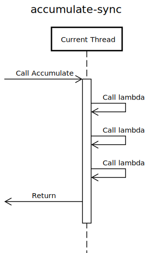

# 深入 C++ 回调

> 2019/3/21
> 
> 本文深入分析 [Chromium 的 Bind/Callback 机制](https://github.com/chromium/chromium/blob/master/docs/callback.md)，并讨论设计 C++ 回调时 ~~你想知道的~~（**你可能不知道的**）一些问题。

[heading-numbering]

许多面试官会问：你知道回调吗？你在写回调的时候遇到哪些坑？你知道对象生命周期管理吗？为什么这里会崩溃，那里会泄漏？ 在设计 C++ 回调时，你是否想过：同步还是异步？回调时（弱引用）上下文是否会失效？一次还是多次？如何销毁/传递（强引用）上下文？ 这篇文章给你详细解答！

背景阅读：

- 如果你还不知道什么是 **回调** _(callback)_，欢迎阅读 [如何浅显的解释回调函数](../2017/Callback-Explained.md)
- 如果你还不知道什么是 **回调上下文** _(callback context)_ 和 **闭包** _(closure)_，欢迎阅读 [对编程范式的简单思考](Thinking-Programming-Paradigms.md)（本文主要讨论基于 **闭包** 的回调，而不是基于 C 语言函数指针的回调）
- 如果你还不清楚 **可调用对象** _(callable object)_ 和 **回调接口** _(callback interface)_ 的区别，欢迎阅读 [回调 vs 接口](../2017/Callback-vs-Interface.md)（本文主要讨论类似 `std::function` 的 **可调用对象**，而不是基于接口的回调）
- 如果你还不知道对象的 **所有权** _(ownership)_ 和 **生命周期管理** _(lifetime management)_，欢迎阅读 [资源管理小记](../2018/Resource-Management.md)

回调是被广泛应用的概念：

- **图形界面客户端** 常用 [事件循环 _(event loop)_](https://en.wikipedia.org/wiki/Event_loop) 有条不紊的处理 用户输入/计时器/系统处理/跨进程通信 等事件，一般采用回调响应事件
- **I/O 密集型程序** 常用 [异步 I/O _(asynchronous I/O)_](https://en.wikipedia.org/wiki/Asynchronous_I/O) 协调各模块处理速率，提高吞吐率，进一步引申出 设计上的 [Reactor](https://en.wikipedia.org/wiki/Reactor_pattern)、语言上的 [协程 _(coroutine)_](https://en.wikipedia.org/wiki/Coroutine)、系统上的 [纤程 _(fiber)_](https://en.wikipedia.org/wiki/Fiber_%28computer_science%29) 等概念，一般采用回调处理 I/O 完成的返回结果（参考：[从时空维度看 I/O 模型](IO-Models.md)）

从语言上看，回调是一个调用函数的过程，涉及两个角色：计算和数据。其中，回调的计算是一个函数，而回调的数据来源于两部分：

- **绑定** _(bound)_ 的数据，即回调的 **上下文**
- **未绑定** _(unbound)_ 的数据，即执行回调时需要额外传入的数据

捕获了上下文的回调函数就成为了闭包，即 **闭包 = 函数 + 上下文**。

在面向对象语言中，一等公民是对象，而不是函数；所以在实现上：

- **闭包** 一般通过 **对象** 实现（例如 `std::function`）
- **上下文** 一般作为闭包对象的 **数据成员**，和闭包属于 [关联/组合/聚合](https://en.wikipedia.org/wiki/Class_diagram#Instance-level_relationships) 的关系

从对象所有权的角度看，上下文进一步分为：

- **不变** _(immutable)_ 上下文
  - 数值/字符串/结构体 等基本类型，永远 **不会失效**
  - 使用时，一般 **不需要考虑** 生命周期问题
- **弱引用** _(weak reference)_ 上下文（**可变** _(mutable)_ 上下文）
  - 闭包 **不拥有** 上下文，所以回调执行时 **上下文可能失效**
  - 如果使用前没有检查，可能会导致 **崩溃**
- **强引用** _(strong reference)_ 上下文（**可变** _(mutable)_ 上下文）
  - 闭包 **拥有** 上下文，能保证回调执行时 **上下文一直有效**
  - 如果使用后忘记释放，可能会导致 **泄漏**

如果你已经熟悉了 [`std::bind`](https://en.cppreference.com/w/cpp/utility/functional/bind)/[`lambda`](https://en.cppreference.com/w/cpp/language/lambda) + [`std::function`](https://en.cppreference.com/w/cpp/utility/functional/function)，那么你在设计 C++ 回调时，**是否考虑过这几个问题**：

[TOC]

本文分析 Chromium 的 [`base::Bind`](https://github.com/chromium/chromium/blob/master/base/bind.h) + [`base::Callback`](https://github.com/chromium/chromium/blob/master/base/callback.h) 回调机制，带你领略回调设计的精妙之处。（参考：[Callback<> and Bind() | Chromium Docs](https://github.com/chromium/chromium/blob/master/docs/callback.md)）

## 回调是同步还是异步的

**同步回调** _(sync callback)_ 在 **构造闭包** 的 **调用栈** _(call stack)_ 里 **局部执行**。例如，累加一组得分（使用 `lambda` 表达式捕获上下文 `total`）：

``` cpp
int total = 0;
std::for_each(std::begin(scores), std::end(scores),
              [&total](auto score) { total += score; });
            // ^ context variable |total| is always valid
```

- **绑定的数据**：`total`，局部变量的上下文（弱引用，所有权在闭包外）
- **未绑定的数据**：`score`，每次迭代传递的值

<!--
# https://sequencediagram.org/
-->

<!--
title accumulate-sync
participant Current Thread

[->>Current Thread: Call Accumulate
activate Current Thread
Current Thread->>Current Thread: Call lambda
Current Thread->>Current Thread: Call lambda
Current Thread->>Current Thread: Call lambda
[<<-Current Thread: Return

space
deactivate Current Thread
-->

[img=max-width:40%]

[align-center]



**异步回调** _(async callback)_ 在构造后存储起来，在 **未来某个时刻**（不同的调用栈里）**非局部执行**。例如，用户界面为了不阻塞 **UI 线程** 响应用户输入，在 **后台线程** 异步加载背景图片，加载完成后再从 **UI 线程** 显示到界面上：

``` cpp
// callback code
void View::LoadImageCallback(const Image& image) {
  // WARNING: |this| may be invalid now!
  if (background_image_view_)
    background_image_view_->SetImage(image);
}

// client code
FetchImageAsync(
    filename,
    base::Bind(&View::LoadImageCallback, this));
               // use raw |this| pointer ^
```

- **绑定的数据**：`base::Bind` 绑定了 `View` 对象的 `this` 指针（弱引用）
- **未绑定的数据**：`View::LoadImageCallback` 的参数 `const Image& image`

<!--
title fetch-image-async
participant UI thread
participant Background Thread

[->>UI thread: Call View::FetchImageAsync
activate UI thread
UI thread->Background Thread: Post LoadImageFromFile

space
deactivate UI thread

space
activate UI thread
note over UI thread: Run other tasks

space
deactivate UI thread

Background Thread->>Background Thread: Call LoadImageFromFile
activate Background Thread
Background Thread->UI thread: Post View::LoadImageCallback

space
deactivate Background Thread

space
UI thread->>UI thread: Call View::LoadImageCallback
activate UI thread
UI thread->>[: Call ImageView::SetImage

space
deactivate UI thread
-->

[img=max-width:90%]

[align-center]


使用 C++ 11 lambda 表达式实现等效为：

``` cpp
FetchImageAsync(
    filename,
    base::Bind([this](const Image& image) {
      // WARNING: |this| may be invalid now!
      if (background_image_view_)
        background_image_view_->SetImage(image);
    }));
```

> 注：
> 
> - `View::FetchImageAsync` 基于 Chromium 的多线程任务模型（参考：[Keeping the Browser Responsive | Threading and Tasks in Chrome](https://github.com/chromium/chromium/blob/master/docs/threading_and_tasks.md#keeping-the-browser-responsive)）

### 回调时（弱引用）上下文会不会失效

由于闭包没有 **弱引用上下文** 的所有权，所以上下文可能失效：

- 对于 **同步回调**，上下文的 **生命周期往往比闭包长**，一般不失效
- 而在 **异步回调** 调用时，上下文可能已经失效了

例如 异步加载图片 的场景：在等待加载时，用户可能已经退出了界面。所以，在执行 `View::LoadImageCallback` 时：

- 如果界面还在显示，`View` 对象仍然有效，则执行 `ImageView::SetImage` 显示背景图片
- 如果界面已经退出，`background_image_view_` 变成 [野指针 _(wild pointer)_](https://en.wikipedia.org/wiki/Dangling_pointer)，调用 `ImageView::SetImage` 导致 **崩溃**

其实，上述两段代码（包括 C++ 11 lambda 表达式版本）都无法编译（Chromium 做了对应的 **静态断言** _(static assert)_）—— 因为传给 `base::Bind` 的参数都是 **不安全的**：

- 传递普通对象的 **裸指针**，容易导致悬垂引用
- 传递捕获了上下文的 lambda 表达式，**无法检查** lambda 表达式捕获的 **弱引用** 的 **有效性**

**C++ 核心指南** _(C++ Core Guidelines)_ 也有类似的讨论：

- [F.52: Prefer capturing by reference in lambdas that will be used locally, including passed to algorithms](https://isocpp.github.io/CppCoreGuidelines/CppCoreGuidelines#Rf-reference-capture)
- [F.53: Avoid capturing by reference in lambdas that will be used nonlocally, including returned, stored on the heap, or passed to another thread](https://isocpp.github.io/CppCoreGuidelines/CppCoreGuidelines#Rf-value-capture)

> 注：
> 
> - [`base::BindLambdaForTesting`](https://github.com/chromium/chromium/blob/master/base/test/bind_test_util.h) 支持了 lambda 表达式的绑定，同时兼容可拷贝/不可拷贝的 lambda 表达式；但仍无法识别捕获的弱引用有效性，仅用于测试（参考：[Binding A Capturing Lambda (In Tests) | Callback<> and Bind()](https://github.com/chromium/chromium/blob/master/docs/callback.md#binding-a-capturing-lambda-in-tests)）

### 如何处理失效的（弱引用）上下文

如果弱引用上下文失效，回调应该 **及时取消**。例如 异步加载图片 的代码，可以给 `base::Bind` 传递 `View` 对象的 **弱引用指针**，即 `base::WeakPtr<View>`：

``` cpp
FetchImageAsync(
    filename,
    base::Bind(&View::LoadImageCallback, AsWeakPtr()));
 // use |WeakPtr| rather than raw |this| ^
}
```

在执行 `View::LoadImageCallback` 时：

- 如果界面还在显示，`View` 对象仍然有效，则执行 `ImageView::SetImage` 显示背景图片
- 否则，弱引用失效，**不执行回调**（因为界面已经退出，**没必要** 再设置图片了）

> 注：
> 
> - [`base::WeakPtr`](https://github.com/chromium/chromium/blob/master/base/memory/weak_ptr.h) 属于 Chromium 提供的 **侵入式** _(intrusive)_ 智能指针，非 **线程安全** _(thread-safe)_
> - `base::Bind` 针对 `base::WeakPtr` 扩展了 `base::IsWeakReceiver<>` 检查，调用前判断弱引用有效性（参考：[Binding A Class Method With Weak Pointers | Callback<> and Bind()](https://github.com/chromium/chromium/blob/master/docs/callback.md#binding-a-class-method-with-weak-pointers)）
> - 也可以基于 `std::weak_ptr` **非侵入式** _(non-intrusive)_ 表示弱引用所有权，但和 `std::shared_ptr` **“捆绑销售”** 🙃，在使用前需要调用 [`lock()`](https://en.cppreference.com/w/cpp/memory/weak_ptr/lock) 方法共享所有权（参考：[弱回调 |《当析构函数遇到多线程 —— C++ 中线程安全的对象回调》陈硕](https://github.com/downloads/chenshuo/documents/dtor_meets_mt.pdf)）

基于弱引用指针，Chromium 封装了 **可取消** _(cancelable)_ 回调 [`base::CancelableCallback`](https://github.com/chromium/chromium/blob/master/base/cancelable_callback.h)，提供 `Cancel`/`IsCancelled` 接口。（参考：[Cancelling a Task | Threading and Tasks in Chrome](https://github.com/chromium/chromium/blob/master/docs/threading_and_tasks.md#cancelling-a-task)）

## 回调只能执行一次还是可以多次

软件设计里，只有三个数 —— [`0`，`1`，`∞`（无穷）](https://en.wikipedia.org/wiki/Zero_one_infinity_rule)。类似的，不管是同步回调还是异步回调，我们只关心它被执行 `0` 次，`1` 次，还是多次。

根据可调用次数，Chromium 把回调分为两种：

| | `base::OnceCallback` | `base::RepeatingCallback` |
|-|----------------------|---------------------------|
| 最多可调用次数 | 一次 | 多次 |
| 构造方法 | `base::BindOnce` | `base::BindRepeating` |
| 调用方法 | `R Run(Args...) &&`，只能通过 `std::move(callback).Run(...)` 一次性调用 | `R Run(Args...) const &`，可以通过 `callback.Run(...)` 多次调用 |
| 调用后状态 | 进入 **失效状态**，无法再调用 | 一直处于 **有效状态** |

> 注：
> 
> - 写在成员函数后的 **引用限定符** _(reference qualifier)_ `&&` / `const &`，区分 在对象处于 非 const 右值 / 其他 状态时的成员函数调用
> - `base::RepeatingCallback` 也支持 `R Run(Args...) &&` 调用，调用后也进入失效状态

### 为什么要区分一次和多次回调

我们先举个 **反例 —— 基于 C 语言函数指针的回调**：

- 由于 **没有闭包**，需要函数管理上下文生命周期，即 申请/释放上下文
- 由于 **资源所有权不明确**，难以判断指针 `T*` 表示 强引用还是弱引用

例如，使用 libevent 监听 socket 可写事件，实现 异步/非阻塞发送数据（[例子来源](../2017/Callback-vs-Interface.md#C-语言中的回调)）：

``` c
// callback code
void do_send(evutil_socket_t fd, short events, void* context) {
  char* buffer = (char*)context;
  // ... send |buffer| via |fd|
  free(buffer);  // free |buffer| here!
}

// client code
char* buffer = malloc(buffer_size);  // alloc |buffer| here!
// ... fill |buffer|
event_new(event_base, fd, EV_WRITE, do_send, buffer);
```

- 正确情况：`do_send` **只执行一次**
  - client 代码 **申请** 发送缓冲区 `buffer` 资源，并作为 `context` 传入 `event_new` 函数
  - callback 代码从 `context` 中取出 `buffer`，发送数据后 **释放** `buffer` 资源
- 错误情况：`do_send` **没有被执行**
  - client 代码申请的 `buffer` 不会被释放，从而导致 **泄漏**
- 错误情况：`do_sent` **被执行多次**
  - callback 代码使用的 `buffer` 可能已经被释放，从而导致 **崩溃**

### 何时销毁（强引用）上下文

对于面向对象的回调，强引用上下文的 **所有权属于闭包**。例如，改写 异步/非阻塞发送数据 的代码：

> 假设 `using Event::Callback = base::OnceCallback<void()>;`

``` cpp
// callback code
void DoSendOnce(std::unique_ptr<Buffer> buffer) {
  // ...
}  // free |buffer| via |~unique_ptr()|

// client code
std::unique_ptr<Buffer> buffer = ...;
event->SetCallback(base::BindOnce(&DoSendOnce,
                                  std::move(buffer)));
```

- 构造闭包时：`buffer` **移动到** `base::OnceCallback` 内
- 回调执行时：`buffer` 从 `base::OnceCallback` 的上下文 **移动到** `DoSendOnce` 的参数里，并在回调结束时销毁（**所有权转移**，`DoSendOnce` **销毁 强引用参数**）
- 闭包销毁时：如果回调没有执行，`buffer` 未被销毁，则此时销毁（**保证销毁且只销毁一次**）

> 假设 `using Event::Callback = base::RepeatingCallback<void()>;`

``` cpp
// callback code
void DoSendRepeating(const Buffer* buffer) {
  // ...
}  // DON'T free reusable |buffer|

// client code
Buffer* buffer = ...;
event->SetCallback(base::BindRepeating(&DoSendRepeating,
                                       base::Owned(buffer)));
```

- 构造闭包时：`buffer` **移动到** `base::RepeatingCallback` 内
- 回调执行时：每次传递 `buffer` 指针，`DoSendRepeating` **只使用** `buffer` 的数据（`DoSendRepeating` **不销毁 弱引用参数**）
- 闭包销毁时：总是由闭包销毁 `buffer`（**有且只有一处销毁的地方**）

> 注：
> 
> - `base::Owned` 是 Chromium 提供的 **高级绑定方式**，将在下文提到

由闭包管理所有权，上下文可以保证：

- 被销毁且只销毁一次（避免泄漏）
- 销毁后不会被再使用（避免崩溃）

但这又引入了另一个微妙的问题 ——

由于 **一次回调** 的 **上下文销毁时机不确定**，上下文对象 **析构函数** 的调用时机 **也不确定** —— 如果上下文中包含了 **复杂析构函数** 的对象（例如 析构时做数据上报），那么析构时需要检查依赖条件的有效性（例如 检查数据上报环境是否有效），否则会 **崩溃**。

### 如何传递（强引用）上下文

根据 [可拷贝性](../2018/Resource-Management.md#资源和对象的映射关系)，强引用上下文又分为两类：

- 不可拷贝的 **互斥所有权** _(exclusive ownership)_，例如 `std::unique_ptr`
- 可拷贝的 **共享所有权** _(shared ownership)_，例如 `std::shared_ptr`

STL 原生的 `std::bind`/`lambda` + `std::function` 不能完整支持 **互斥所有权** 语义：

``` cpp
// OK, pass |std::unique_ptr| by move construction
auto unique_lambda = [p = std::unique_ptr<int>{new int}]() {};
// OK, pass |std::unique_ptr| by ref
unique_lambda();
// Bad, require |unique_lambda| copyable
std::function<void()>{std::move(unique_lambda)};

// OK, pass |std::unique_ptr| by move
auto unique_bind = std::bind([](std::unique_ptr<int>) {},
                             std::unique_ptr<int>{});
// Bad, failed to copy construct |std::unique_ptr|
unique_bind();
// Bad, require |unique_bind| copyable
std::function<void()>{std::move(unique_bind)};
```

- `unique_lambda`/`unique_bind`
  - 只能移动，不能拷贝
  - 不能构造 `std::function`
- `unique_lambda` 可以执行，上下文在 `lambda` 函数体内作为引用
- `unique_bind` 不能执行，因为函数的接收参数要求拷贝 `std::unique_ptr`

类似的，STL 回调在处理 **共享所有权** 时，会导致多余的拷贝：

``` cpp
auto shared_lambda = [p = std::shared_ptr<int>{}]() {};
std::function<void()>{shared_lambda};  // OK, copyable

auto shared_func = [](std::shared_ptr<int> ptr) {     // (6)
  assert(ptr.use_count() == 6);
};
auto p = std::shared_ptr<int>{new int};               // (1)
auto shared_bind = std::bind(shared_func, p);         // (2)
auto copy_bind = shared_bind;                         // (3)
auto shared_fn = std::function<void()>{shared_bind};  // (4)
auto copy_fn = shared_fn;                             // (5)
assert(p.use_count() == 5);
```

- `shared_lambda`/`shared_bind`
  - 可以拷贝，对其拷贝也会拷贝闭包拥有的上下文
  - 可以构造 `std::function`
- `shared_lambda` 和对应的 `std::function` 可以执行，上下文在 `lambda` 函数体内作为引用
- `shared_bind` 和对应的 `std::function` 可以执行，上下文会拷贝成新的 `std::shared_ptr`

Chromium 的 `base::Callback` 在各环节优化了上述问题：

| | `lambda` | `bind` | `function` | `Repeating Callback` | `Once Callback` |
|-|----------|--------|------------|---------------------|----------------|
| 构造闭包 | 传值/引用 <td colspan=4> 使用 `std::forward` **完美转发** _(perfect forwarding)_ |
| 执行回调 <td colspan=4> 把上下文直接传递给函数的接收参数（**左值引用**）| 使用 `std::move` 转移所有权（**右值引用**）|
| 拷贝闭包 <td colspan=2> **上下文决定** 可拷贝性（如果可以，拷贝上下文）| **可拷贝**，拷贝上下文 | **浅拷贝** _(shallow copy)_，使用 `scoped_refptr` 共享所有权 | **不可拷贝** |

> 注：
> 
> - [`scoped_refptr`](https://github.com/chromium/chromium/blob/master/base/memory/scoped_refptr.h) 也属于 Chromium 提供的侵入式智能指针，通过对象内部引用计数，实现类似 `std::shared_ptr` 的功能
> - [提案 P0228R3 `std::unique_function`](http://www.open-std.org/jtc1/sc22/wg21/docs/papers/2019/p0228r3.html) 为 STL 添加类似 `base::OnceCallback` 的支持
> - [提案 P0792R3 `std::function_ref`](http://www.open-std.org/jtc1/sc22/wg21/docs/papers/2019/p0792r5.html) 为 STL 支持了不拷贝 Callable 对象的回调容器（可用于同步回调）

目前，Chromium 支持丰富的上下文 **绑定方式**：

| 绑定方式 | 回调参数类型（目的）| 绑定数据类型（源）|是否拥有上下文 |
|---|---|---|---|
| `std::ref/cref()` | `T&`/`const T&` | `T&`/`const T&` | 否，不保证有效性 |
| `base::Unretained()` | `T*` | `T*` | 否，不保证有效性 |
| `base::WeakPtr` | `T*` | `base::WeakPtr` | 否，检查有效性 |
| `base::Owned()` | `T*` | `T*` | 是，析构销毁 |
| `std::unique_ptr` | `std::unique_ptr` | `std::unique_ptr` | 是，析构销毁 |
| `base::RetainedRef()` | `T*` | `scoped_refptr` | 是，析构销毁 |
| `scoped_refptr` | `scoped_refptr` | `scoped_refptr` | 是，析构销毁 |

> 注：
> 
> - 主要参考 [Quick reference for advanced binding | Callback<> and Bind()](https://github.com/chromium/chromium/blob/master/docs/callback.md#quick-reference-for-advanced-binding)
> - `base::Unretained/Owned/RetainedRef()` 类似于 `std::ref/cref()`，支持 `base::BindUnwrapTraits<>` 扩展，构造特殊类型数据的封装（参考：[Customizing the behavior | Callback<> and Bind()](https://github.com/chromium/chromium/blob/master/docs/callback.md#customizing-the-behavior)）
> - 表格中没有列出的 `base::Passed`
>   - 主要用于在 `base::RepeatingCallback` 回调时，使用 `std::move` 移动上下文（语义上只能执行一次，但实现上无法约束）
>   - 而 Chromium 建议直接使用 `base::OnceCallback` 明确语义

## 写在最后 [no-toc] [no-number]

从这篇文章可以看出，C++ 是很复杂的：

- 要求程序员自己管理对象生命周期，对象 **从出生到死亡** 的各个环节都要想清楚
- Chromium 的 Bind/Callback 实现基于 **现代 C++ 元编程**，实现起来很复杂（参考：[浅谈 C++ 元编程](../2017/Cpp-Metaprogramming.md)）

对于专注内存安全的 [Rust 语言](https://en.wikipedia.org/wiki/Rust_%28programming_language%29)，在 [语言层面上支持](https://www.apriorit.com/dev-blog/520-rust-vs-c-comparison) 了本文讨论的概念：

> @hghwng 在 2019/3/29 评论：
> 
> 其实这一系列问题的根源，在我看，就是闭包所捕获变量的 **所有权的归属**。或许是因为最近在写 Rust，编码的思维方式有所改变吧。所有权机制保证了不会有野指针，[Fn](https://doc.rust-lang.org/std/ops/trait.Fn.html)/[FnMut](https://doc.rust-lang.org/std/ops/trait.FnMut.html)/[FnOnce](https://doc.rust-lang.org/std/ops/trait.FnOnce.html) 对应了对闭包捕获变量操作的能力。
> 
> 前一段时间在写事件驱动的程序，以组合的方式写了大量的 Future，开发（让编译通过）效率很低。最后反而觉得基于 Coroutine 来写异步比较直观（不过这又需要保证闭包引用的对象不可移动，Pin 等一系列问题又出来了）。可能这就是为什么 Go 比较流行的原因吧：**Rust 的安全检查再强，C++ 的模板再炫，也需要使用者有较高的水平保证内存安全**（无论是运行时还是编译期）。有了 GC，就可以抛弃底层细节，随手胡写了。

对于原生支持 垃圾回收/协程 的 [Go 语言](https://en.wikipedia.org/wiki/Go_%28programming_language%29)，也可能出现 **泄漏问题**：

- [Goroutine Leaks - The Forgotten Sender](https://www.ardanlabs.com/blog/2018/11/goroutine-leaks-the-forgotten-sender.html)（回调构造后，发送方不开始 —— 回调不执行，也不释放）
- [Goroutine Leaks - The Abandoned Receivers](https://www.ardanlabs.com/blog/2018/12/goroutine-leaks-the-abandoned-receivers.html)（回调执行后，发送方不结束 —— 回调不结束，也不释放）

如果有什么问题，**欢迎交流**。😄

Delivered under MIT License &copy; 2019, BOT Man
